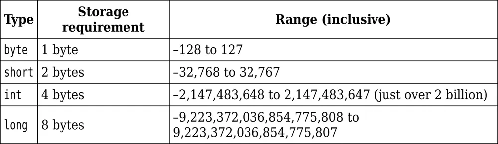
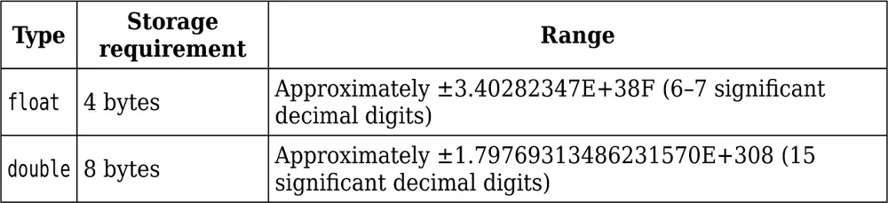
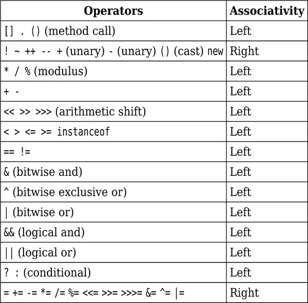

# 1. Fundamental Programming Structure

- [1. Fundamental Programming Structure](#1-fundamental-programming-structure)
  - [1.1 Introduction to Java Programming Language](#11-introduction-to-java-programming-language)
  - [1.2 Primitive Types](#12-primitive-types)
    - [Signed Integer Types](#signed-integer-types)
    - [Floating-Point Types](#floating-point-types)
    - [Char Type](#char-type)
    - [Boolean Type](#boolean-type)
  - [1.3 Variables](#13-variables)
    - [Var](#var)
    - [Constants](#constants)
  - [1.4 Arithmetic Operations](#14-arithmetic-operations)
    - [1.4.1 Assignment](#141-assignment)
    - [1.4.2 Basic Arithmetic](#142-basic-arithmetic)
    - [1.4.3 Mathematical Methods](#143-mathematical-methods)
    - [1.4.4 Number Type Conversions](#144-number-type-conversions)
    - [1.4.5 Relational and Logical Operators](#145-relational-and-logical-operators)
    - [1.4.6 Big Numbers](#146-big-numbers)
  - [1.5 Strings](#15-strings)
    - [1.5.1 Concatenation](#151-concatenation)
    - [1.5.2 Substrings](#152-substrings)
    - [1.5.3 String Comparison](#153-string-comparison)
    - [1.5.4 Converting Numbers ↔ Strings](#154-converting-numbers-↔-strings)
    - [1.5.5 String API](#155-string-api)
    - [1.5.6 Code Points & Code Units](#156-code-points--code-units)
    - [1.5.7 Text Blocks](#157-text-blocks)
  - [1.6 Input and Output](#16-input-and-output)
    - [Reading Input](#reading-input)
    - [Formatted Output](#formatted-output)
  - [1.7 Control Flow](#17-control-flow)
    - [If-Else](#if-else)
    - [Switch](#switch)
    - [Loops](#loops)
    - [Break & Continue](#break--continue)
  - [1.8 Arrays & ArrayLists](#18-arrays--arraylists)
    - [Arrays](#arrays)
    - [ArrayList](#arraylist)
    - [Wrapper Classes](#wrapper-classes)
    - [Enhanced For Loop](#enhanced-for-loop)
    - [Copying Arrays & Lists](#copying-arrays--lists)
    - [Common Algorithms](#common-algorithms)
    - [Command-Line Arguments](#command-line-arguments)
    - [Multidimensional Arrays](#multidimensional-arrays)

## 1.1 Introduction to Java Programming Language

1. Java is a high-level, class-based, object-oriented programming language that is designed to have as few implementation dependencies as possible.
2. It is a general-purpose programming language intended to let application developers write once, run anywhere

# 1.2 Primitive Types

## Signed Integer Types

1. The constants Integer.MIN_VALUE and Integer.MAX_VALUE are
   the smallest and largest int values. The Long, Short, and Byte classes
   also have MIN_VALUE and MAX_VALUE constants.
2. If the long type is not sufficient, use the BigInteger class.
3. Long types are written in program with L at the end. For Byte and short we can use cast eg. (byte) 127.
4. In most situations, the int type is the most practical. If you want to represent
   the number of inhabitants of our planet, you’ll need to resort to a long. The
   byte and short types are mainly intended for specialized applications, such
   as low-level file handling, or for large arrays when storage space is at a
   premium.



## Floating-Point Types



## Char Type

1. The char type describes “code units” in the UTF-16 character encoding used
   by Java. The details are rather technical.
2. Char Can be initiated as with single quotes.

## Boolean Type

1. The boolean type has two values, false and true.
2. In Java, the boolean type is not a number type. There is no relationship
   between boolean values and the integers 0 and 1.

# 1.3 Variables

## Var

To avoid this repetition, you can declare a variable with the var keyword:

```java
var generator = new Random();
```

## Constants

The final keyword denotes a value that cannot be changed once it has been assigned. In other languages, one would call such a value a constant. For example,

```java
final int DAYS_PER_WEEK = 7;
```

# 1.4 Arithmetic Operations

---



operators are listed by decreasing precedence.

## 1.4.1 Assignment

- `=` assigns value.
- Compound assignment: `x += y` → `x = x + y`.
- Right-associative: `i -= j -= k → i -= (j -= k)`.

```java
int x = 10;
x += 5;   // x = 15
int i = 10, j = 5, k = 2;
i -= j -= k; // j = 3, i = 7

```

---

## 1.4.2 Basic Arithmetic

- Operators: `+ - * / %`
- Integer division truncates remainder.
- `%` gives remainder. Use `Math.floorMod()` for negatives.
- Increment/decrement: `n++` (post), `++n` (pre).

```java
int a = 17, b = 5;
System.out.println(a / b);       // 3
System.out.println(a % b);       // 2
System.out.println(Math.floorMod(-17, 5)); // 3

int n = 5;
System.out.println(n++); // 5, then n=6
System.out.println(++n); // 7

```

---

## 1.4.3 Mathematical Methods

- `Math.pow(x, y)`, `Math.sqrt(x)`
- `Math.min(a, b)`, `Math.max(a, b)`
- Constants: `Math.PI`, `Math.E`
- Safe operations: `Math.addExact`, `Math.multiplyExact`

```java
System.out.println(Math.pow(2, 3));   // 8.0
System.out.println(Math.sqrt(16));    // 4.0
System.out.println(Math.max(10, 20)); // 20
System.out.println(Math.PI);          // 3.141592653589793
System.out.println(Math.multiplyExact(1_000_000_000, 3)); // Exception if overflow

```

---

## 1.4.4 Number Type Conversions

- Promotion order: `double > float > long > int`
- Example: `3.14 + 42 → 45.14 (double)`
- Casting truncates: `(int) 3.75 → 3`
- Rounding: `(int) Math.round(3.75) → 4`
- Use `Math.toIntExact(long)` for safe cast.

```java
double x = 3.14 + 42;  // 45.14
int n = (int) 3.75;    // 3
int r = (int) Math.round(3.75); // 4
long big = 3_000_000_000L;
int safe = Math.toIntExact(big); // Exception if overflow

```

---

## 1.4.5 Relational and Logical Operators

- Relational: `< > <= >= == !=`
- Logical: `&&` (AND), `||` (OR), `!` (NOT)
- Short-circuit prevents unnecessary evaluation.
- Conditional (ternary): `cond ? a : b`
- Bitwise: `& | ^ ~ << >> >>>`

```java
int n = 5, s = 10;
System.out.println(n != 0 && s / n > 1); // true
System.out.println(n == 0 || s / n > 1); // true

int time = 14;
System.out.println(time < 12 ? "am" : "pm"); // pm

int mask = 0xF;
System.out.println(42 & mask); // 10
System.out.println(1 << 3);    // 8

```

---

## 1.4.6 Big Numbers

- `BigInteger` → arbitrary-precision integers.
- `BigDecimal` → precise decimal numbers.
- Create:
  - `BigInteger.valueOf(long)`
  - `new BigInteger("12345")`
- Use methods (`add`, `multiply`), not operators.

```java
import java.math.BigInteger;
import java.math.BigDecimal;

BigInteger n = BigInteger.valueOf(876543210123456789L);
BigInteger k = new BigInteger("9876543210123456789");
BigInteger r = BigInteger.valueOf(5).multiply(n.add(k));
System.out.println(r);

BigDecimal dec = BigDecimal.valueOf(2, 0).subtract(BigDecimal.valueOf(17, 1));
System.out.println(dec); // 0.3

```

---

⚡ **Tips**

- Use `Math.floorMod()` for cyclic ranges (clocks).
- Use `Exact` methods (`addExact`, `multiplyExact`) to detect overflow.
- Prefer `BigDecimal` for precise financial calculations.

---

# 1.5 Strings

A string is a sequence of Unicode characters in Java. Example: `"Java™"` = `J, a, v, a, ™`.

---

## 1.5.1 Concatenation

- Use `+` to join strings.
- Any value concatenated with a string is converted to string.
- Beware: `"Next year " + age + 1` → `"421"`
- Use parentheses for arithmetic.
- `String.join(delimiter, items...)` for multiple strings.
- Use `StringBuilder` for efficient multiple concatenations.

```java
String location = "Java";
String greeting = "Hello " + location; // "Hello Java"

int age = 42;
System.out.println("Next year: " + (age + 1)); // 43

String names = String.join(", ", "Peter", "Paul", "Mary");
// "Peter, Paul, Mary"

StringBuilder builder = new StringBuilder();
builder.append("Hello ").append("World");
String result = builder.toString();

```

---

## 1.5.2 Substrings

- `substring(start, end)` → start inclusive, end exclusive.
- `split(regex)` → splits into array of substrings.

```java
String greeting = "Hello, World!";
String location = greeting.substring(7, 12); // "World"

String names = "Peter, Paul, Mary";
String[] arr = names.split(", "); // ["Peter", "Paul", "Mary"]

```

---

## 1.5.3 String Comparison

- Use `.equals()` for equality.
- Never use `==` (compares references).
- Null check: `if (str == null)`
- Empty string: `""` vs `null`.
- Case-insensitive: `.equalsIgnoreCase()`
- Ordering: `.compareTo(other)` → `<0`, `0`, `>0`.
- Use `Collator` for locale-aware sorting.

```java
String location = "World";
System.out.println(location.equals("World")); // true
System.out.println("world".equalsIgnoreCase(location)); // true
System.out.println("word".compareTo("world")); // -8

```

---

## 1.5.4 Converting Numbers ↔ Strings

- Number → String:
  - `Integer.toString(n)`
  - `Integer.toString(n, base)`
  - `"" + n` (quick way)
- String → Number:
  - `Integer.parseInt(str)`
  - `Integer.parseInt(str, base)`
  - `Double.parseDouble(str)`

```java
int n = 42;
String s1 = Integer.toString(n);   // "42"
String s2 = Integer.toString(n, 2); // "101010"

int x = Integer.parseInt("101010", 2); // 42
double d = Double.parseDouble("3.14"); // 3.14

```

---

## 1.5.5 String API

- Strings are **immutable**.
- Useful methods:
  - `length()`, `charAt(i)`
  - `toUpperCase()`, `toLowerCase()`
  - `trim()`, `replace()`, `startsWith()`, `endsWith()`
  - `contains()`, `indexOf()`, `lastIndexOf()`
- Many methods accept `CharSequence`.

```java
String msg = " Hello ";
System.out.println(msg.trim());       // "Hello"
System.out.println(msg.toUpperCase()); // " HELLO "

```

---

## 1.5.6 Code Points & Code Units

- Java uses **UTF-16 encoding**.
- `char` = code unit (16-bit), not always a full Unicode character.
- Use `codePointAt()` for full Unicode characters.
- Use `codePoints()` to stream all Unicode code points.

```java
String str = "𝕆ct"; // "𝕆" is U+1D546
int cp = str.codePointAt(0);
System.out.println(Character.charCount(cp)); // 2

int[] cps = str.codePoints().toArray();
System.out.println(cps.length); // 3 code points

```

---

## 1.5.7 Text Blocks

- Multiline string literals with `""" ... """`.
- No need to escape quotes inside.
- Line breaks included automatically.
- Use `\` at line end to suppress newline.
- Leading indentation handled automatically.
- Escape sequences still apply (`\n`, `\s`, etc.).

```java
String greeting = """
Hello
World
""";

String prompt = """
Hello, my name is Hal. \
Please enter your name:""";

String html = """
<div class="Warning">
Beware of those who say "Hello"
</div>
""";

```

---

⚡ **Key Tips**

- Use `.equals()` for string equality.
- Prefer `StringBuilder` for loops with concatenation.
- For Unicode correctness, use `codePoints()`.
- Text blocks simplify multiline strings.

---

[String Methods](https://www.notion.so/String-Methods-27b7207edabd8139984ed1d6b044a82b?pvs=21)

## 1.6 Input and Output

### 🔹 Reading Input

Use `Scanner` to read from console:

```java
import java.util.Scanner;

Scanner in = new Scanner(System.in);
String name = in.nextLine();  // full line
String word = in.next();      // single word
int age = in.nextInt();       // integer
double gpa = in.nextDouble(); // floating point

```

Check if input exists before reading:

```java
if (in.hasNextInt()) {
   int x = in.nextInt();
}

```

Use `Console` for secure input (like passwords):

```java
Console c = System.console();
String user = c.readLine("User: ");
char[] pass = c.readPassword("Password: ");

```

---

### 🔹 Formatted Output

- `print` → prints without newline
- `println` → prints with newline
- `printf` → formatted output with placeholders

```java
System.out.printf("%8.2f", 1000.0/3.0); //   333.33
System.out.printf("Hello %s, next year %d", name, age);

```

**Common format specifiers:**

- `%d` → integer
- `%f` → floating-point
- `%s` → string

**Flags for formatting:**

- `+` → show sign
- `,` → add grouping separators
- `0` → pad with zeros

Example:

```java
System.out.printf("%,+.2f", 33333.333); // +33,333.33

```

---

## 1.7 Control Flow

### 🔹 If-Else

Choose between alternatives:

```java
if (count > 0) avg = sum/count;
else if (count == 0) avg = 0;
else System.out.println("Error");

```

---

### 🔹 Switch

**Expression form (returns a value):**

```java
String season = switch(code) {
  case 0 -> "Spring";
  case 1 -> "Summer";
  case 2 -> "Fall";
  case 3 -> "Winter";
  default -> "???";
};

```

**Statement form (executes code):**

```java
switch(code) {
  case 0 -> season="Spring";
  case 1 -> season="Summer";
  default -> season="";
}

```

---

### 🔹 Loops

**While loop** (repeat while condition is true):

```java
while(sum < target) {
   sum += rnd.nextInt(10);
}

```

**Do-while loop** (runs at least once):

```java
do {
   x = rnd.nextInt(10);
} while (x != target);

```

**For loop** (counter controlled):

```java
for(int i=1; i<=20; i++) sum += rnd.nextInt(10);

```

**For loop with progression:**

```java
for(int i=1; i<target; i*=2) System.out.println(i);

```

---

### 🔹 Break & Continue

**Break** exits the loop:

```java
while(true){
  String s = in.next();
  if(s.equals("Q")) break; // stop loop
}

```

**Continue** skips current iteration:

```java
for(int i=0;i<10;i++){
  if(i%2==0) continue; // skip even numbers
  System.out.println(i);
}

```

---

## 1.8 Arrays & ArrayLists

### 🔹 Arrays

Fixed-size container for elements of same type:

```java
String[] names = new String[100];
int[] primes = {2,3,5,7,11};
int len = names.length;

```

- Default values: `0` (numbers), `false` (boolean), `null` (objects).

---

### 🔹 ArrayList

Resizable list from Java Collections Framework:

```java
import java.util.ArrayList;
var friends = new ArrayList<String>();

friends.add("Peter");
friends.add("Paul");
friends.remove(1);
String first = friends.get(0);
friends.set(0, "Mary");

```

---

### 🔹 Wrapper Classes

Needed because generics don’t support primitives.

Examples:

- `Integer` for `int`
- `Double` for `double`
- `Character` for `char`
- `Boolean` for `boolean`

---

### 🔹 Enhanced For Loop

Simpler way to loop through arrays/lists:

```java
for (int n : numbers) sum += n;
for (String name : friends) System.out.println(name);

```

---

### 🔹 Copying Arrays & Lists

```java
int[] copy = Arrays.copyOf(primes, primes.length);
var copyList = new ArrayList<>(friends);

```

---

### 🔹 Common Algorithms

```java
Arrays.sort(nums);               // sort array
Collections.sort(friends);       // sort list
Collections.reverse(friends);    // reverse list
Collections.shuffle(friends);    // shuffle list
System.out.println(Arrays.toString(nums)); // print array

```

---

### 🔹 Command-Line Arguments

Pass values when starting the program:

```java
public static void main(String[] args) {
  for (String arg : args) System.out.println(arg);
}

```

---

### 🔹 Multidimensional Arrays

Arrays within arrays:

```java
int[][] square = {
  {16,3,2,13},
  {5,10,11,8},
  {9,6,7,12},
  {4,15,14,1}
};

```

---
