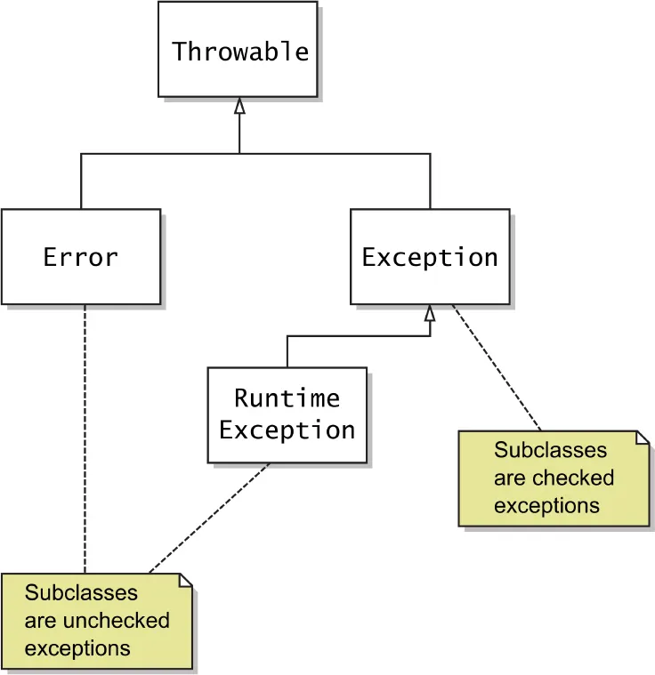

## 4.1 What is an Exception?

- An **exception** is an event that disrupts the normal flow of a program.
- It occurs during runtime and can be **handled** to prevent program termination.

Example:

```java
public class ExceptionIntro {
    public static void main(String[] args) {
        int a = 10, b = 0;
        System.out.println(a / b);  // ArithmeticException
    }
}

```

**Output:**

```
// Exception in thread "main" java.lang.ArithmeticException: / by zero

```

---

## 4.2 Difference between Error and Exception

| Feature     | Error                                     | Exception                       |
| ----------- | ----------------------------------------- | ------------------------------- |
| Meaning     | Serious problems (e.g., OutOfMemoryError) | Issues in program logic         |
| Recoverable | Generally **not recoverable**             | Can be handled with `try-catch` |
| Package     | `java.lang.Error`                         | `java.lang.Exception`           |

---

## 4.3 Types of Exceptions

1. **Checked Exceptions** (compile-time)
   - Must be either caught or declared in `throws`.
   - Example: `IOException`, `SQLException`.
2. **Unchecked Exceptions** (runtime)
   - Occur during program execution.
   - Example: `NullPointerException`, `ArithmeticException`.
3. **Errors**
   - Serious issues, like `StackOverflowError`.

---

## 4.4 Exception Hierarchy

```
Object
 └── Throwable
      ├── Exception
      │    ├── RuntimeException
      │    └── Checked Exceptions
      └── Error

```

---

## 4.5 Exception Handling Keywords

- **try** → code that may throw exception.
- **catch** → handles exception.
- **finally** → executes always (cleanup code).
- **throw** → used to throw an exception.
- **throws** → declares exceptions in method signature.

---

## 4.6 Example: try-catch

```java
public class TryCatchExample {
    public static void main(String[] args) {
        try {
            int result = 10 / 0;
        } catch (ArithmeticException e) {
            System.out.println("Cannot divide by zero!");
        }
    }
}

```

**Output:**

```
// Cannot divide by zero!

```

---

## 4.7 Multiple Catch Blocks

```java
public class MultiCatch {
    public static void main(String[] args) {
        try {
            String s = null;
            System.out.println(s.length());
        } catch (ArithmeticException e) {
            System.out.println("Math error");
        } catch (NullPointerException e) {
            System.out.println("Null value!");
        }
    }
}

```

**Output:**

```
// Null value!

```

---

## 4.8 Finally Block

```java
public class FinallyExample {
    public static void main(String[] args) {
        try {
            int result = 10 / 2;
            System.out.println("Result: " + result);
        } finally {
            System.out.println("Cleanup code runs always!");
        }
    }
}

```

**Output:**

```
// Result: 5
// Cleanup code runs always!

```

---

## 4.9 Throw Keyword

```java
public class ThrowExample {
    static void checkAge(int age) {
        if (age < 18) {
            throw new IllegalArgumentException("Age must be 18 or above");
        }
        System.out.println("Access granted");
    }

    public static void main(String[] args) {
        checkAge(16);
    }
}

```

**Output:**

```
// Exception in thread "main" java.lang.IllegalArgumentException: Age must be 18 or above

```

---

## 4.10 Throws Keyword

```java
import java.io.*;

public class ThrowsExample {
    static void readFile() throws IOException {
        FileReader fr = new FileReader("test.txt");
        fr.read();
    }

    public static void main(String[] args) {
        try {
            readFile();
        } catch (IOException e) {
            System.out.println("File not found");
        }
    }
}

```

**Output:**

```
// File not found

```

---

## 4.11 Custom Exception

```java
class InvalidAgeException extends Exception {
    public InvalidAgeException(String msg) {
        super(msg);
    }
}

public class CustomExceptionExample {
    static void validate(int age) throws InvalidAgeException {
        if (age < 18)
            throw new InvalidAgeException("Age not valid");
        else
            System.out.println("Welcome!");
    }

    public static void main(String[] args) {
        try {
            validate(15);
        } catch (InvalidAgeException e) {
            System.out.println("Caught: " + e.getMessage());
        }
    }
}

```

**Output:**

```
// Caught: Age not valid

```

---

## 4.12 Try-With-Resources (Java 7+)

- Used for automatic resource management (e.g., files, sockets).
- Automatically closes resources when try block ends.

```java
import java.io.*;

public class TryWithResources {
    public static void main(String[] args) {
        try (FileReader fr = new FileReader("test.txt")) {
            System.out.println((char) fr.read());
        } catch (IOException e) {
            System.out.println("File error");
        }
    }
}

```

**Output:**

```
// File error

```

---

## 4.13 Best Practices

1. Always catch **specific exceptions**.
2. Avoid **swallowing exceptions** (empty catch).
3. Use **finally** or **try-with-resources** for cleanup.
4. Don’t use exceptions for **flow control**.
5. Define **custom exceptions** for business logic errors.

---

✅ **Summary**

- Exceptions handle **unexpected runtime events** gracefully.
- Two types: **Checked** (compile-time) and **Unchecked** (runtime).
- Use `try-catch-finally`, `throw`, and `throws` effectively.
- Custom exceptions improve readability and maintainability.

---
