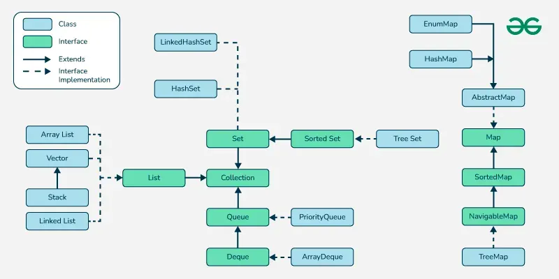

## Table of Contents

- [Collection](#collection)
- [List](#list)
- [Set](#set)
- [Map](#mapkv)
- [Queue](#queue)
- [Deque](#deque)
- [NavigableSet](#navigableset)
- [NavigableMap](#navigablemapkv)
- [ArrayList](#arraylist)
- [LinkedList](#linkedlist)
- [HashSet](#hashset)
- [LinkedHashSet](#linkedhashset)
- [TreeSet](#treeset)
- [HashMap](#hashmapkv)
- [LinkedHashMap](#linkedhashmapkv)
- [TreeMap](#treemapkv)
- [ConcurrentHashMap](#concurrenthashmapkv)
- [ArrayDeque](#arraydeque)
- [PriorityQueue](#priorityqueue)
- [CopyOnWriteArrayList](#copyonwritearraylist)
- [WeakHashMap](#weakhashmapkv)
- [EnumSet](#enumset)
- [EnumMap](#enummapk-extends-enumv)
- [ConcurrentLinkedQueue](#concurrentlinkedqueue)
- [LinkedBlockingQueue](#linkedblockingqueue)
- [IdentityHashMap](#identityhashmapkv)
- [ConcurrentSkipListMap](#concurrentskiplistmapkv)
- [Java Collections: Differentiating Examples Cheatsheet](#java-collections-differentiating-examples-cheatsheet)
  - [List vs Set vs Map](#list-vs-set-vs-map)
  - [ArrayList vs LinkedList](#arraylist-vs-linkedlist)
  - [HashSet vs LinkedHashSet vs TreeSet](#hashset-vs-linkedhashset-vs-treeset)
  - [HashMap vs LinkedHashMap vs TreeMap](#hashmap-vs-linkedhashmap-vs-treemap)
  - [Queue vs Deque vs Stack](#queue-vs-deque-vs-stack)
  - [PriorityQueue vs ArrayDeque](#priorityqueue-vs-arraydeque)
  - [NavigableSet and NavigableMap](#navigableset-and-navigablemap)
  - [ConcurrentHashMap vs synchronizedMap](#concurrenthashmap-vs-synchronizedmap)
  - [CopyOnWriteArrayList vs ArrayList (iteration under modification)](#copyonwritearraylist-vs-arraylist-iteration-under-modification)
  - [WeakHashMap vs HashMap](#weakhashmap-vs-hashmap)
  - [IdentityHashMap vs HashMap](#identityhashmap-vs-hashmap)
  - [BlockingQueue quick picks](#blockingqueue-quick-picks)
  - [Unmodifiable view vs Immutable collection](#unmodifiable-view-vs-immutable-collection)
  - [EnumSet and EnumMap](#enumset-and-enummap)



# **Collection**

- Represents a group of elements with basic operations for **add/remove**.
- Does not define key-based access, only **element-oriented** operations.
- Supports bulk operations for **adding/removing** other collections.
- Provides **iteration** via `Iterator` and enhanced for-loop.

| Method     | Arguments                   | Returns    | Description                                |
| ---------- | --------------------------- | ---------- | ------------------------------------------ |
| `add`      | `E e`                       | `boolean`  | Adds an element if possible.               |
| `remove`   | `Object o`                  | `boolean`  | Removes one matching element if present.   |
| `contains` | `Object o`                  | `boolean`  | Tests membership.                          |
| `size`     | —                           | `int`      | Number of elements.                        |
| `addAll`   | `Collection<? extends E> c` | `boolean`  | Adds all elements from another collection. |
| `iterator` | —                           | `Iterator` | Returns an iterator over elements.         |

```java
Collection<String> bag = new ArrayList<>();
bag.add("a"); bag.add("b");// generic container with basic operations
for (String s : bag) { /* iterate */ }

```

# **List**

- Ordered sequence with **index-based** access.
- Allows **duplicates** and maintains insertion order.
- Supports positional operations like **get/set** and **subList**.
- Often used when **order** and **random access** matter.

| Method    | Arguments          | Returns | Description                       |
| --------- | ------------------ | ------- | --------------------------------- |
| `get`     | `int index`        | `E`     | Returns element at index.         |
| `set`     | `int index, E e`   | `E`     | Replaces and returns old element. |
| `add`     | `int index, E e`   | `void`  | Inserts at a position.            |
| `indexOf` | `Object o`         | `int`   | First index of element or -1.     |
| `subList` | `int from, int to` | `List`  | View over a range.                |

```java
List<String> names = new ArrayList<>(List.of("A","B","A"));
names.get(1);// "B" — preserves order
names.indexOf("A");// 0 — duplicates allowed
```

# **Set**

- Unordered collection of **unique** elements.
- No index-based access and typically **fast membership** checks.
- Variants differ by **ordering** (none, insertion, sorted).
- Ideal when **uniqueness** is required.

| Method     | Arguments  | Returns   | Description                  |
| ---------- | ---------- | --------- | ---------------------------- |
| `add`      | `E e`      | `boolean` | Adds if not already present. |
| `contains` | `Object o` | `boolean` | Tests membership.            |
| `remove`   | `Object o` | `boolean` | Removes element if present.  |
| `size`     | —          | `int`     | Number of unique elements.   |

```java
Set<String> s = new HashSet<>();
s.add("A"); s.add("A");// second add ignored
System.out.println(s.size());// 1
```

# **Map<K,V>**

- Associates **unique keys** to values.
- Provides views of **keys**, **values**, and **entries**.
- Overwrites on same key with **put**.
- Useful for **lookups**, caches, and indexing.

| Method            | Arguments       | Returns   | Description                     |
| ----------------- | --------------- | --------- | ------------------------------- |
| `put`             | `K k, V v`      | `V`       | Adds or replaces value for key. |
| `get`             | `Object k`      | `V`       | Returns value or `null`.        |
| `containsKey`     | `Object k`      | `boolean` | Key presence.                   |
| `remove`          | `Object k`      | `V`       | Removes and returns old value.  |
| `computeIfAbsent` | `K k, Function` | `V`       | Lazily create values.           |

```java
Map<String,Integer> m = new HashMap<>();
m.put("x", 1);
m.put("x", 2);// overwrites
System.out.println(m.get("x"));// 2
```

# **Queue**

- First-in-first-out (**FIFO**) processing.
- Adds at tail, removes from head with **offer/poll**.
- Ideal for **scheduling** and **buffering** tasks.
- Blocking variants support **producer-consumer** patterns.

| Method  | Arguments | Returns   | Description                   |
| ------- | --------- | --------- | ----------------------------- |
| `offer` | `E e`     | `boolean` | Insert if possible.           |
| `poll`  | —         | `E`       | Remove head or `null`.        |
| `peek`  | —         | `E`       | View head or `null`.          |
| `add`   | `E e`     | `boolean` | Insert, may throw on failure. |

```java
Queue<Integer> q = new ArrayDeque<>();
q.offer(1); q.offer(2);
System.out.println(q.poll());// 1
```

# **Deque**

- Double-ended queue for **stack and queue** operations.
- Supports head/tail **insertion and removal**.
- Efficient for **LIFO** and **FIFO** in one structure.
- Often faster than legacy `Stack`.

| Method        | Arguments | Returns | Description     |
| ------------- | --------- | ------- | --------------- |
| `addFirst`    | `E e`     | `void`  | Insert at head. |
| `addLast`     | `E e`     | `void`  | Insert at tail. |
| `removeFirst` | —         | `E`     | Remove head.    |
| `removeLast`  | —         | `E`     | Remove tail.    |
| `peekFirst`   | —         | `E`     | View head.      |

```java
Deque<String> d = new ArrayDeque<>();
d.addFirst("A"); d.addLast("B");
System.out.println(d.removeLast());// "B"
```

# **NavigableSet**

- A `SortedSet` with **navigation** helpers.
- Methods like **lower/floor/ceiling/higher**.
- Commonly implemented by **TreeSet**.
- Useful for **range queries** and nearest neighbors.

| Method    | Arguments                                  | Returns        | Description           |
| --------- | ------------------------------------------ | -------------- | --------------------- |
| `lower`   | `E e`                                      | `E`            | Greatest element < e. |
| `floor`   | `E e`                                      | `E`            | Greatest element ≤ e. |
| `ceiling` | `E e`                                      | `E`            | Smallest element ≥ e. |
| `higher`  | `E e`                                      | `E`            | Smallest element > e. |
| `subSet`  | `E from, boolean incF, E to, boolean incT` | `NavigableSet` | Range view.           |

```java
NavigableSet<Integer> ns = new TreeSet<>(List.of(10,20));
System.out.println(ns.floor(15));// 10
System.out.println(ns.ceiling(15));// 20
```

# **NavigableMap<K,V>**

- A `SortedMap` with **entry navigation** methods.
- Supports **lowerEntry**, **floorEntry**, **ceilingEntry**, **higherEntry**.
- Commonly implemented by **TreeMap**.
- Great for **ordered lookups** and range views.

| Method         | Arguments                              | Returns             | Description         |
| -------------- | -------------------------------------- | ------------------- | ------------------- |
| `lowerEntry`   | `K k`                                  | `Map.Entry<K,V>`    | Entry with key < k. |
| `floorEntry`   | `K k`                                  | `Map.Entry<K,V>`    | Entry with key ≤ k. |
| `ceilingEntry` | `K k`                                  | `Map.Entry<K,V>`    | Entry with key ≥ k. |
| `higherEntry`  | `K k`                                  | `Map.Entry<K,V>`    | Entry with key > k. |
| `subMap`       | `K from, boolean fi, K to, boolean ti` | `NavigableMap<K,V>` | Range view.         |

```java
NavigableMap<Integer,String> nm = new TreeMap<>();
nm.put(10,"A"); nm.put(20,"B");
System.out.println(nm.ceilingEntry(15).getValue());// "B"
```

# **ArrayList**

- Resizable array with **fast random access**.
- Amortized O(1) **append** and good cache locality.
- Slower **inserts/removes** in the middle.
- Ideal for **reads** and tail appends.

| Method           | Arguments      | Returns   | Description             |
| ---------------- | -------------- | --------- | ----------------------- |
| `add`            | `E e`          | `boolean` | Append element.         |
| `get`            | `int idx`      | `E`       | Index access.           |
| `set`            | `int idx, E e` | `E`       | Replace at index.       |
| `ensureCapacity` | `int min`      | `void`    | Pre-grow backing array. |

```java
List<Integer> a = new ArrayList<>();
for (int i = 0; i < 3; i++) a.add(i);// fast appends, O(1) avg
System.out.println(a.get(2));// 2
```

# **LinkedList**

- Doubly-linked nodes with **cheap inserts/removes** at ends.
- Implements **List** and **Deque**.
- Random access is **O(n)** and slower.
- Useful for **queues** and frequent middle operations.

| Method        | Arguments | Returns | Description                  |
| ------------- | --------- | ------- | ---------------------------- |
| `addFirst`    | `E e`     | `void`  | Push at head.                |
| `addLast`     | `E e`     | `void`  | Append at tail.              |
| `removeFirst` | —         | `E`     | Pop head.                    |
| `get`         | `int idx` | `E`     | Linear-time access by index. |

```java
LinkedList<String> ll = new LinkedList<>();
ll.addFirst("B"); ll.addFirst("A");
System.out.println(ll.removeFirst());// "A"
```

# **HashSet**

- Backed by hash table, **no ordering** guarantees.
- Very fast **add/contains/remove** on average.
- Requires stable **hashCode/equals**.
- Great default for **unique membership**.

| Method     | Arguments  | Returns    | Description        |
| ---------- | ---------- | ---------- | ------------------ |
| `add`      | `E e`      | `boolean`  | Insert if absent.  |
| `contains` | `Object o` | `boolean`  | Membership test.   |
| `remove`   | `Object o` | `boolean`  | Delete if present. |
| `iterator` | —          | `Iterator` | Unspecified order. |

```java
Set<Integer> s = new HashSet<>(List.of(3,1,2));
System.out.println(s);// order unspecified
```

# **LinkedHashSet**

- HashSet with **insertion-order** iteration.
- Slight overhead for order tracking via **linked buckets**.
- Predictable iteration without sorting.
- Useful for **de-duplication** while preserving order.

| Method     | Arguments  | Returns    | Description                |
| ---------- | ---------- | ---------- | -------------------------- |
| `add`      | `E e`      | `boolean`  | Insert if absent.          |
| `iterator` | —          | `Iterator` | Insertion-order iteration. |
| `contains` | `Object o` | `boolean`  | Membership test.           |

```java
Set<String> s = new LinkedHashSet<>();
s.add("A"); s.add("B"); s.add("A");
System.out.println(s);// [A, B]
```

# **TreeSet**

- Sorted set via **balanced tree** (red-black).
- Provides **NavigableSet** operations.
- Requires **Comparable** or a **Comparator**.
- Great for **ordered unique** data.

| Method    | Arguments | Returns | Description       |
| --------- | --------- | ------- | ----------------- |
| `first`   | —         | `E`     | Smallest element. |
| `last`    | —         | `E`     | Largest element.  |
| `floor`   | `E e`     | `E`     | Greatest ≤ e.     |
| `ceiling` | `E e`     | `E`     | Smallest ≥ e.     |

```java
Set<Integer> ts = new TreeSet<>(List.of(3,1,2));
System.out.println(ts);// [1, 2, 3]
```

# **HashMap<K,V>**

- Hash table map with **O(1)** average operations.
- No iteration **order** guarantees.
- Allows one **null** key and multiple null values.
- Default choice for **key-value** storage.

| Method   | Arguments  | Returns | Description            |
| -------- | ---------- | ------- | ---------------------- |
| `put`    | `K k, V v` | `V`     | Add/replace mapping.   |
| `get`    | `Object k` | `V`     | Fetch value or `null`. |
| `remove` | `Object k` | `V`     | Remove by key.         |
| `keySet` | —          | `Set`   | View of keys.          |

```java
Map<String,Integer> hm = new HashMap<>();
hm.put("a", 1); hm.put(null, 2);
System.out.println(hm.containsKey(null));// true
```

# **LinkedHashMap<K,V>**

- HashMap with **predictable iteration** (insertion or access order).
- Can be tuned as **LRU** cache with access-order.
- Slight overhead for doubly-linked entries.
- Good for **caches** and ordered maps.

| Method              | Arguments                         | Returns               | Description                               |
| ------------------- | --------------------------------- | --------------------- | ----------------------------------------- |
| `LinkedHashMap`     | `(initialCap, load, accessOrder)` | —                     | Access-order toggles LRU-style iteration. |
| `removeEldestEntry` | `Map.Entry<K,V> e`                | `boolean`             | Override to auto-evict.                   |
| `entrySet`          | —                                 | `Set<Map.Entry<K,V>>` | Ordered entries.                          |

```java
LinkedHashMap<Integer,String> lru = new LinkedHashMap<>(16, 0.75f, true);
lru.put(1,"A"); lru.put(2,"B"); lru.get(1);// 1 becomes most-recent
System.out.println(lru.keySet());// [2, 1]
```

# **TreeMap<K,V>**

- Sorted map via **balanced tree** (red-black).
- Implements **NavigableMap** for range queries.
- Requires key **Comparable** or **Comparator**.
- Great for **ordered key** lookups.

| Method       | Arguments      | Returns          | Description   |
| ------------ | -------------- | ---------------- | ------------- |
| `firstKey`   | —              | `K`              | Smallest key. |
| `lastKey`    | —              | `K`              | Largest key.  |
| `floorEntry` | `K k`          | `Entry<K,V>`     | Greatest ≤ k. |
| `subMap`     | `K from, K to` | `SortedMap<K,V>` | Range view.   |

```java
Map<Integer,String> tm = new TreeMap<>();
tm.put(20,"B"); tm.put(10,"A");
System.out.println(tm.keySet());// [10, 20]
```

# **ConcurrentHashMap<K,V>**

- High-concurrency map with **non-blocking reads**.
- Fine-grained synchronization for **scalable updates**.
- No `null` keys/values for clarity under concurrency.
- Ideal for **multi-threaded** caches and registries.

| Method        | Arguments              | Returns | Description               |
| ------------- | ---------------------- | ------- | ------------------------- |
| `putIfAbsent` | `K k, V v`             | `V`     | Add only if missing.      |
| `compute`     | `K k, BiFunction`      | `V`     | Atomic remap.             |
| `forEach`     | `long p, BiConsumer`   | `void`  | Parallelizable traversal. |
| `merge`       | `K k, V v, BiFunction` | `V`     | Combine values safely.    |

```java
Map<String,Integer> chm = new ConcurrentHashMap<>();
chm.putIfAbsent("hits", 0);
chm.compute("hits", (k,v) -> v + 1);// atomic
```

# **ArrayDeque**

- Array-based **Deque** with no capacity limit.
- Faster than `Stack` and `LinkedList` for stack/queue.
- No `null` elements allowed.
- Ideal for **LIFO/FIFO** utilities.

| Method  | Arguments | Returns   | Description          |
| ------- | --------- | --------- | -------------------- |
| `push`  | `E e`     | `void`    | Stack push (head).   |
| `pop`   | —         | `E`       | Stack pop (head).    |
| `offer` | `E e`     | `boolean` | Queue insert (tail). |
| `poll`  | —         | `E`       | Queue remove (head). |

```java
ArrayDeque<Integer> ad = new ArrayDeque<>();
ad.push(1); ad.push(2);
System.out.println(ad.pop());// 2 (LIFO)
```

# **PriorityQueue**

- Heap-backed queue ordered by **priority**.
- Not FIFO; head is **smallest** (or comparator-defined).
- Efficient for **task scheduling** and top-k.
- Iteration order is **not sorted**.

| Method       | Arguments | Returns                 | Description                   |
| ------------ | --------- | ----------------------- | ----------------------------- |
| `add`        | `E e`     | `boolean`               | Insert with priority.         |
| `peek`       | —         | `E`                     | View min element.             |
| `poll`       | —         | `E`                     | Remove min element.           |
| `comparator` | —         | `Comparator<? super E>` | Returns comparator or `null`. |

```java
PriorityQueue<Integer> pq = new PriorityQueue<>();
pq.add(3); pq.add(1); pq.add(2);
System.out.println(pq.poll());// 1
```

# **CopyOnWriteArrayList**

- Thread-safe list that **copies on write**.
- Reads are **lock-free** and very fast.
- Writes are **expensive**, suited for rare updates.
- Iterators are **snapshot** and never fail fast.

| Method     | Arguments  | Returns    | Description                |
| ---------- | ---------- | ---------- | -------------------------- |
| `add`      | `E e`      | `boolean`  | Creates new copy on write. |
| `iterator` | —          | `Iterator` | Snapshot iterator.         |
| `remove`   | `Object o` | `boolean`  | Removes by copying.        |

```java
CopyOnWriteArrayList<String> l = new CopyOnWriteArrayList<>(List.of("A"));
for (String s : l) l.add("B");// no ConcurrentModificationException
```

# **WeakHashMap<K,V>**

- Keys held with **weak references**.
- Entries removed when keys become **unreachable**.
- Useful for **caches** tied to key lifetimes.
- Not for strict **retention** guarantees.

| Method | Arguments  | Returns | Description             |
| ------ | ---------- | ------- | ----------------------- |
| `put`  | `K k, V v` | `V`     | Add mapping.            |
| `get`  | `Object k` | `V`     | Lookup by key.          |
| `size` | —          | `int`   | Entry count (may drop). |

```java
WeakHashMap<Object,String> whm = new WeakHashMap<>();
Object key = new Object();
whm.put(key, "value");
key = null; System.gc();// entry may disappear later
```

# **EnumSet<E extends Enum>**

- High-performance set for **enum** constants.
- Internally uses **bit vectors** for speed.
- Extremely memory- and time-efficient.
- Only supports a single **enum type**.

| Method   | Arguments       | Returns   | Description             |
| -------- | --------------- | --------- | ----------------------- |
| `of`     | `E... elements` | `EnumSet` | Create from constants.  |
| `allOf`  | `Class type`    | `EnumSet` | Set of all constants.   |
| `noneOf` | `Class type`    | `EnumSet` | Empty set of enum type. |

```java
enum Day { MON,TUE,WED }
EnumSet<Day> work = EnumSet.of(Day.MON, Day.TUE);
System.out.println(work.contains(Day.WED));// false
```

# **EnumMap<K extends Enum,V>**

- Map specialized for **enum keys**.
- Backed by arrays for **compact** storage.
- Predictable **iteration** in enum order.
- Very fast get/put when keys are enums.

| Method    | Arguments       | Returns | Description                   |
| --------- | --------------- | ------- | ----------------------------- |
| `EnumMap` | `Class keyType` | —       | Construct with enum key type. |
| `put`     | `K k, V v`      | `V`     | Add/replace mapping.          |
| `get`     | `Object k`      | `V`     | Lookup value.                 |

```java
enum Day { MON,TUE }
EnumMap<Day,Integer> hours = new EnumMap<>(Day.class);
hours.put(Day.MON, 8);
System.out.println(hours.get(Day.MON));// 8
```

# **ConcurrentLinkedQueue**

- Unbounded, lock-free **FIFO** queue.
- Great for **high-throughput** multi-producer consumption.
- Provides non-blocking `offer/poll`.
- Iterators are **weakly consistent**.

| Method  | Arguments | Returns   | Description        |
| ------- | --------- | --------- | ------------------ |
| `offer` | `E e`     | `boolean` | Enqueue element.   |
| `poll`  | —         | `E`       | Dequeue or `null`. |
| `peek`  | —         | `E`       | View head.         |

```java
Queue<Integer> cq = new ConcurrentLinkedQueue<>();
cq.offer(1); cq.offer(2);
System.out.println(cq.poll());// 1
```

# **LinkedBlockingQueue**

- Optionally bounded, **blocking** FIFO queue.
- Supports **put/take** with thread waiting.
- Ideal for **producer-consumer** pipelines.
- Backed by linked nodes.

| Method  | Arguments                 | Returns   | Description      |
| ------- | ------------------------- | --------- | ---------------- |
| `put`   | `E e`                     | `void`    | Blocks if full.  |
| `take`  | —                         | `E`       | Blocks if empty. |
| `offer` | `E e, long t, TimeUnit u` | `boolean` | Timed insert.    |
| `poll`  | `long t, TimeUnit u`      | `E`       | Timed remove.    |

```java
BlockingQueue<Integer> bq = new LinkedBlockingQueue<>(1);
new Thread(() -> { try { bq.put(42); } catch (InterruptedException ignored) {} }).start();
System.out.println(bq.take());// 42 (blocks until available)
```

# **IdentityHashMap<K,V>**

- Compares keys by **reference identity** (`==`) not `equals`.
- Useful for **object-identity** keys like graph nodes.
- Not a general purpose replacement for `HashMap`.
- Iteration order is **unspecified**.

| Method        | Arguments  | Returns   | Description           |
| ------------- | ---------- | --------- | --------------------- |
| `put`         | `K k, V v` | `V`       | Add/replace mapping.  |
| `get`         | `Object k` | `V`       | Lookup by identity.   |
| `containsKey` | `Object k` | `boolean` | Identity-based check. |

```java
IdentityHashMap<String,String> im = new IdentityHashMap<>();
im.put(new String("k"), "v");
System.out.println(im.get("k"));// null (different reference)
```

# **ConcurrentSkipListMap<K,V>**

- Concurrent, sorted map using **skip lists**.
- Natural or comparator **ordering** with lock-free reads.
- Implements **NavigableMap** operations.
- Good for **concurrent ordered** data.

| Method          | Arguments      | Returns             | Description          |
| --------------- | -------------- | ------------------- | -------------------- |
| `put`           | `K k, V v`     | `V`                 | Add/replace mapping. |
| `ceilingEntry`  | `K k`          | `Entry<K,V>`        | Entry ≥ key.         |
| `subMap`        | `K from, K to` | `SortedMap<K,V>`    | Range view.          |
| `descendingMap` | —              | `NavigableMap<K,V>` | Reverse-order view.  |

```java
ConcurrentNavigableMap<Integer,String> csm = new ConcurrentSkipListMap<>();
csm.put(2,"B"); csm.put(1,"A");
System.out.println(csm.firstEntry().getValue());// "A"
```

If more types are needed (like `Deque` variants, `ConcurrentLinkedDeque`, `ArrayBlockingQueue`, `PriorityBlockingQueue`, `ConcurrentSkipListSet`, `EnumSet/EnumMap` deeper coverage), the same format can be extended on request.

# **Java Collections: Differentiating Examples Cheatsheet**

## **List vs Set vs Map**

- Use **ordered sequence** when position matters and duplicates are allowed.
- Use **unique elements** when membership matters and duplicates must be ignored.
- Use **key–value lookup** when fast retrieval by key is needed.
- Prefer **List** for indexing, **Set** for uniqueness, **Map** for association.

```java
List<String> list = new ArrayList<>(List.of("A","B","A"));// keeps order, allows duplicates
Set<String> set = new HashSet<>(List.of("A","B","A"));// stores unique values only
Map<String,Integer> map = new HashMap<>();
map.put("A",1); map.put("A",2);// overwrites by key
System.out.println(list);// [A, B, A]
System.out.println(set);// [A, B] (order not guaranteed)
System.out.println(map);// {A=2}
```

## **ArrayList vs LinkedList**

- Choose **ArrayList** for fast random access and tail appends.
- Choose **LinkedList** for frequent **head/tail** insertions/removals.
- Random index access in LinkedList is **O(n)** and slower.
- Both are **not** thread-safe by default.

```java
List<Integer> array = new ArrayList<>();
array.add(1); array.add(2); array.add(3);
System.out.println(array.get(2));// O(1) random access -> 3

LinkedList<Integer> linked = new LinkedList<>();
linked.addFirst(2); linked.addFirst(1); linked.addLast(3);
System.out.println(linked.removeFirst());// O(1) at ends -> 1
```

## **HashSet vs LinkedHashSet vs TreeSet**

- **HashSet**: fast, no ordering guarantees.
- **LinkedHashSet**: preserves **insertion order**.
- **TreeSet**: sorted order with **NavigableSet** operations.
- Use **Comparator** or **Comparable** for TreeSet ordering.

```java
Set<Integer> hs  = new HashSet<>(List.of(3,1,2));// order unspecified
Set<Integer> lhs = new LinkedHashSet<>(List.of(3,1,2));// [3, 1, 2]
Set<Integer> ts  = new TreeSet<>(List.of(3,1,2));// [1, 2, 3]
System.out.println(hs);
System.out.println(lhs);
System.out.println(ts);

```

## **HashMap vs LinkedHashMap vs TreeMap**

- **HashMap**: fastest average ops, no order.
- **LinkedHashMap**: preserves **insertion** or **access** order.
- **TreeMap**: keys in **sorted** order; supports range queries.
- Prefer **LinkedHashMap(accessOrder=true)** for LRU-like iteration.

```java
Map<Integer,String> hm  = new HashMap<>();
Map<Integer,String> lhm = new LinkedHashMap<>(16,0.75f,true);
Map<Integer,String> tm  = new TreeMap<>();

hm.put(2,"B"); hm.put(1,"A"); System.out.println(hm.keySet());// random
lhm.put(1,"A"); lhm.put(2,"B"); lhm.get(1); System.out.println(lhm.keySet());// [2, 1]
tm.put(2,"B"); tm.put(1,"A"); System.out.println(tm.keySet());// [1, 2]
```

## **Queue vs Deque vs Stack**

- **Queue**: FIFO with **offer/poll/peek**.
- **Deque**: double-ended; can act as **queue** or **stack**.
- Prefer Deque over legacy **Stack** for LIFO.
- Use **ArrayDeque** for fast in-memory stacks/queues.

```java
Queue<Integer> q = new ArrayDeque<>();
q.offer(1); q.offer(2);
System.out.println(q.poll());// 1 (FIFO)

Deque<Integer> d = new ArrayDeque<>();
d.push(10); d.push(20);
System.out.println(d.pop());// 20 (LIFO)
```

## **PriorityQueue vs ArrayDeque**

- **PriorityQueue**: orders by **priority** (smallest first by default).
- **ArrayDeque**: preserves **arrival order** (FIFO/LIFO).
- Iteration of PriorityQueue is **not sorted** view.
- Use custom **Comparator** to change priority.

```java
PriorityQueue<Integer> pq = new PriorityQueue<>();
pq.add(3); pq.add(1); pq.add(2);
System.out.println(pq.poll());// 1 (by priority)

ArrayDeque<Integer> ad = new ArrayDeque<>();
ad.offer(3); ad.offer(1); ad.offer(2);
System.out.println(ad.poll());// 3 (arrival order)
```

## **NavigableSet and NavigableMap**

- Use **floor/ceiling/lower/higher** to find nearest elements.
- Enables **range views** like subSet/subMap with inclusivity flags.
- Backed by **TreeSet/TreeMap** implementations.
- Great for **sorted** queries and neighbor lookups.

```java
NavigableSet<Integer> ns = new TreeSet<>(List.of(10,20,30));
System.out.println(ns.floor(25));// 20
System.out.println(ns.ceiling(25));// 30

NavigableMap<Integer,String> nm = new TreeMap<>();
nm.put(10,"A"); nm.put(20,"B");
System.out.println(nm.higherEntry(10).getValue());// "B"
```

## **ConcurrentHashMap vs synchronizedMap**

- **ConcurrentHashMap**: non-blocking reads, scalable updates.
- **Collections.synchronizedMap**: single lock; simpler but **coarse**.
- Avoid **null** keys/values in concurrent maps.
- Prefer CHM for **high concurrency** scenarios.

```java
Map<String,Integer> chm = new ConcurrentHashMap<>();
chm.putIfAbsent("hits", 0);
chm.compute("hits", (k,v) -> v + 1);// atomic

Map<String,Integer> sm = Collections.synchronizedMap(new HashMap<>());
synchronized (sm) { sm.put("x", 1); }// external locking for compound ops
```

## **CopyOnWriteArrayList vs ArrayList (iteration under modification)**

- **COWAL**: safe iteration snapshot; writes are **expensive**.
- **ArrayList**: fast writes but **fail-fast** iterator.
- Use COWAL for **many reads, few writes**.
- Iterators in COWAL don’t see **new** elements mid-loop.

```java
List<String> cow = new CopyOnWriteArrayList<>(List.of("A"));
for (String s : cow) { cow.add("B"); }// safe, snapshot iterator
System.out.println(cow);// ["A","B"]

List<String> arr = new ArrayList<>(List.of("A"));
try {
  for (String s : arr) { arr.add("B"); }// throws ConcurrentModificationException
} catch (ConcurrentModificationException e) {
  System.out.println("fail-fast");
}

```

## **WeakHashMap vs HashMap**

- **WeakHashMap**: keys are **weakly referenced** and auto-removed.
- **HashMap**: strong references; entries persist until removed.
- Use WeakHashMap for **memory-sensitive** caches.
- Not suitable for **guaranteed retention**.

```java
Map<Object,String> weak = new WeakHashMap<>();
Object key = new Object();
weak.put(key, "v");
key = null; System.gc();// entry may vanish later

Map<Object,String> strong = new HashMap<>();
Object k2 = new Object();
strong.put(k2, "v");
k2 = null; System.gc();// entry remains until explicit remove
```

## **IdentityHashMap vs HashMap**

- **IdentityHashMap** compares keys by **==**, not `equals`.
- Distinguishes equal objects with different **references**.
- Use when **object identity** semantics are required.
- Iteration order is **unspecified**.

```java
Map<String, Integer> im = new IdentityHashMap<>();
im.put(new String("k"), 1);
System.out.println(im.get("k"));// null (different reference)

Map<String, Integer> hm = new HashMap<>();
hm.put(new String("k"), 1);
System.out.println(hm.get("k"));// 1 (equals-based)
```

## **BlockingQueue quick picks**

- **LinkedBlockingQueue**: optionally bounded, **put/take** block.
- **ArrayBlockingQueue**: bounded array, predictable **capacity**.
- **SynchronousQueue**: zero capacity, direct **handoff**.
- **PriorityBlockingQueue**: priority ordering with blocking.

```java
BlockingQueue<Integer> q = new ArrayBlockingQueue<>(1);
new Thread(() -> { try { q.put(42); } catch (InterruptedException ignored) {} }).start();
System.out.println(q.take());// 42 (waits if empty)
```

## **Unmodifiable view vs Immutable collection**

- **Unmodifiable view**: wrapper blocks writes but backing list can **change**.
- **Immutable collection**: cannot be changed at all.
- Prefer immutable for **defensive** APIs.
- Use **List.of/Set.of/Map.of** for immutables.

```java
List<String> base = new ArrayList<>(List.of("A"));
List<String> ro = Collections.unmodifiableList(base);
base.add("B");// visible through the view
System.out.println(ro);// [A, B]

List<String> imm = List.of("X","Y");// truly immutable// imm.add("Z"); // UnsupportedOperationException
```

## **EnumSet and EnumMap**

- **EnumSet**: ultra-fast sets for **enum** types.
- **EnumMap**: compact maps keyed by **enum**.
- Iteration follows **enum order**.
- Ideal when domain is a fixed **enum**.

```java
enum Day { MON, TUE, WED }
EnumSet<Day> work = EnumSet.of(Day.MON, Day.TUE);
System.out.println(work.contains(Day.WED));// false

EnumMap<Day,Integer> hours = new EnumMap<>(Day.class);
hours.put(Day.MON, 8);
System.out.println(hours.get(Day.MON));// 8
```
