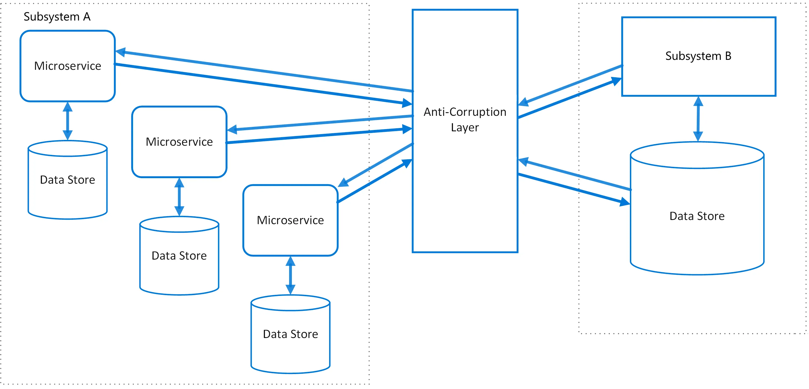
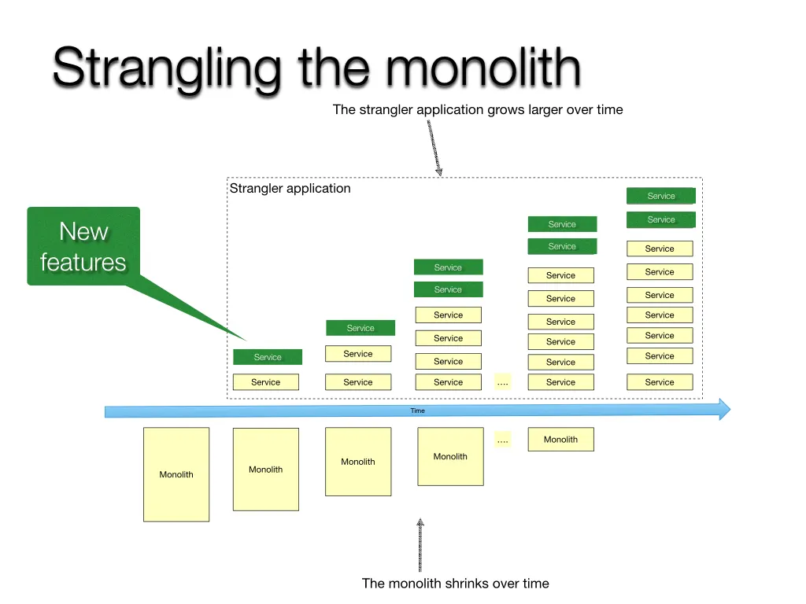

# Anti-curruption Layer (ACL)

An anti-corruption layer (ACL) is **a software design pattern that acts as a protective intermediary between different systems or domains, preventing the "corruption" of a core system's model by external or legacy ones**

# Strangle Pattern

This pattern incrementally migrates a legacy system by gradually replacing specific pieces of functionality with new applications and services. As you replace features from the legacy system, the new system eventually comprises all of the old system's features. This approach suppresses the old system so that you can decommission it.

