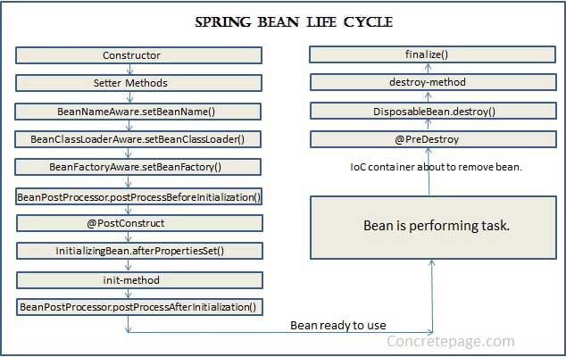
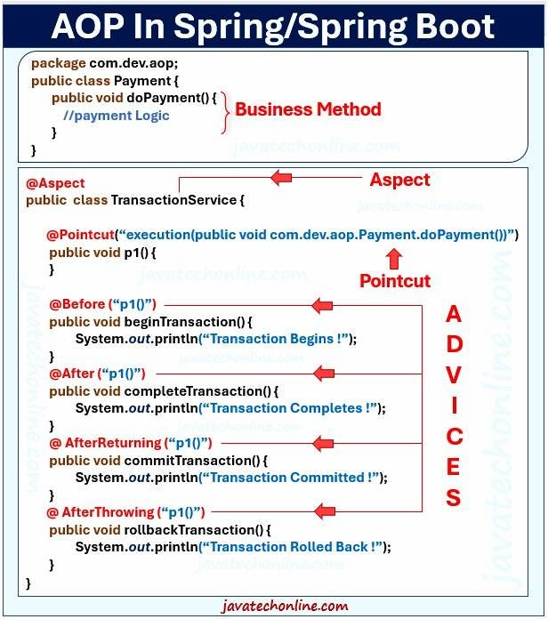

# Bean Life Cycle



# Custom Exception Handling

```java
@RestControllerAdvice
public class GlobalExceptionHandler {

    // Handle Resource Not Found
    @ExceptionHandler(ResourceNotFoundException.class)
    public ResponseEntity<ErrorResponse> handleResourceNotFoundException(
        ResourceNotFoundException ex, WebRequest request) {
        ErrorResponse error = custom class;
        return new ResponseEntity<>(error, HttpStatus.NOT_FOUND);
    }
}
```

# AOP



```java
@Aspect
@Component
public class LoggingAspect {

    private static final Logger logger = LoggerFactory.getLogger(LoggingAspect.class);

    // Pointcut for all methods in service package
    @Pointcut("execution(* com.example.service.*.*(..))")
    public void serviceMethods() {}

    // Before advice
    @Before("serviceMethods()")
    public void logBefore(JoinPoint joinPoint) {
        logger.info("Executing: " + joinPoint.getSignature().getName());
        logger.info("Arguments: " + Arrays.toString(joinPoint.getArgs()));
    }

    // After returning advice
    @AfterReturning(pointcut = "serviceMethods()", returning = "result")
    public void logAfterReturning(JoinPoint joinPoint, Object result) {
        logger.info("Method executed successfully: " + joinPoint.getSignature().getName());
        logger.info("Return value: " + result);
    }

    // After throwing advice
    @AfterThrowing(pointcut = "serviceMethods()", throwing = "exception")
    public void logAfterThrowing(JoinPoint joinPoint, Exception exception) {
        logger.error("Exception in method: " + joinPoint.getSignature().getName());
        logger.error("Exception: " + exception.getMessage());
    }

    // After (finally) advice
    @After("serviceMethods()")
    public void logAfter(JoinPoint joinPoint) {
        logger.info("Method completed: " + joinPoint.getSignature().getName());
    }

    // Around advice
    @Around("serviceMethods()")
    public Object logAround(ProceedingJoinPoint joinPoint) throws Throwable {
        long startTime = System.currentTimeMillis();

        logger.info("Starting method: " + joinPoint.getSignature().getName());

        Object result = null;
        try {
            result = joinPoint.proceed(); // Execute actual method
            return result;
        } finally {
            long endTime = System.currentTimeMillis();
            logger.info("Method executed in: " + (endTime - startTime) + "ms");
        }
    }
}
```
