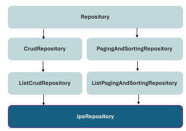

# Spring Boot

## Bean Life Cycle


## Custom Exception Handling

```java
@RestControllerAdvice
public class GlobalExceptionHandler {

    // Handle Resource Not Found
    @ExceptionHandler(ResourceNotFoundException.class)
    public ResponseEntity<ErrorResponse> handleResourceNotFoundException(
        ResourceNotFoundException ex, WebRequest request) {
        ErrorResponse error = custom class;
        return new ResponseEntity<>(error, HttpStatus.NOT_FOUND);
    }
}
```

## AOP


```java
@Aspect
@Component
public class LoggingAspect {

    private static final Logger logger = LoggerFactory.getLogger(LoggingAspect.class);

    // Pointcut for all methods in service package
    @Pointcut("execution(* com.example.service.*.*(..))")
    public void serviceMethods() {}

    // Before advice
    @Before("serviceMethods()")
    public void logBefore(JoinPoint joinPoint) {
        logger.info("Executing: " + joinPoint.getSignature().getName());
        logger.info("Arguments: " + Arrays.toString(joinPoint.getArgs()));
    }

    // After returning advice
    @AfterReturning(pointcut = "serviceMethods()", returning = "result")
    public void logAfterReturning(JoinPoint joinPoint, Object result) {
        logger.info("Method executed successfully: " + joinPoint.getSignature().getName());
        logger.info("Return value: " + result);
    }

    // After throwing advice
    @AfterThrowing(pointcut = "serviceMethods()", throwing = "exception")
    public void logAfterThrowing(JoinPoint joinPoint, Exception exception) {
        logger.error("Exception in method: " + joinPoint.getSignature().getName());
        logger.error("Exception: " + exception.getMessage());
    }

    // After (finally) advice
    @After("serviceMethods()")
    public void logAfter(JoinPoint joinPoint) {
        logger.info("Method completed: " + joinPoint.getSignature().getName());
    }

    // Around advice
    @Around("serviceMethods()")
    public Object logAround(ProceedingJoinPoint joinPoint) throws Throwable {
        long startTime = System.currentTimeMillis();

        logger.info("Starting method: " + joinPoint.getSignature().getName());

        Object result = null;
        try {
            result = joinPoint.proceed(); // Execute actual method
            return result;
        } finally {
            long endTime = System.currentTimeMillis();
            logger.info("Method executed in: " + (endTime - startTime) + "ms");
        }
    }
}
```

### Performance Monitoring Aspect

```java
@Aspect
@Component
public class PerformanceMonitoringAspect {

    private static final Logger logger = LoggerFactory.getLogger(PerformanceMonitoringAspect.class);

    @Around("@annotation(com.example.annotation.MonitorPerformance)")
    public Object monitorPerformance(ProceedingJoinPoint joinPoint) throws Throwable {
        long startTime = System.currentTimeMillis();
        String methodName = joinPoint.getSignature().getName();

        try {
            Object result = joinPoint.proceed();
            long endTime = System.currentTimeMillis();
            long executionTime = endTime - startTime;

            logger.info("Method: {} executed in {} ms", methodName, executionTime);

            if (executionTime > 1000) {
                logger.warn("Method: {} took longer than 1 second", methodName);
            }

            return result;
        } catch (Exception ex) {
            logger.error("Exception in method: {}", methodName, ex);
            throw ex;
        }
    }
}

// Custom annotation
@Target(ElementType.METHOD)
@Retention(RetentionPolicy.RUNTIME)
public @interface MonitorPerformance {
}

// Usage
@Service
public class UserService {

    @MonitorPerformance
    public User findById(Long id) {
        return userRepository.findById(id).orElseThrow();
    }
}
```

### Web Clients

```java
    public Employee createEmployee(Employee employee) {
        return restTemplate.postForObject(BASE_URL, employee, Employee.class);
    }

    public Employee createEmployee(Employee employee) {
        return restTemplate.postForObject(BASE_URL, employee, Employee.class);
    }

    public List<Employee> getAllEmployees() {
        return restClient.get()
            .uri("/employees")
            .retrieve()
            .body(new ParameterizedTypeReference<List<Employee>>() {});
    }

    public Employee createEmployee(Employee employee) {
        return restClient.post()
            .uri("/employees")
            .contentType(MediaType.APPLICATION_JSON)
            .body(employee)
            .retrieve()
            .body(Employee.class);
    }
    public Mono<Employee> createEmployee(Employee employee) {
        return webClient.post()
            .uri("/employees")
            .contentType(MediaType.APPLICATION_JSON)
            .body(Mono.just(employee), Employee.class)
            .retrieve()
            .bodyToMono(Employee.class);
    }

```

### Feign client

```java
// This Feign client will communicate with a service named "address-service"
@FeignClient(name = "address-service")
public interface AddressClient {

    // This method maps to a GET request on the address-service
    // It retrieves an address using the employee's ID
    @GetMapping("/addresses/employee/{id}")
    AddressResponse getAddressByEmployeeId(@PathVariable("id") Long id);
}
```

```yaml
my-service:
  url: https://api.example.com/v1
```

### File Controller

```java
@RestController
@RequestMapping("/api/files")
@RequiredArgsConstructor
public class FileController {

    private final FileStorageService fileStorageService;

    @PostMapping("/upload")
    public ResponseEntity<FileUploadResponse> uploadFile(
            @RequestParam("file") MultipartFile file) {
        String fileName = fileStorageService.storeFile(file);

        String fileDownloadUri = ServletUriComponentsBuilder.fromCurrentContextPath()
            .path("/api/files/download/")
            .path(fileName)
            .toUriString();

        FileUploadResponse response = new FileUploadResponse(
            fileName,
            fileDownloadUri,
            file.getContentType(),
            file.getSize()
        );

        return ResponseEntity.ok(response);
    }

    @PostMapping("/uploadMultiple")
    public ResponseEntity<List<FileUploadResponse>> uploadMultipleFiles(
            @RequestParam("files") MultipartFile[] files) {
        List<FileUploadResponse> responses = Arrays.stream(files)
            .map(file -> {
                String fileName = fileStorageService.storeFile(file);
                String fileDownloadUri = ServletUriComponentsBuilder.fromCurrentContextPath()
                    .path("/api/files/download/")
                    .path(fileName)
                    .toUriString();
                return new FileUploadResponse(fileName, fileDownloadUri,
                    file.getContentType(), file.getSize());
            })
            .collect(Collectors.toList());

        return ResponseEntity.ok(responses);
    }

    @GetMapping("/download/{fileName:.+}")
    public ResponseEntity<Resource> downloadFile(
            @PathVariable String fileName, HttpServletRequest request) {
        Resource resource = fileStorageService.loadFileAsResource(fileName);

        String contentType = null;
        try {
            contentType = request.getServletContext().getMimeType(resource.getFile().getAbsolutePath());
        } catch (IOException ex) {
            contentType = "application/octet-stream";
        }

        return ResponseEntity.ok()
            .contentType(MediaType.parseMediaType(contentType))
            .header(HttpHeaders.CONTENT_DISPOSITION,
                "attachment; filename=\"" + resource.getFilename() + "\"")
            .body(resource);
    }
}
```

# JPA

### Key Annotations

| Annotation        | Purpose                         | Example                                               |
| ----------------- | ------------------------------- | ----------------------------------------------------- |
| `@Entity`         | Marks class as JPA entity       | `@Entity`                                             |
| `@Table`          | Specifies table name            | `@Table(name = "employees")`                          |
| `@Id`             | Marks primary key field         | `@Id`                                                 |
| `@GeneratedValue` | Auto-generate primary key       | `@GeneratedValue(strategy = GenerationType.IDENTITY)` |
| `@Column`         | Maps field to database column   | `@Column(name = "first_name", length = 50)`           |
| `@Transient`      | Excludes field from persistence | `@Transient`                                          |
| `@Temporal`       | Maps Date/Time types            | `@Temporal(TemporalType.DATE)`                        |
| `@Enumerated`     | Maps enum types                 | `@Enumerated(EnumType.STRING)`                        |
| `@Lob`            | Maps large objects (BLOB/CLOB)  | `@Lob`                                                |

### Generation Strategies



```java
// AUTO - Let JPA provider choose
@GeneratedValue(strategy = GenerationType.AUTO)

// IDENTITY - Database auto-increment
@GeneratedValue(strategy = GenerationType.IDENTITY)

// SEQUENCE - Database sequence
@GeneratedValue(strategy = GenerationType.SEQUENCE, generator = "emp_seq")
@SequenceGenerator(name = "emp_seq", sequenceName = "employee_sequence", allocationSize = 1)

// TABLE - Uses a database table
@GeneratedValue(strategy = GenerationType.TABLE, generator = "emp_table")
@TableGenerator(name = "emp_table", table = "id_gen", pkColumnName = "gen_name", valueColumnName = "gen_val")
```

## Entity Relationships

### Relationship

```java
    @OneToOne(cascade = CascadeType.ALL, fetch = FetchType.LAZY)
    @JoinColumn(name = "address_id", referencedColumnName = "id")
    private Address address;

    @OneToMany(mappedBy = "department", cascade = CascadeType.ALL,
               orphanRemoval = true, fetch = FetchType.LAZY)
    private List<Employee> employees = new ArrayList<>();

    @ManyToOne(fetch = FetchType.LAZY)
    @JoinColumn(name = "department_id")
    private Department department;

    @ManyToMany(cascade = {CascadeType.PERSIST, CascadeType.MERGE})
    @JoinTable(
        name = "student_course",
        joinColumns = @JoinColumn(name = "student_id"),
        inverseJoinColumns = @JoinColumn(name = "course_id")
    )
    private Set<Course> courses = new HashSet<>();

    // LAZY (default for @OneToMany and @ManyToMany)
    @OneToMany(fetch = FetchType.LAZY)
    private List<Employee> employees;

    // EAGER (default for @ManyToOne and @OneToOne)
    @ManyToOne(fetch = FetchType.EAGER)
    private Department department;
```

### Cascade Types

| Cascade Type          | Description                |
| --------------------- | -------------------------- |
| `CascadeType.PERSIST` | Cascade save operations    |
| `CascadeType.MERGE`   | Cascade merge operations   |
| `CascadeType.REMOVE`  | Cascade delete operations  |
| `CascadeType.REFRESH` | Cascade refresh operations |
| `CascadeType.DETACH`  | Cascade detach operations  |
| `CascadeType.ALL`     | All of the above           |

### Paging and Sorting

```java
    public Page<Employee> getEmployeesMultiSort(int page, int size) {
        Sort sort = Sort.by("department").ascending()
                       .and(Sort.by("salary").descending());

        Pageable pageable = PageRequest.of(page, size, sort);
        return employeeRepository.findAll(pageable);
    }
```

### Stored Procedures

```java
@Entity
@NamedStoredProcedureQuery(
    name = "Employee.calculateBonus",
    procedureName = "calculate_employee_bonus",
    parameters = {
        @StoredProcedureParameter(mode = ParameterMode.IN, name = "emp_id", type = Long.class),
        @StoredProcedureParameter(mode = ParameterMode.OUT, name = "bonus", type = Double.class)
    }
)
public class Employee {
    // Entity fields
}

@Repository
public interface EmployeeRepository extends JpaRepository<Employee, Long> {

    @Procedure(name = "calculate_employee_bonus")
    Double calculateBonus(@Param("emp_id") Long employeeId);
}
```
