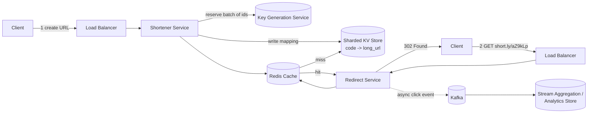

# 1. Design a URL Shortener (bit.ly / TinyURL)

> The "hello world" of system design interviews — deceptively simple, but it tests estimation, ID generation, caching, and read/write asymmetry.

## 1.1 Requirements

**Functional**
- Given a long URL, generate a short alias (e.g., `short.ly/aZ9kLp`).
- Optionally allow a user-supplied custom alias.
- Redirecting to the short URL sends the client to the original long URL.
- Links can expire (TTL) or be deleted by the owner.
- Basic click analytics (count, referrer, timestamp) — often a follow-up, not core.

**Non-functional**
- **Read-heavy**: redirects vastly outnumber creations (~100:1 or higher).
- Redirect latency should feel instant — **p99 < 50 ms**.
- High availability > strong consistency for redirects; **alias uniqueness must be strongly consistent** (two users must never get the same code for different URLs).
- URLs should be unguessable-ish (not sequential) but that's a soft requirement.

**Clarifying questions to ask:** Custom aliases allowed? Expiry needed? Do we need click analytics? Expected QPS/scale? Is this global (multi-region)?

## 1.2 Back-of-the-Envelope Estimation

- 100M new URLs/month → ~40 writes/sec average.
- Read:write ratio 100:1 → ~4K reads/sec average, peak (3-5x) ≈ 20K reads/sec.
- Retention 5 years: 100M × 12 × 5 = **6B URLs**.
- Each record (short code + long URL + metadata) ≈ 500 bytes → **~3 TB** total raw storage (before replication).
- Short code space: base62 (`[A-Za-z0-9]`) at 7 characters gives 62⁷ ≈ 3.5 trillion combinations — comfortably covers 6B+ growth for decades.

## 1.3 High-Level Architecture

- **Shortener service** — stateless, handles `POST /shorten`.
- **Key Generation Service (KGS)** — hands out unused codes in batches so no per-request coordination is needed (see 1.5).
- **Redirect service** — stateless, handles `GET /{code}`, cache-first lookup.
- **Cache** — Redis in front of the DB; ~20% of codes drive ~80% of traffic (Zipfian), so a modestly sized cache absorbs most reads.
- **Datastore** — key-value shaped access (`code → url`), so a partitioned KV store (DynamoDB/Cassandra) or Postgres with read replicas both work at this scale — say the trade-off out loud in the interview.

## 1.4 API & Data Model

| Endpoint | Description |
|---|---|
| `POST /api/v1/shorten {long_url, custom_alias?, ttl?}` | Returns short code |
| `GET /{code}` | 302 redirect to long URL |
| `DELETE /api/v1/{code}` | Owner deletes a link |
| `GET /api/v1/{code}/stats` | Click analytics |

**Table `urls`**

| Column | Type | Notes |
|---|---|---|
| `code` | varchar(7), PK | base62 short code |
| `long_url` | text | original URL |
| `user_id` | bigint, nullable | owner (if authenticated) |
| `created_at` / `expires_at` | timestamp | for TTL cleanup |
| `click_count` | bigint | denormalized counter, updated async |

Partition key = `code` (uniform hash distribution → no hot ranges, unlike sequential IDs).

## 1.5 Deep Dive — ID / Code Generation

Three approaches, trade-offs matter here:

1. **Hash the long URL** (MD5/SHA-256, take first 7 chars, base62-encode). Simple, but collisions require re-hashing with a salt, and it doesn't naturally support custom aliases cleanly.
2. **Random generation + uniqueness check** — generate a random 7-char code, `INSERT ... ON CONFLICT` retry on collision. Fine at low collision probability but adds retry latency under load.
3. **Pre-generated Key Generation Service (recommended)** — a dedicated service pre-computes unique codes offline (shuffle a counter through a permutation, or draw from a Snowflake-style unique ID and base62-encode it) and stores them in a `available_keys` table. Application servers **check out a batch** (e.g., 1000 keys) at startup, hand them out in memory, and only go back to the KGS when the batch is exhausted. This removes uniqueness coordination from the hot write path entirely — the only shared state is "which batches are checked out," touched rarely.

Custom aliases still need a **uniqueness constraint** (unique index on `code`, or a linearizable claim if the store doesn't support unique indexes) — this is the one place in the whole design that needs strong consistency.

## 1.6 Deep Dive — Redirect Path & Caching

- **301 vs 302:** 301 (permanent) lets browsers cache the redirect, reducing server load but killing click analytics after the first hit. **302 (temporary)** is preferred so every click hits your service and can be counted.
- **Cache-aside** pattern: on redirect, check Redis first; on miss, read DB and populate cache with TTL + jitter (avoid synchronized expiry stampedes).
- **Negative caching**: cache "not found" for invalid codes briefly, otherwise bots hammering random codes hit the DB every time (cache penetration).
- Clicks are **never written synchronously** to the DB — emit a lightweight event to Kafka, aggregate counts in a stream processor, and flush periodically. This keeps the redirect's hot path to a single cache read.

## 1.7 Scaling, Failure Handling & Trade-offs

- **Hot/celebrity link** (viral URL): CDN/edge caching in front of the redirect service absorbs the spike; the origin barely notices.
- **Region loss**: multi-region read replicas of the KV store; writes for custom-alias claims are pinned to a home region to preserve the uniqueness guarantee, then replicated asynchronously.
- **Database choice**: at 6B rows a partitioned NoSQL store scales writes/storage horizontally with minimal operational tuning; a single Postgres instance would need explicit sharding much sooner. If the interviewer pushes for strict transactional guarantees on custom aliases, a relational store with a unique index is simpler to reason about at moderate scale.
- **Expiry cleanup**: a background batch job (or TTL feature of the KV store) sweeps expired rows — don't do this synchronously on read.

## 1.8 Common Follow-ups

- "How would you support custom domains per user?" → store a `domain` column, route by `Host` header at the LB/CDN layer.
- "How do you prevent abuse (spam/phishing links)?" → rate limit `POST /shorten` per API key/IP, run long URLs through a safe-browsing/blocklist check asynchronously.
- "What if you outgrow base62(7)?" → bump to 8 characters (62⁸ ≈ 218 trillion) — no migration needed since old codes remain valid, just allocate longer codes going forward.
