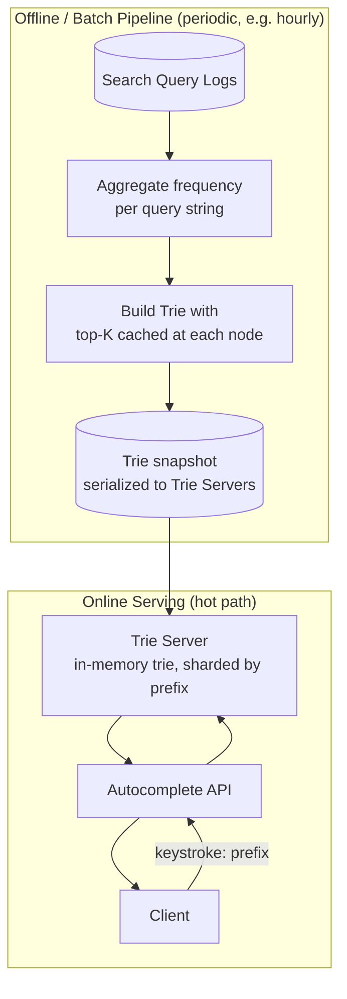
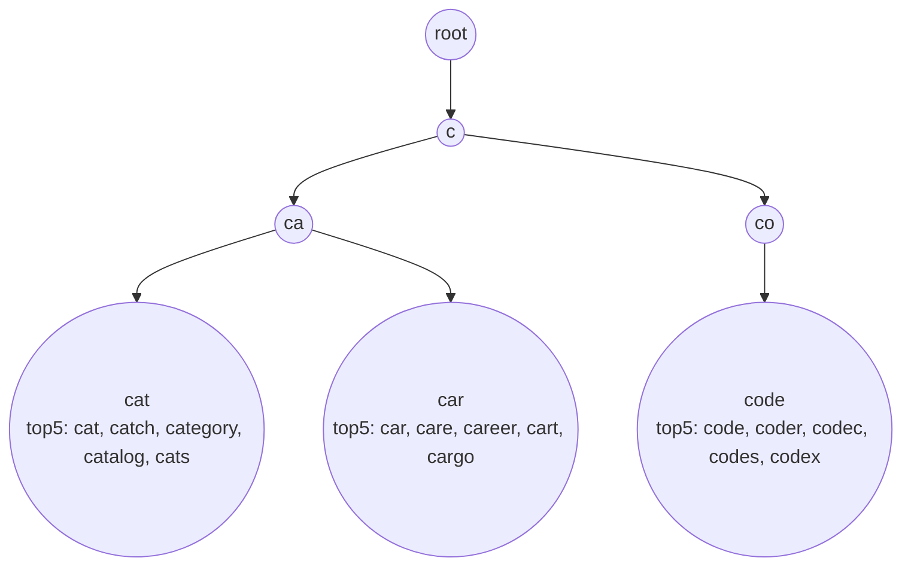

# 10. Design a Search Autocomplete / Typeahead System

> A read-latency-obsessed question centered on one data structure — the trie — plus the harder half: how do you keep suggestions fresh without recomputing everything on every keystroke.

## 10.1 Requirements

**Functional**
- As a user types a prefix, return the **top-K most relevant completions** (e.g., top 5 by search frequency).
- Update rankings over time as query popularity shifts.

**Non-functional**
- **Extremely low latency** — suggestions must render within ~100 ms of each keystroke, or the feature feels broken.
- High read QPS (every keystroke of every user is a query) vs. much lower write rate (aggregated query-log updates, not per-keystroke writes).
- Suggestions don't need to be perfectly real-time — a few minutes/hours of staleness in rankings is fine.

## 10.2 Back-of-the-Envelope Estimation

- 10M searches/day generate query-log entries; aggregated into a smaller set of **unique queries with frequency counts** (Zipfian — a small fraction of unique queries dominate volume).
- Read QPS is roughly **(searches/day) × (avg query length in characters)**, since a query of length 10 fires ~10 autocomplete requests (one per keystroke) — this is often the loudest read amplifier in the whole system, and the reason client-side debouncing (only firing a request after ~100–200ms of typing pause) matters as much as the backend design.

## 10.3 High-Level Architecture

**Key architectural decision**: split into an **offline pipeline** (build/update the trie from aggregated logs, on a schedule) and an **online serving path** (pure, fast, read-only trie lookups) — this is the same "batch-computes-a-derived-view, serving-layer-only-reads-it" pattern from the batch-processing chapter, applied to a search structure instead of a database index.

## 10.4 Deep Dive — The Trie with Cached Top-K

A **trie** (prefix tree) naturally supports "all strings with this prefix," but naively walking the whole subtree under a prefix node to find the top-K on every request is too slow for a hot path serving huge QPS.

**Optimization: cache the top-K completions at every trie node**, computed once during the offline build:

- Each node stores its own precomputed "top 5 completions rooted here," so a lookup for prefix `"ca"` is a single trie traversal to that node (O(prefix length)) followed by an O(1) read of its cached list — no subtree scan at request time.
- This trades memory (every node duplicates some of its descendants' top strings) for serving-time speed — the right trade given the read:write ratio here.

## 10.5 Deep Dive — Keeping Suggestions Fresh

- **Periodic rebuild** (simplest): batch job re-aggregates the query log and rebuilds the whole trie every N minutes/hours, then atomically swaps the old trie for the new one on serving nodes (blue-green style, zero downtime).
- **Incremental updates**: for trending/breaking queries where minutes matter, a lighter-weight path increments counts for existing nodes and re-sorts just the affected top-K lists, without a full rebuild — more complex, only worth it if freshness truly is a hard requirement (e.g., breaking news search).
- **Personalization layer** (common follow-up): the global trie gives generic top-K; a thin per-user re-ranking step (recent searches, location) can reorder or inject candidates on top of the generic list without needing a separate trie per user.

## 10.6 Scaling & Serving

- **Sharding the trie**: partition by first 1–2 characters of the prefix (e.g., `a*`–`m*` on one shard group, `n*`–`z*` on another) so no single machine needs to hold the entire structure in memory once vocabulary and language coverage grow large (multi-language support especially).
- **Replication for read scale**: trie servers are read-only and stateless with respect to serving (all mutation happens offline), so scaling reads is simply adding more replicas behind a load balancer — one of the simpler scaling stories in this whole list, precisely because writes were moved out of the hot path.
- **Caching in front of trie servers**: an additional Redis/CDN cache for the most common prefixes (single letters, common short prefixes get hammered) shaves off even the trie traversal for the hottest queries.

## 10.7 Common Follow-ups

- "How would you filter out offensive/banned suggestions?" → a blocklist check during the offline aggregation step, before a query string is ever inserted into the trie — never filter at serve time per-request, that's wasted repeated work for a property that doesn't change per request.
- "How do you handle typos (fuzzy prefix match)?" → out of scope for a pure trie; typically layered on top via a separate edit-distance index or by falling back to a full-text search engine (Section 19) when the trie returns nothing.
- "Why not just query the database with `LIKE 'prefix%'` on every keystroke?" → even with an index, a relational `LIKE` prefix scan under this QPS (every keystroke, every user) would overwhelm the database; the trie is an intentionally denormalized, purpose-built read structure exactly because the access pattern is so narrow and so hot.
