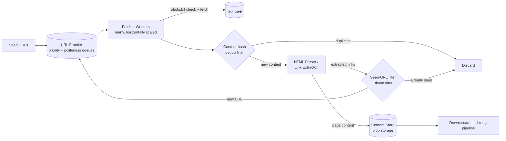
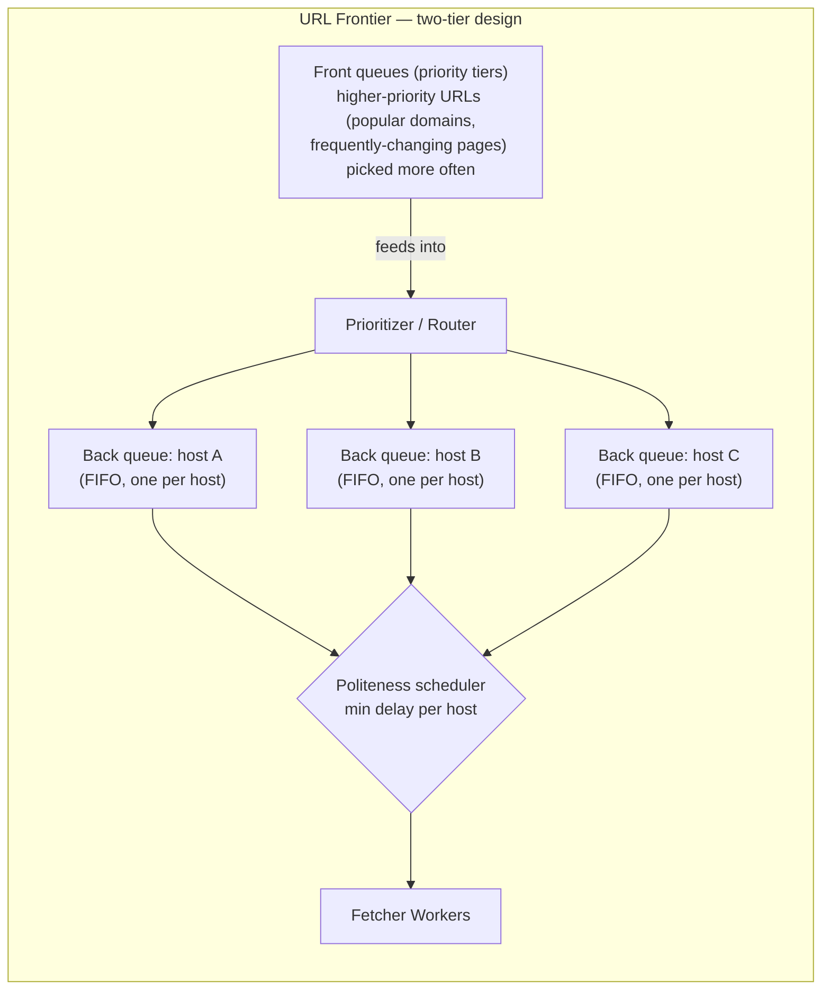

# 11. Design a Web Crawler

> Tests graph traversal at planetary scale, politeness/rate-limiting toward external systems you don't control, and dealing with an effectively infinite, adversarial input space.

## 11.1 Requirements

**Functional**
- Given seed URLs, discover and download web pages, extract links, and recursively crawl.
- Store crawled content for downstream indexing (Section 19).
- Avoid recrawling unchanged pages too often; recrawl changed pages eventually.

**Non-functional**
- **Scalability**: billions of pages.
- **Politeness**: never overwhelm a single host — respect `robots.txt` and rate-limit per domain.
- **Avoid infinite loops/traps** (crawler traps, infinite calendar pages, duplicate content via URL parameters).
- Extensible to new content types (HTML, PDF, images metadata).

## 11.2 High-Level Architecture

## 11.3 Deep Dive — The URL Frontier (the heart of this design)

The frontier is not a single FIFO queue — it must balance **priority** (crawl important pages first) against **politeness** (never hammer one host):

- **Front queues** implement prioritization — pages estimated as higher value (PageRank-like score, update frequency, seed proximity) get pulled more often.
- **Back queues** are **one FIFO queue per host**, guaranteeing that a fetcher never has two in-flight requests to the same domain simultaneously, and a per-host timer enforces a minimum delay between requests (politeness). A mapping table routes each URL to its host's back queue.
- This two-tier structure is the standard answer (from the Mercator crawler design) for "how do I stay polite without starving important sites."

## 11.4 Deep Dive — Deduplication at Two Levels

1. **URL-seen filter**: before even queuing a URL for fetching, check whether it's already been discovered. At billions of URLs, an exact set is too large to hold cheaply in memory — a **Bloom filter** gives a compact, fast "definitely not seen" / "maybe seen" check, with false positives (occasionally skipping a genuinely new URL) an acceptable trade-off for the memory savings, backed by a persistent store for the definitive check on maybes.
2. **Content-hash dedup**: many distinct URLs serve identical or near-identical content (session IDs in query strings, mirrors, syndicated articles). Hash the fetched content (SHA-256, or a fuzzy/near-duplicate hash like SimHash for near-identical pages) and skip re-parsing/re-storing if seen before — this also prevents crawler traps where infinite distinct URLs generate the same page.

## 11.5 Deep Dive — Crawler Traps & Robustness

- **Crawler traps**: dynamically generated infinite link spaces (e.g., a calendar app linking "next month" forever). Mitigations: cap crawl **depth** per domain, cap **total pages per domain** within a time window, and flag domains whose content-hash dedup rate is suspiciously low (mostly "new" content that's actually near-duplicate) for manual review or exclusion.
- **`robots.txt` and crawl-delay**: fetched and cached per domain (with its own TTL) before any URL from that domain is fetched — a hard, non-negotiable gate, not a best-effort check.
- **Freshness / recrawl policy**: pages are recrawled at a frequency proportional to their observed change rate (a news homepage might be recrawled hourly; a static "About Us" page maybe monthly) — tracked via last-modified headers/content-hash changes over time, feeding back into the front-queue prioritization.
- **Distributed coordination**: fetcher workers are stateless and horizontally scaled; the frontier (often itself sharded by host-hash so all URLs for one host land on the same frontier shard) is the one piece of shared state, making per-host politeness enforcement local to a shard rather than needing global coordination.

## 11.6 Storage & Scale

- **Content store**: raw fetched pages go to blob storage (same reasoning as Pastebin's design, Section 2) — large, immutable-per-crawl blobs, not a good fit for a relational row.
- **Metadata**: `url`, `last_crawled_at`, `content_hash`, `status`, `depth` in a fast KV/wide-column store, partitioned by URL hash for even distribution across fetchers and storage nodes alike.
- **Scale numbers to anchor estimation**: crawling 1B pages/month ≈ ~400 pages/sec average fetch rate; average page ~500 KB (with embedded resources) → hundreds of TB/month raw before dedup — dedup and compression matter enormously here.

## 11.7 Common Follow-ups

- "How do you prioritize which pages to crawl first?" → a scoring function combining inbound link count/PageRank-style importance, historical change frequency, and freshness need — fed into the front-queue tiers.
- "How would you crawl JavaScript-rendered (SPA) pages?" → route those hosts/pages to a headless-browser rendering tier instead of a raw HTTP fetcher, at much higher per-page cost — usually a separate, smaller worker pool reserved for pages that fail a "meaningful content in raw HTML" heuristic.
- "How do you detect and avoid crawling malicious/spam content?" → a content-classification step post-fetch (same idea as the pastebin abuse-scanning step) that can flag or exclude a domain from future crawling without blocking the pipeline synchronously.
