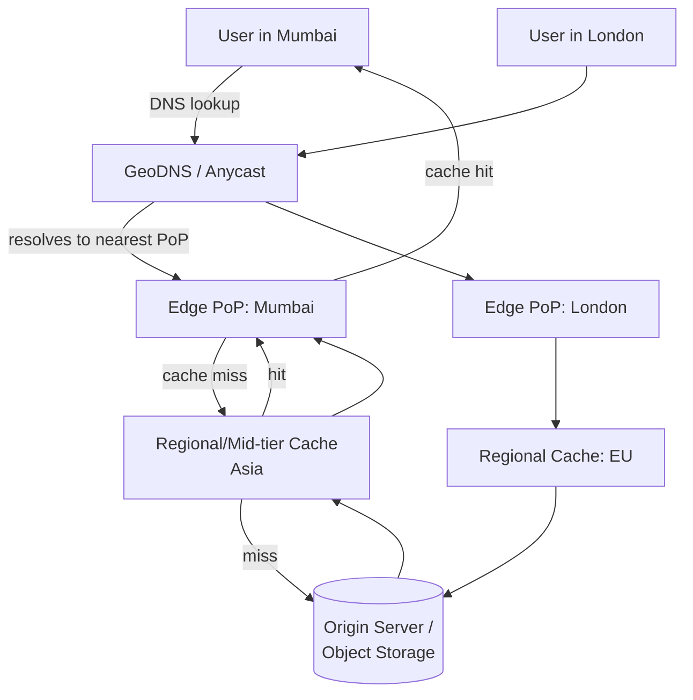

# 12. Design a Content Delivery Network (CDN)

> Less about a single service, more about geography: how do you get bytes physically close to users, keep edge caches coherent enough, and route each request to the *right* nearby edge without a slow, centralized decision.

## 12.1 Requirements

**Functional**
- Serve static (and increasingly dynamic) content from edge locations close to end users.
- Cache origin content at the edge; fetch from origin on miss.
- Support invalidation/purge when origin content changes.

**Non-functional**
- **Minimize latency** by minimizing physical distance and network hops to the user.
- **Massively reduce origin load** — a good CDN should absorb the overwhelming majority of requests before they ever reach the origin.
- High availability — an edge location failure should fail over transparently.

## 12.2 High-Level Architecture

- **Points of Presence (PoPs)**: hundreds of edge locations distributed globally, each holding a subset of content close to a population of users.
- **Two-tier caching** (edge → regional/mid-tier → origin) means a cache miss at one edge PoP doesn't necessarily hit the origin directly — a regional tier absorbs misses from many nearby edges, so the origin only ever sees a tiny fraction of total traffic ("shielding" the origin).

## 12.3 Deep Dive — Request Routing (getting users to the *right* PoP)

| Method | How it works | Trade-offs |
|---|---|---|
| **DNS-based (GeoDNS)** | Resolver returns different IPs based on the requester's geographic location/network | Simple, works everywhere; but DNS **TTL caching** means routing decisions are somewhat sticky/slow to change (can't react to a PoP outage within seconds) |
| **Anycast** | The same IP address is announced from many PoPs; BGP routing naturally sends the packet to the topologically nearest one | Fast failover (BGP reconverges automatically if a PoP disappears), no DNS TTL lag; more complex to operate |
| **Application-layer redirect** | Client hits a central endpoint that computes the best PoP and issues an HTTP redirect | Most flexible (can factor in real-time load, not just geography), but adds a round trip |

Most large CDNs combine **Anycast for fast, coarse routing** with **application-level logic** for load-aware fine-tuning within a region.

## 12.4 Deep Dive — Caching Strategy at the Edge

- **Cache-control headers drive everything**: `Cache-Control: max-age`, `immutable`, `stale-while-revalidate`, and `ETag`/`Last-Modified` for conditional revalidation — the CDN is fundamentally an HTTP-caching layer, so origin servers express caching policy declaratively rather than the CDN guessing.
- **Cache key design**: normally URL + relevant headers (e.g., `Accept-Encoding`, sometimes `Cookie` for personalized content) — a cache key that's too broad causes wrong content to be served to different users; too narrow (including irrelevant headers like a random request ID) tanks the hit ratio to near zero.
- **Static vs dynamic content**: static assets (images, JS/CSS bundles, video segments) are the classic, easy case — long TTLs, high hit ratios. Dynamic/personalized content either bypasses the CDN entirely, uses very short TTLs, or is decomposed so the static *shell* is cached and personalized fragments are fetched separately (edge-side includes, or client-side composition).
- **Same stampede/penetration/avalanche failure modes as any cache** (Section 4.5) apply at the edge too — a viral asset's first miss at each of hundreds of PoPs could otherwise stampede the origin; mitigated with **request collapsing** (one in-flight origin fetch per PoP serves all concurrent requests for the same miss) and the regional mid-tier shielding layer.

## 12.5 Deep Dive — Invalidation / Purge

Cache invalidation is a genuinely hard, distributed problem here: content is replicated across potentially hundreds of geographically independent PoPs.

- **TTL-based (passive)**: simplest — just wait for content to expire naturally. Works well when origin content changes are anticipated (versioned filenames/URLs, e.g., `app.a1b2c3.js`, sidestep invalidation entirely — **cache-busting via content-hashed filenames is the single best practice** here, since a "new" URL is trivially a cache miss with no propagation delay).
- **Active purge (push)**: an explicit purge API propagates a "drop this key" command to all PoPs — necessary for content that must be pulled immediately (legal takedown, incorrect pricing pushed live). This requires a **reliable broadcast mechanism** to hundreds of independent caches, which is inherently slower and less certain than a local cache invalidation — purges typically take seconds to low minutes to fully propagate, a trade-off worth stating explicitly.

## 12.6 Scaling & Failure Handling

- **PoP failure**: Anycast/GeoDNS routes around a dead PoP automatically; in-flight requests fail over to the next-nearest PoP, which may have a cold cache for that content temporarily (brief regional origin load spike, absorbed by the regional shielding tier).
- **Origin shield**: a single logical "shield" layer (or a small number of regional shields) is the *only* thing allowed to talk to the origin directly — this caps the maximum concurrent origin load regardless of how many edge PoPs exist globally, since all their misses funnel through a bounded number of shield nodes.
- **Security functions riding along**: CDNs are also the natural place for TLS termination close to users, DDoS absorption (huge aggregate edge capacity soaks up volumetric attacks before they reach origin), and WAF rules — worth a one-line mention since interviewers sometimes probe on this.

## 12.7 Common Follow-ups

- "Push CDN vs pull CDN?" → **pull** (origin is queried lazily on first miss, as described above) is the default for most web content; **push** (origin proactively uploads content to all PoPs ahead of demand) suits scenarios with a known, bounded content set and a need to guarantee it's warm everywhere before traffic arrives (e.g., a scheduled global product launch asset).
- "How would you serve personalized/dynamic content through a CDN?" → split the response: cache the static shell/layout at the edge, fetch personalized fragments via a fast API call from the client or via edge compute (edge functions) that can run light logic per-request without a full origin round trip.
- "How do you measure whether your CDN is actually helping?" → origin offload ratio (% of requests never reaching origin) and edge cache hit ratio are the two headline metrics; latency percentiles by region validate the "closer to users" goal directly.
