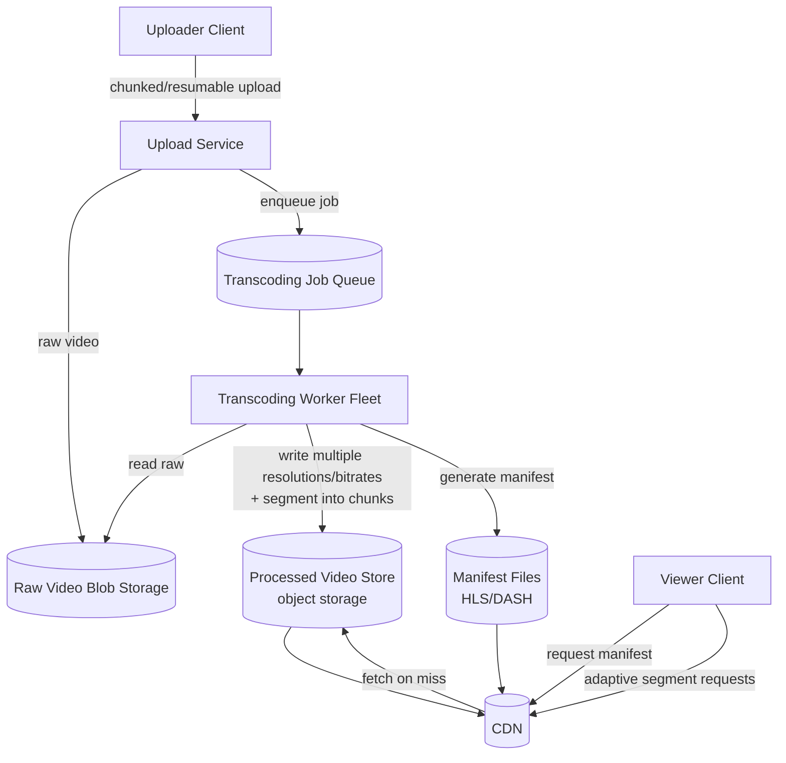

# 13. Design a Video Streaming Platform (YouTube / Netflix)

> Combines a heavy asynchronous processing pipeline (transcoding) with a CDN-and-caching serving story — the interesting parts are almost entirely in "what happens between upload and playback," not the CRUD around it.

## 13.1 Requirements

**Functional**
- Users upload videos; the platform makes them playable across a wide range of devices/network conditions.
- Playback should adapt to the viewer's bandwidth (no buffering on slow connections, high quality on fast ones).
- Search, recommendations, comments, likes (often out of scope, focus is upload → transcode → stream).

**Non-functional**
- **Read (view) traffic vastly exceeds write (upload) traffic**.
- Uploads are large (hundreds of MB to GBs) and must survive network interruption.
- Global low-latency playback start (fast "time to first frame").
- Storage-efficient — the same video is stored in many resolutions/formats.

## 13.2 High-Level Architecture



## 13.3 Deep Dive — Upload & Transcoding Pipeline

- **Resumable/chunked upload**: large files are split into chunks client-side, uploaded independently (with retry per chunk), and reassembled server-side — a network blip mid-upload only costs one chunk's retry, not restarting a multi-GB upload from zero.
- **Transcoding, the core async workload**: once the raw file lands, a job is enqueued to convert it into **multiple resolutions and bitrates** (e.g., 240p/480p/720p/1080p/4K, each at a couple of bitrate targets) and **segment** each into small chunks (2–10 seconds) for adaptive streaming. This is CPU/GPU-intensive and can take much longer than the video's own runtime — it must be fully decoupled from the upload response (the uploader gets "processing" status immediately, not a synchronous wait).
- **Worker fleet is horizontally scalable and stateless** — a job queue (Section 16/17-style) distributes transcoding jobs across many workers; a worker dying mid-job just means the job gets retried by another worker, since progress isn't held in worker memory as the source of truth.
- **Thumbnails, captions, content moderation** are typically parallel jobs off the same raw upload, fanning out from one event rather than a single monolithic pipeline stage.

## 13.4 Deep Dive — Adaptive Bitrate Streaming (the "why is this hard" part)

```mermaid
sequenceDiagram
    participant V as Viewer
    participant CDN as CDN Edge
    participant Player as Video Player (client)
    V->>CDN: GET manifest.m3u8 (or .mpd for DASH)
    CDN-->>V: manifest listing available bitrates + segment URLs
    Player->>Player: start at a conservative bitrate
    loop every few segments
        Player->>Player: measure recent download throughput
        Player->>CDN: GET next segment at chosen bitrate
        CDN-->>Player: segment (2-10s of video)
        Player->>Player: if throughput dropped, switch to lower bitrate;<br/>if headroom, switch up
    end
```

- **HLS (Apple) / MPEG-DASH (open standard)**: both work the same way conceptually — a manifest lists every available quality rendition and the URLs of their segments; the player, not the server, decides which quality to fetch next based on **its own measured download speed and buffer health**. This client-driven adaptation is what "adaptive bitrate streaming" means, and it's why transcoding must produce many pre-segmented renditions ahead of time rather than the server dynamically re-encoding per request.
- **Segment size trade-off**: shorter segments (2–4s) allow faster quality switching and lower latency to first frame, but add HTTP request overhead and manifest complexity; longer segments (6–10s) are more efficient but coarser-grained adaptation.

## 13.5 Storage & CDN Strategy

- **Storage tiering by popularity**: a small fraction of videos (recent uploads, viral content) drive most views — keep those fully replicated across CDN edges; long-tail older content can live primarily in cheaper origin/object storage and be pulled to the edge on-demand (same "hot 20%" reasoning as the caching chapter).
- **CDN is not optional here — it's the primary serving path**: video is exactly the workload CDNs are built for (large, cacheable, immutable-per-rendition segments) — see Section 12 for the general CDN design; this system is one of its biggest consumers in practice.
- **Storage cost math**: storing 5 renditions of every video roughly multiplies raw storage several-fold — worth explicitly calling out as a cost/quality trade-off (e.g., only generate the highest few renditions eagerly, generate rarely-requested ones like 4K lazily on first request).

## 13.6 Scaling & Failure Handling

- **Transcoding backlog**: a viral upload spike is absorbed by the job queue; workers autoscale to drain the backlog — the visible user-facing effect is "processing" status taking longer, not a failure, as long as the queue itself doesn't run out of capacity to accept new jobs.
- **Partial rendition availability**: playback can often start as soon as the *lowest* rendition finishes transcoding, without waiting for every quality level to complete — worth mentioning as a latency-hiding trick (prioritize the smallest/fastest rendition job first).
- **Live streaming (a common follow-up)** changes the model significantly: there's no "finished raw file" to batch-transcode — encoding happens in near-real-time on a continuous stream, segments are published incrementally, and the acceptable end-to-end latency budget (seconds, not the on-demand case's "eventually") drives much shorter segment durations and a fundamentally streaming (not batch) transcoding pipeline.

## 13.7 Common Follow-ups

- "How would you reduce time-to-first-frame?" → prioritize transcoding/publishing the lowest bitrate rendition first, prefetch the manifest and first segment as early as possible client-side, and rely on CDN edge presence to avoid a long-haul first fetch.
- "How do you handle DRM/content protection?" → segments are encrypted, and the player fetches a decryption license/key from a separate license server after authorization — orthogonal to the storage/transcoding architecture, added as an extra step in the playback sequence.
- "Live vs on-demand — same architecture?" → same conceptual pipeline (transcode → segment → adaptive manifest → CDN) but live trades batch throughput for continuous low-latency processing, and viewer requests hit a sliding window of very recent segments instead of a fixed catalog.
