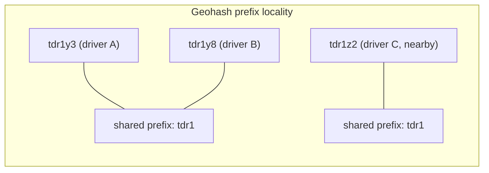
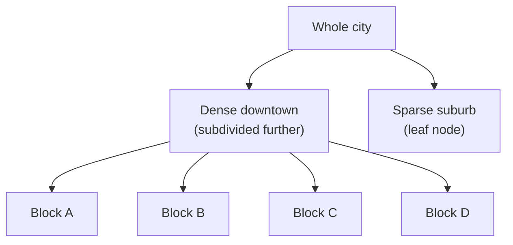
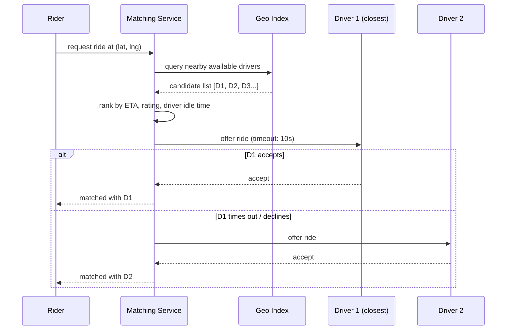

# 14. Design a Ride-Sharing System (Uber / Lyft)

> The flagship **geospatial** question — real-time location tracking, efficient proximity search, and a matching algorithm under tight latency, layered on top of a fairly standard request/dispatch workflow.

## 14.1 Requirements

**Functional**
- Riders request a ride from their location to a destination.
- System matches the rider to a nearby available driver.
- Both parties track the ride in real time (driver's live location).
- Pricing (including surge), payment, ratings — often follow-ups, not core.

**Non-functional**
- **Low-latency matching** — riders expect a match within a few seconds.
- Handle continuous, high-volume location updates from millions of active drivers.
- Geographic locality — most matching logic only needs to reason about a small local area, not the whole world at once.

## 14.2 High-Level Architecture

```mermaid
flowchart TB
    Driver[Driver App] -->|location ping every few sec| LocationSvc[Location Ingestion Service]
    LocationSvc -->|update driver position| GeoIndex[(Geospatial Index<br/>quadtree / geohash, sharded by region)]
    LocationSvc -->|append raw pings| LocationLog[(Location History Store)]

    Rider[Rider App] -->|request ride at (lat,lng)| MatchSvc[Matching Service]
    MatchSvc -->|find nearby available drivers| GeoIndex
    MatchSvc -->|rank candidates: distance, ETA, rating| Ranker[Ranking/Scoring]
    MatchSvc -->|offer to top driver| Driver
    Driver -->|accept| MatchSvc
    MatchSvc -->|confirm match| Rider
    MatchSvc -->|persist trip| TripDB[(Trip Store)]
```

## 14.3 Deep Dive — Geospatial Indexing (the crux of this question)

The core operation is: **"given a point, find all available drivers within N km, fast."** A naive scan-and-filter over all drivers' lat/lng is far too slow at scale. Two standard structures:

**Geohash**: encode `(lat, lng)` into a base32 string where nearby locations tend to share prefixes.


- Drivers are stored keyed by geohash prefix (e.g., in Redis sorted sets or a database index on the geohash column). "Find nearby drivers" becomes "look up this cell and its 8 neighboring cells" — a small, bounded set of lookups instead of a full scan.
- Precision (string length) trades cell size vs. lookup count — a 6-character geohash cell is roughly ~1.2km × 0.6km, a reasonable "local search" granularity for ride matching.

**Quadtree**: recursively subdivide the map into 4 quadrants, only subdividing further where driver density is high.


- Naturally adapts cell size to driver density — dense downtown areas get fine-grained cells, sparse suburbs stay coarse — which geohash's fixed-precision grid doesn't do as elegantly.
- A common real-world choice (Uber's own H3 hexagonal grid is a further refinement addressing geohash/quadtree edge-boundary distortions, worth a one-line mention as "what production systems actually use").

Either structure is **sharded by region** (e.g., by city or by top-level geohash prefix) so that a burst of activity in one city doesn't require touching index shards responsible for other cities — matching is an inherently local operation.

## 14.4 Deep Dive — Location Updates at Scale

- Drivers ping their location every few seconds. At millions of concurrent active drivers, this is a **massive continuous write stream** — writes go to an in-memory geospatial index (Redis `GEOADD`/sorted sets, or a custom quadtree service) for fast matching reads, while a fire-and-forget copy streams to a durable log (Kafka) for historical analytics/ETA modeling, decoupled from the latency-critical matching path.
- Stale entries (driver went offline, app crashed) are handled with a **TTL** on the index entry — no ping within N seconds silently drops the driver from "available" results, rather than requiring an explicit offline signal.

## 14.5 Deep Dive — Matching Algorithm



- Candidates are ranked by more than raw distance: estimated **time to arrival** (accounting for road network, not straight-line distance), driver rating, and fairness (avoid always picking the same top driver — factor in idle time to spread demand).
- **Sequential offer with timeout** (as shown) is simpler to reason about than trying to lock multiple drivers simultaneously; a short accept/decline timeout keeps rider wait time bounded even if a driver doesn't respond.
- **Avoiding double-booking**: once a driver accepts, they must be atomically marked unavailable (a conditional update / distributed lock on the driver's status) before confirming to the rider — a race where two riders are both told "matched with driver X" is the one correctness bug this design must rule out explicitly.

## 14.6 Scaling & Failure Handling

- **Surge pricing** is really a signal-propagation problem, not a pricing-algorithm problem for this design: local supply/demand ratio per geo-cell (from the same sharded index) feeds a pricing multiplier shown to riders before they confirm — computed regionally, never globally.
- **Regional sharding**: since matching is local, the entire pipeline (geo-index, matching service instances) can be **partitioned by city/region**, letting each region scale and fail independently — a matching service outage in one city shouldn't affect another.
- **Driver reconnect / app crash mid-trip**: trip state lives in the durable `TripDB`, not in the matching service's memory, so a driver's app restarting mid-trip can resync current trip state rather than losing the assignment.

## 14.7 Common Follow-ups

- "How would you compute accurate ETA (not just straight-line distance)?" → a routing/road-network service (external or in-house, akin to a simplified Google Maps) that scores candidates by actual travel time along roads, not geodesic distance — the geospatial index narrows candidates cheaply, then a more expensive routing call ranks the short list.
- "How do you handle a large event causing a demand spike in one small area (concert letting out)?" → this is exactly what regional sharding + surge pricing are for — the affected geo-cells see index-query load spike (still cheap, it's just reads) and rising prices naturally throttle demand while pulling supply from adjacent cells.
- "What data would you log for later analytics/ML (ETA prediction, fraud detection)?" → the raw location ping stream (via Kafka) feeds those pipelines independently of the real-time matching path — another instance of "the fast path only keeps what it needs; everything else is a downstream, decoupled consumer of the same event stream."
