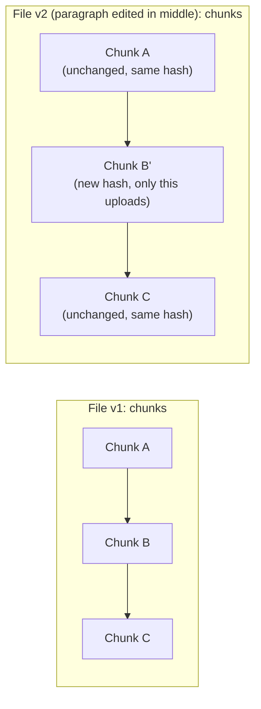
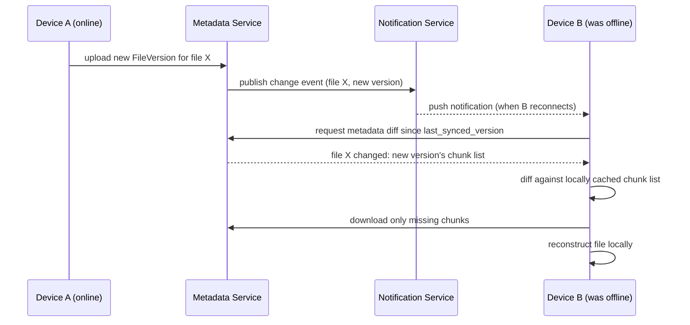

# 15. Design a File Storage & Sync Service (Dropbox / Google Drive)

> Splits into two genuinely different problems that are easy to conflate: durable, deduplicated **storage** of large files, and **sync** — efficiently propagating changes across a user's many devices.

## 15.1 Requirements

**Functional**
- Upload/download files and folders; share with other users.
- **Sync**: a change made on one device (edit, add, delete, rename) propagates to all the user's other devices automatically.
- Version history / conflict handling when the same file is edited offline on two devices.

**Non-functional**
- Large files (up to GBs), efficient re-upload of only what changed (not re-sending a whole file for a 1-byte edit).
- Strong durability (users trust this system with irreplaceable data) — replicate content across failure domains.
- Sync should feel near-real-time when online; must work correctly after long offline periods.

## 15.2 High-Level Architecture

```mermaid
flowchart TB
    Client1[Client Device A] -->|watch local folder for changes| SyncAgentA[Sync Agent]
    SyncAgentA -->|chunk + hash + upload only new/changed chunks| BlockSvc[Block/Chunk Service]
    BlockSvc -->|dedupe check by hash| BlockStore[(Block Storage<br/>content-addressed, object storage)]
    SyncAgentA -->|update file metadata| MetaSvc[Metadata Service]
    MetaSvc -->|persist| MetaDB[(Metadata DB:<br/>file tree, versions, block lists)]
    MetaSvc -->|publish change event| Notify[(Notification / Pub-Sub Service)]
    Notify -->|push "something changed"| SyncAgentB[Sync Agent on Client B]
    SyncAgentB -->|pull metadata diff| MetaSvc
    SyncAgentB -->|download only missing chunks| BlockSvc
```

## 15.3 Deep Dive — Chunking, Hashing, and Deduplication

Uploading a whole file on every edit is wasteful, especially for large files with small changes (a 500-page document, one paragraph edited).

- **Chunking**: files are split into fixed-size or content-defined chunks (e.g., ~4MB blocks; content-defined chunking using a rolling hash handles insertions/deletions gracefully — a single inserted byte doesn't shift every subsequent chunk boundary the way naive fixed-offset chunking would).
- **Content hashing**: each chunk is hashed (SHA-256); the file's metadata becomes an **ordered list of chunk hashes**, not the file bytes themselves.
- **Deduplication, two levels**: (1) if a chunk's hash already exists in block storage — from this user's own previous version, or even from an unrelated user uploading the same block (e.g., identical file shared by many people) — skip the upload entirely and just reference the existing block; (2) only the **changed chunks** of a modified file need to be re-uploaded and re-downloaded by other devices, turning a small edit into a small network transfer regardless of total file size.



## 15.4 Deep Dive — Metadata Model & the File Tree

The metadata service is the source of truth for **structure** (folders, filenames, permissions) and **versions**, separate entirely from the content-addressed block storage:

| Entity | Key fields |
|---|---|
| `File` | `file_id`, `name`, `parent_folder_id`, `owner_id`, `current_version_id` |
| `FileVersion` | `version_id`, `file_id`, `created_at`, ordered list of `chunk_hash`es, `size` |
| `Folder` | `folder_id`, `parent_folder_id`, `name` (tree structure) |

Every edit creates a **new immutable `FileVersion`** rather than mutating one in place — this is what gives "version history" and undo for free, and it means sync only ever needs to reconcile "which version does each device have," never worry about partial in-place mutations racing each other.

## 15.5 Deep Dive — Sync Protocol & Conflict Handling



- **Long-poll/WebSocket notification** tells online devices "something changed, go sync" instead of constant polling; a device that was offline simply syncs the full metadata diff on reconnect using a `last_synced_version` cursor per client — the same "resume from a cursor" pattern used in the chat design (Section 7).
- **Conflict detection**: if device A and device B both edited the same file while offline from each other, both attempt to create a new version from the *same* parent version — the metadata service detects this as a **version conflict** (two children of one parent) using an optimistic concurrency check (compare-and-swap on `current_version_id`).
- **Conflict resolution**: rather than trying to auto-merge arbitrary binary files (usually impossible), the standard approach is to **keep both**: the losing write is saved as a separate file (`document (Conflicted Copy from Device B).docx`), and the user resolves it manually. Structured/text-mergeable content is the exception (see Section 20, collaborative editing, which solves this properly for real-time text using OT/CRDTs).

## 15.6 Storage & Scaling

- **Block storage** is exactly the object-storage pattern from Pastebin/Video Streaming — content-addressed, replicated across failure domains (e.g., 3x across availability zones), garbage-collected only when no `FileVersion` references a chunk anymore (reference counting per block).
- **Metadata DB** is comparatively small (structure + hash lists, not file bytes) and can be sharded by `user_id` or `file_id`, since most operations (list a folder, get a file's versions) are scoped to one user's tree.
- **Sharing across users**: a shared file/folder is a permission edge in the metadata graph (`file_id ↔ user_id` with a role), not a data copy — the underlying blocks are referenced, not duplicated, by every collaborator.

## 15.7 Common Follow-ups

- "How would you handle a very large file (video, VM image) syncing across a slow connection?" → chunked upload/download resumes from the last completed chunk on interruption (no restart from zero), and chunk-level dedup means even large files often mostly-match a previous version.
- "How do you avoid syncing the same change back and forth in a loop (echo)?" → each sync agent tags the version it just applied locally as "already synced" before re-scanning the local filesystem, so its own change-detection doesn't re-upload what it just downloaded.
- "What if two devices are on the same account but never online at the same time — does anything break?" → no — the whole design is built around asynchronous, cursor-based reconciliation rather than requiring devices to be simultaneously connected, which is exactly the point of separating durable metadata/versions from live notification.
