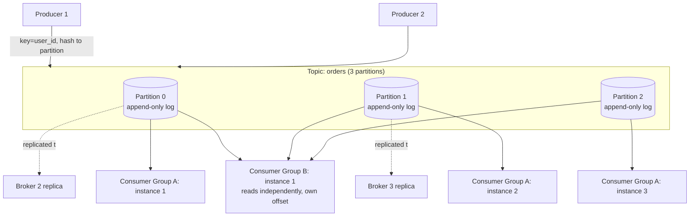
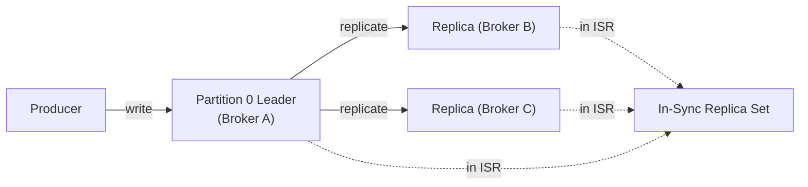

# 16. Design a Distributed Message Queue (Kafka-style)

> Rather than "use Kafka," this question asks you to explain **why** Kafka is built the way it is — the log-structured core that makes it simultaneously a queue, a replayable event store, and a replication primitive.

## 16.1 Requirements

**Functional**
- Producers publish messages to named **topics**; consumers subscribe and read them.
- Multiple independent consumer groups can each read the full stream at their own pace.
- Messages persist for a configurable retention period (not deleted immediately after one consumer reads them).

**Non-functional**
- **Very high throughput** (millions of messages/sec across a cluster), sequential disk I/O preferred over random access.
- Durability — an acknowledged write must survive broker crashes.
- Ordering guarantee **within a partition**, horizontal scalability **across partitions**.

## 16.2 High-Level Architecture

## 16.3 Deep Dive — The Log Is the Core Data Structure

Every other property of the system (throughput, ordering, replay, replication) falls out of one choice: **a partition is an append-only, immutable log on disk**, not a traditional mutable data structure.

- **Sequential writes only**: producers always append to the end — this is the single biggest reason Kafka achieves such high throughput even on spinning disks; sequential I/O can rival RAM speeds, while random I/O (what a traditional message queue with per-message deletion does) is orders of magnitude slower.
- **Consumers don't remove messages** — they simply track an **offset** (their read position) into the log and advance it. Multiple consumer groups can read the same log independently at completely different offsets/speeds without interfering with each other — this is what "pub-sub with independent, replayable consumers" actually means mechanically.
- **Retention, not deletion-on-read**: messages are deleted only after a retention period (time or size based) elapses, regardless of whether they've been consumed — this is what enables **replay** (a new consumer, or a consumer recovering from a bug, can rewind and reprocess history) and is a fundamental difference from traditional queues (RabbitMQ/SQS) where a message vanishes once acknowledged.

## 16.4 Deep Dive — Partitioning (throughput + ordering trade-off)

- A topic is split into **partitions**, each an independent log, spread across brokers — this is what makes throughput horizontally scalable (add brokers/partitions to add capacity).
- **Ordering is only guaranteed within a partition**, never across partitions of the same topic. This is why **the choice of partition key matters enormously**: hashing by `user_id` (or `conversation_id`, as in the chat design, Section 7) guarantees every event for that entity lands in the same partition in send order, giving you ordering exactly where you need it without paying for global ordering you don't.
- **Consumer groups**: each partition is consumed by exactly one instance within a given consumer group at a time (partition-to-consumer assignment), which is why **partition count is the upper bound on consumer parallelism** for a group — more consumers than partitions just sit idle.

## 16.5 Deep Dive — Replication & Durability

- Each partition has one **leader** (handles all reads/writes) and N-1 **followers** replicating from it — the same single-leader replication pattern from the replication chapter, applied per-partition.
- **In-Sync Replicas (ISR)**: the set of replicas caught up closely enough with the leader to be considered "safe" — a producer with `acks=all` waits for the write to be acknowledged by all ISR members before considering it durable, trading latency for durability. `acks=1` (leader only) or `acks=0` (fire-and-forget) trade durability for speed — an explicit tunable knob, worth naming as "here's exactly what you give up at each setting."
- **Leader failure**: a new leader is elected from the ISR (via a controller/consensus mechanism, e.g., ZooKeeper historically, or Kafka's own Raft-based KRaft mode now) — only replicas that were fully caught up are eligible, preventing silent data loss from promoting a lagging replica.

## 16.6 Delivery Semantics

| Guarantee | How it's achieved |
|---|---|
| **At-most-once** | Consumer commits offset *before* processing — if processing crashes, the message is lost, never retried |
| **At-least-once** (most common default) | Consumer commits offset *after* processing — a crash before commit means reprocessing, so message handlers must be **idempotent** |
| **Exactly-once** | Achieved via idempotent producers (dedup by producer ID + sequence number) combined with transactional writes across the produce-and-commit-offset boundary — genuinely achievable *within* a Kafka-to-Kafka pipeline, much harder the moment an external side effect (an email send, an HTTP call) is involved |

## 16.7 Scaling & Operational Concerns

- **Consumer lag** (the gap between the latest produced offset and a consumer group's committed offset) is the primary health metric — a growing lag means consumers can't keep up with producers, signaling a need for more partitions/consumer instances or faster processing.
- **Rebalancing**: when a consumer joins/leaves a group, partitions are reassigned among the remaining members — this causes a brief pause in consumption for affected partitions, which is why frequent consumer churn (crash-looping instances) is operationally costly, not just a correctness footnote.
- **Compaction** (an alternative retention policy): instead of deleting by age, **log compaction** keeps only the latest value per key forever — useful for a changelog topic representing "current state," like a rebuildable cache-invalidation feed (ties directly into the CDC pattern from the stream-processing chapter).

## 16.8 Common Follow-ups

- "Kafka vs traditional message queue (RabbitMQ/SQS)?" → traditional queues delete-on-ack, favor per-message routing/priority flexibility, and are simpler for classic task-queue workloads; log-based brokers favor extreme throughput, replay, and multiple independent consumer groups over the same stream — pick based on whether you need replay/multiple readers of history or just reliable one-time task delivery.
- "How would you guarantee a consumer never processes a message twice, end-to-end, including a database write?" → make the database write idempotent (unique constraint on a message ID, or an upsert keyed by it) rather than chasing exactly-once at the messaging layer alone — at-least-once delivery + idempotent consumer is the practical, robust answer almost everywhere in this list of designs.
- "How do you scale beyond your current partition count without reordering existing data?" → increasing partition count doesn't move existing messages, but it **does change which partition a given key hashes to going forward** — new messages for a key may land in a different partition than its history, so this is a deliberate, planned operation (often paired with a consumer that can tolerate the brief reordering window), not a transparent scaling knob.
