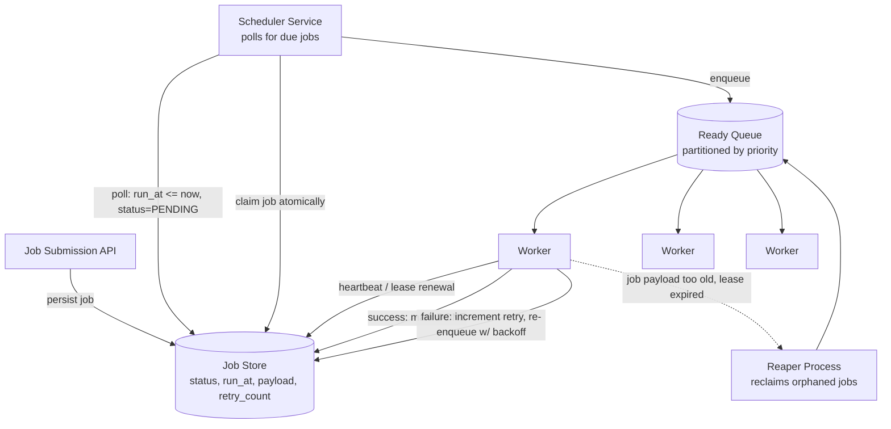
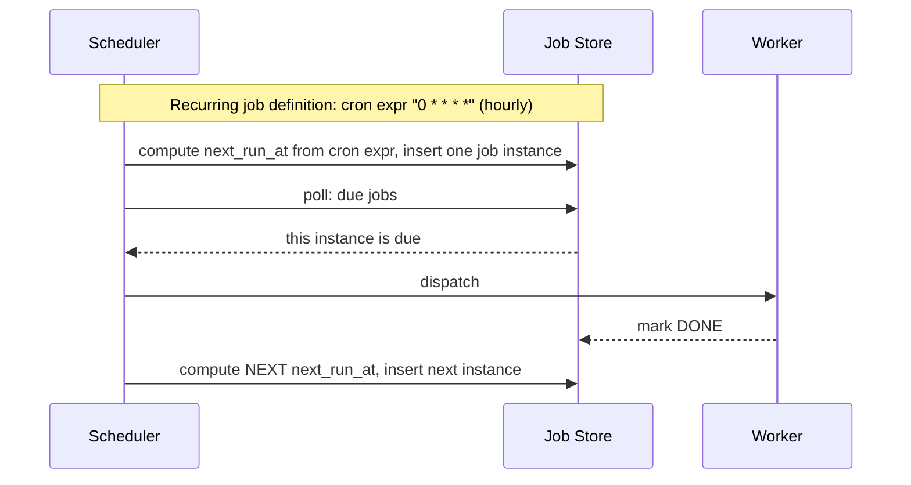

# 17. Design a Distributed Task Scheduler / Job Queue

> Covers two related but distinct problems interviewers often blend: **"run this job once, reliably, possibly with retries"** (a task queue) and **"run this job at a specific future time / on a recurring schedule"** (a scheduler like cron, at distributed scale).

## 17.1 Requirements

**Functional**
- Submit a job to run **immediately**, **at a specific future time**, or **on a recurring schedule** (cron-like).
- Guarantee a job runs **at least once**, with retries on failure.
- Support job priorities and dependencies (optional, common follow-up).

**Non-functional**
- **No job is ever silently dropped**, even across worker or scheduler crashes.
- **No duplicate execution** for jobs that must run exactly once (e.g., "charge this invoice") — or explicit idempotency if at-least-once is accepted.
- Scales to millions of scheduled jobs, many due at overlapping times.

## 17.2 High-Level Architecture

## 17.3 Deep Dive — Finding Due Jobs Efficiently

Scanning an entire job table for `run_at <= now()` on every poll cycle doesn't scale to millions of scheduled jobs.

- **Index on `run_at` + `status`**: a composite index lets the scheduler efficiently query only the (small) set of jobs actually due, rather than scanning everything.
- **Time-bucketed / hierarchical wheel**: for extreme scale, jobs are bucketed by due-time granularity (e.g., a "minute wheel" of 60 buckets, cascading into finer wheels as a job's due time approaches) — an in-memory **timing wheel** data structure, the same technique used inside OS timers and Kafka's own delayed-message implementation, giving O(1) insertion and efficient "what's due right now" lookups without scanning a sorted structure repeatedly.
- **Sharding the scheduler by time range or job-hash**: multiple scheduler instances each own a partition of the job space (e.g., by `job_id` hash, or by `run_at` bucket range) so no single instance becomes a bottleneck polling millions of rows.

## 17.4 Deep Dive — Exactly-Once Claiming (avoiding two schedulers grabbing the same job)

With multiple scheduler/worker instances polling the same due-job pool concurrently, a race exists: two instances could both see the same due job and both dispatch it.

- **Atomic claim via conditional update**: `UPDATE jobs SET status='CLAIMED', claimed_by=?, lease_expires_at=? WHERE job_id=? AND status='PENDING'` — only one claimer's conditional update succeeds (this is an optimistic-concurrency / compare-and-swap pattern, the same primitive underlying leader election and Section 15's version-conflict detection).
- **Leases, not permanent locks**: a claimed job gets a lease with an expiry — if the worker crashes before completing (and thus never marks it `DONE`), the lease eventually expires and a **reaper process** notices and reclaims the job for re-execution. This is what turns "worker crash" into "delayed retry" instead of "job lost forever."
- **Idempotency for at-least-once**: since a lease can expire and get reclaimed even if the original worker actually finished (just didn't report back in time — a "lost heartbeat," not necessarily a real failure), job handlers should be idempotent (keyed by `job_id`) wherever the underlying action allows it, exactly like the notification system's dedup approach (Section 9.3).

## 17.5 Deep Dive — Recurring Jobs (cron-at-scale)

- A recurring job definition is **not** repeatedly re-triggered by re-evaluating the cron expression on every poll; instead, **one concrete job instance is materialized for the next occurrence** as soon as the previous one completes (or is scheduled) — this avoids double-triggering if the scheduler is briefly down and keeps the "due jobs" query simple (it only ever looks at concrete, already-computed instances, never has to evaluate cron logic under the hot polling path).
- **Missed schedules (scheduler was down for an hour)**: a policy decision, not an accident — either **catch up** (run all missed occurrences) or **skip to next** (only run the next upcoming occurrence, treat missed ones as skipped) — this must be an explicit, documented behavior, since both are legitimate depending on the job's semantics (a billing job likely needs catch-up; a "refresh cache" job is fine skipping).

## 17.6 Scaling & Failure Handling

- **Priority queues**: separate ready-queues (or a priority field consumed in order) per priority tier ensure a flood of low-priority bulk jobs doesn't starve time-sensitive ones — same idea as the notification system's per-priority queue split.
- **Backpressure**: if workers can't keep up, the ready-queue backs up — this should be a visible metric (queue depth, oldest-undispatched-job age) rather than a scheduler that silently falls further and further behind.
- **Job dependencies (DAGs)**: a job that depends on others completing first is modeled as an edge in a dependency graph; the scheduler only marks a dependent job `PENDING`/eligible once all its prerequisites report `DONE` — effectively a lightweight workflow engine (Airflow/Temporal solve this class of problem in production).
- **Poison jobs**: a job that fails every retry and keeps consuming worker time should be capped at a max retry count and moved to a **dead-letter state** for manual/alerted investigation, rather than retried forever.

## 17.7 Common Follow-ups

- "How is this different from a message queue (Section 16)?" → a message queue is fundamentally about *streaming* events between producers and consumers as fast as possible; a scheduler is about *time* — deciding **when** a unit of work becomes eligible to run at all. In practice, a scheduler often uses a queue as its dispatch mechanism once a job becomes due (as shown above), so the two compose rather than compete.
- "How would you guarantee a payment-charging job runs exactly once, not just at-least-once?" → make the downstream charge operation itself idempotent (an idempotency key sent to the payment provider, Section 18) rather than trying to make the scheduler provide exactly-once semantics — the correctness burden belongs at the side-effect boundary, not the dispatch layer.
- "How do you avoid a thundering herd when 10,000 jobs are all scheduled for exactly midnight?" → add random jitter to `run_at` at schedule time for jobs that don't have a hard real-time requirement, spreading dispatch over a short window instead of a single instant spike.
