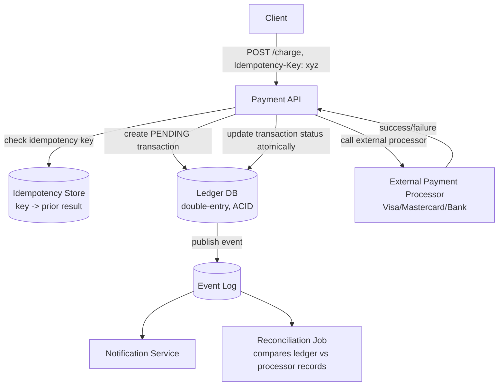
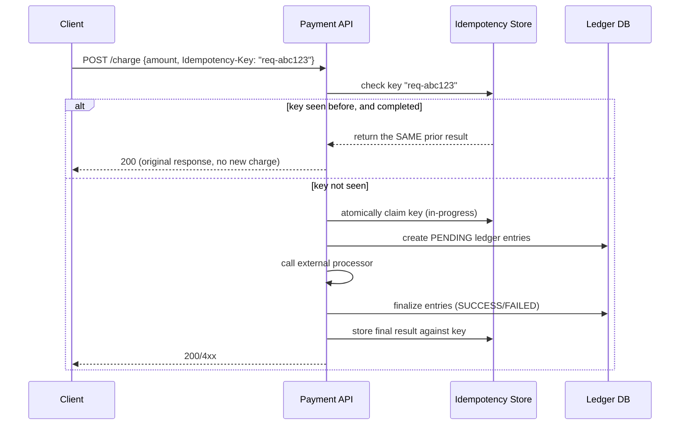

# 18. Design a Payment / Digital Wallet System

> The one design in this list where "eventual consistency, it's fine" is usually the *wrong* answer — money demands correctness (no double-spends, no lost transactions) even while the system stays available and auditable.

## 18.1 Requirements

**Functional**
- Transfer money between accounts (wallet-to-wallet) or charge an external payment method (card) and credit a merchant.
- Full transaction history / statements, refunds.
- Handle integration with external payment processors (card networks, banks) which have their own latency and failure modes.

**Non-functional**
- **Correctness above all**: no money created or destroyed, no double charges, no lost transactions — even under retries, crashes, and network partitions.
- **Idempotency** — a client retrying a "charge $50" request after a timeout must never result in two charges.
- Auditable: every state change must be traceable (who, what, when, why).
- Durable and available, but *never at the cost of a double-spend* — this is a case where the CAP trade-off leans deliberately toward consistency for the ledger itself.

## 18.2 High-Level Architecture

## 18.3 Deep Dive — The Ledger Is Double-Entry, Not a Balance Column

The single most important modeling decision: **don't store a mutable `balance` column that gets incremented/decremented**. Instead, model every movement of money as an **immutable, append-only ledger entry**, following double-entry bookkeeping:

| transaction_id | account_id | amount | type | created_at |
|---|---|---|---|---|
| tx_101 | user_A | -50.00 | DEBIT | 2026-08-06T10:00:00Z |
| tx_101 | user_B | +50.00 | CREDIT | 2026-08-06T10:00:00Z |

- Every transaction writes **two (or more) balanced rows that sum to zero** — money is never created or destroyed by construction, and this is mechanically enforced (a transaction where debits ≠ credits should be a validation error, not just a bug to hope doesn't happen).
- A user's **current balance is a derived value** (`SUM(amount)` over their ledger entries, or a materialized/cached running balance recomputed from the log) — never the single source of truth itself. This means the full history is always reconstructible and auditable; you can always answer "how did this account arrive at this balance" by replaying its entries, the same durability argument as an event-sourced system.
- This is the financial-systems analogue of "never mutate, always append" that shows up throughout this list (chat messages, file versions, event logs) — here it's not just an optimization, it's a **correctness and audit requirement**.

## 18.4 Deep Dive — Idempotency (the make-or-break detail)

- The client generates a unique **idempotency key** per logical operation attempt (not per HTTP retry — the same key is reused across retries of the *same* intended charge).
- The server atomically checks-and-claims the key **before** doing any side-effecting work; if a network timeout causes the client to retry, the server recognizes the key and returns the original result instead of charging twice — this is the same idempotency-key pattern used by every major payment API (Stripe, etc.) for exactly this reason.
- This must be atomic against concurrent retries too (two near-simultaneous retries with the same key) — a unique constraint on the idempotency key column, checked via an atomic insert, not a read-then-write.

## 18.5 Deep Dive — Consistency for Money Movement

- **ACID transactions within one database** for a single-currency, single-region transfer are the simplest correct answer: wrap the debit + credit ledger rows in one transaction, so either both happen or neither does — this is precisely the kind of invariant (Section 7 of the System Design chapters) where you spend your "consistency budget."
- **Cross-service/cross-database transfers** (e.g., debiting a wallet in one service and crediting a merchant account in another) can't use a single local ACID transaction — this is where a **saga pattern** applies: each step is a local transaction, and a compensating action (a reversing ledger entry) undoes prior steps if a later step fails, rather than attempting a distributed two-phase commit across services.
- **External processor calls are the genuinely uncertain part**: a call to a card network can fail, time out with an unknown outcome, or succeed after the caller gave up waiting. The transaction is created in a `PENDING` state *before* the external call, and a **reconciliation job** later cross-checks `PENDING`/ambiguous transactions against the processor's own transaction records (most processors expose a lookup-by-idempotency-key or webhook mechanism) to resolve them definitively — never assume timeout means failure.

## 18.6 Data Model & Storage

- **Ledger table**: append-only, indexed by `account_id` and `transaction_id`; this is a write-heavy but small-per-row workload well suited to a traditional relational database for the strong transactional guarantees, sharded by `account_id` once volume demands it (with cross-shard transfers going through the saga pattern above).
- **Idempotency store**: a fast KV store (Redis-backed with a durable fallback, or a table with a unique index) keyed by idempotency key, with a bounded TTL (retries are only meaningful for a limited window after the original request).
- **Audit/event log**: every state transition emits an immutable event (Kafka), feeding fraud detection, customer support tooling, and regulatory reporting independently of the transactional hot path.

## 18.7 Scaling & Failure Handling

- **Sharding by account**: since almost every operation touches a small number of specific accounts, sharding the ledger by `account_id` hash keeps most transactions single-shard (fast, local ACID) and isolates cross-shard transfers as the deliberately more expensive saga path.
- **Read scaling for balance checks**: cached, eventually-consistent balance reads are fine for display purposes ("your balance: $120") since a brief staleness there is a UX detail, not a correctness violation — but the actual debit/credit operation must always read the authoritative, current ledger state, not the cache.
- **Fraud/risk checks**: typically an inline, low-latency synchronous check (velocity limits, risk scoring) before the ledger entries are finalized, plus asynchronous deeper analysis afterward that can freeze an account or flag for reversal — a layered defense rather than a single gate.

## 18.8 Common Follow-ups

- "How do you handle a refund?" → a new, separate ledger transaction (reversing debit/credit), never an edit to the original transaction — preserves the immutable-history property and keeps the audit trail intact.
- "What happens if the external processor call succeeds but your service crashes before recording it?" → this is exactly why reconciliation against the processor's own records exists — the PENDING state plus periodic reconciliation is the safety net for "did the money actually move" ambiguity that no amount of in-process error handling alone can fully close.
- "How is this different from the Dynamo-style key-value store's eventual consistency (Section 5)?" → deliberately opposite trade-off: that design chose availability over consistency for arbitrary data; a ledger chooses consistency for the money-moving operation itself, while still using eventual consistency freely for everything non-critical layered on top (notifications, cached balances, analytics).
