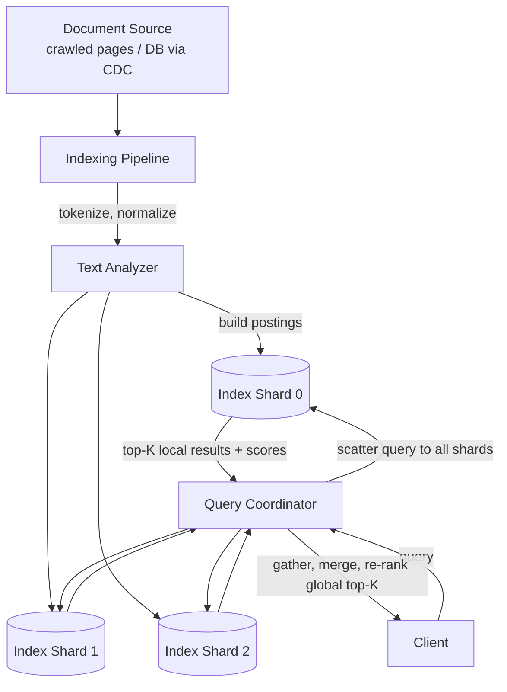
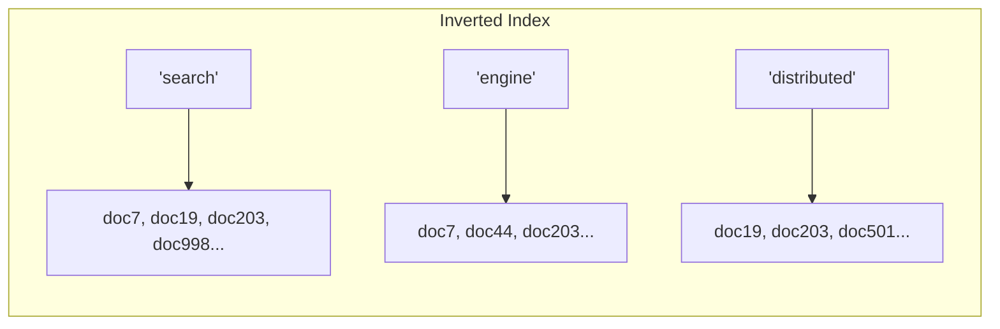

# 19. Design a Distributed Search Engine (Full-Text Search)

> "Build Elasticsearch/Google Search" — the core insight is a single data structure (the inverted index) plus the distributed-systems machinery to keep it fresh and scalable, echoing the earlier crawler and ranking questions.

## 19.1 Requirements

**Functional**
- Given a query (keywords, phrases), return relevant documents ranked by relevance, fast.
- Support filtering (facets), typo tolerance, and highlighting matched terms — often follow-ups.
- Index new/updated documents so they become searchable within a reasonable delay.

**Non-functional**
- **Query latency** in tens of milliseconds even across billions of documents.
- Index must handle continuous updates (new documents, edits, deletions) without full rebuilds.
- Horizontally scalable — both the index size and the query throughput.

## 19.2 High-Level Architecture

## 19.3 Deep Dive — The Inverted Index (the core data structure)

A **forward index** (`document → words it contains`) is what you'd naturally build first, but it can't answer "which documents contain word X" without scanning everything. The **inverted index** flips this: `word → list of documents containing it (postings list)`.

- A query for `"distributed search"` becomes: fetch the postings list for `distributed` and for `search`, **intersect** them (documents containing both) — a query against millions of documents becomes a fast merge of two sorted lists, not a scan.
- **Postings lists also store term positions and frequency** — positions enable phrase queries ("distributed search" as an exact phrase, not just both words anywhere), and frequency feeds directly into relevance scoring (Section 19.4).
- **Segments are immutable**: like an LSM-tree (storage chapter), the index is built as a series of immutable segments; new documents go into a new segment rather than mutating existing ones, and a background **merge process** periodically consolidates small segments into larger ones for query efficiency — this is exactly why full-text search engines (Lucene, which underlies Elasticsearch/Solr) are built on the same append-then-compact philosophy as LSM storage engines.

## 19.4 Deep Dive — Relevance Ranking

Returning *all* matching documents isn't enough — they must be ranked by relevance. The classic algorithm to name is **TF-IDF** or its refinement **BM25**:

- **Term Frequency (TF)**: a document mentioning "search" 10 times is probably more about search than one mentioning it once.
- **Inverse Document Frequency (IDF)**: a term that appears in almost every document (like "the") is a weak signal; a rare term is a strong signal — IDF downweights common words automatically.
- **BM25** refines raw TF-IDF with saturation (the 10th occurrence of a word matters much less than the 2nd) and document-length normalization (a long document naturally contains more word occurrences; BM25 corrects for that so long documents aren't unfairly favored).
- **Beyond text relevance**: production ranking layers in signals like inbound-link authority (PageRank-style, from the crawler design, Section 11), freshness, and personalization — same "candidate generation → scoring → serving" pipeline shape as the news feed design (Section 8), just with different scoring inputs.

## 19.5 Deep Dive — Sharding & Scatter-Gather Queries

- **Sharding strategy**: documents are distributed across shards (by hash of document ID, typically), each shard building and holding its own complete inverted index over its subset of documents — there is no single global inverted index spanning all documents.
- **Every query fans out to every shard** (scatter), each shard independently finds and scores its local top-K matches, and a **query coordinator gathers and merges** these partial results into a final global top-K (gather) — this scatter-gather pattern means query latency is bounded by the *slowest* shard's response, making **tail latency** (not average latency) the metric that matters (the same "tail at scale" problem covered in the foundations chapter).
- **Replication per shard** (not just for durability, but for **read throughput**) lets query load be spread across replicas, since search is overwhelmingly read-heavy.

## 19.6 Deep Dive — Keeping the Index Fresh

- **Near-real-time indexing**: new/updated documents are added to a small in-memory buffer segment immediately, made searchable within a short refresh interval (e.g., ~1 second in Elasticsearch), and later merged into larger on-disk segments — a small window of "not yet searchable" is an accepted trade-off for indexing throughput.
- **CDC-driven indexing** (when the search index is *derived* from a primary database, e.g., product search over a catalog DB): the index is fed by the database's change stream (Section 4/11's CDC pattern) rather than dual-writing from the application — this guarantees the index eventually reflects every DB change, in order, without the application needing to remember to update two systems atomically.
- **Deletions**: rather than immediately removing entries from immutable segments (expensive), a document is marked with a **tombstone**; it's filtered out of query results immediately, and physically removed later when its segment is merged/compacted — same technique as LSM-tree tombstones in the storage chapter.

## 19.7 Scaling & Failure Handling

- **Hot shard from a skewed document distribution or a viral query term**: sharding by document ID hash (rather than, say, category) spreads storage evenly, but query load per shard is still uniform because every query scatters to every shard regardless — the bottleneck to watch is the coordinator's fan-out cost and the slowest-shard tail latency, not per-shard hot spots the way key-value stores worry about hot keys.
- **Shard failure**: a replica takes over serving queries for that shard; if a query coordinator gets a partial failure (one shard times out), it typically returns best-effort results from the shards that responded rather than failing the whole query — a deliberate availability-over-completeness trade-off worth stating.
- **Index size growth**: sharding count is usually fixed at index-creation time in systems like Elasticsearch (resharding is expensive, closer to a full reindex) — worth mentioning that over-provisioning shard count upfront is a common operational practice specifically because of this rigidity.

## 19.8 Common Follow-ups

- "How would you support typo-tolerant / fuzzy search?" → augment the inverted index lookup with an edit-distance structure (e.g., a BK-tree or n-gram index over terms) to find near-matches to the query term before doing the normal postings intersection — layered on top of, not a replacement for, the exact-match inverted index.
- "How do you rank results personalized per user without a separate index per user?" → keep one shared index; personalization is a **re-ranking step** applied to the coordinator's merged candidate list, using the user's profile/history — the same separation of "retrieval" from "ranking" as the news feed and autocomplete designs.
- "Elasticsearch vs a database's built-in full-text search (e.g., Postgres `tsvector`)?" → a database's built-in search is fine at moderate scale and avoids operating a second system, but a dedicated search engine wins once you need sub-second latency across huge corpora, rich relevance tuning (BM25 variants, custom scoring), and horizontal scale independent of the primary database's own scaling constraints.
