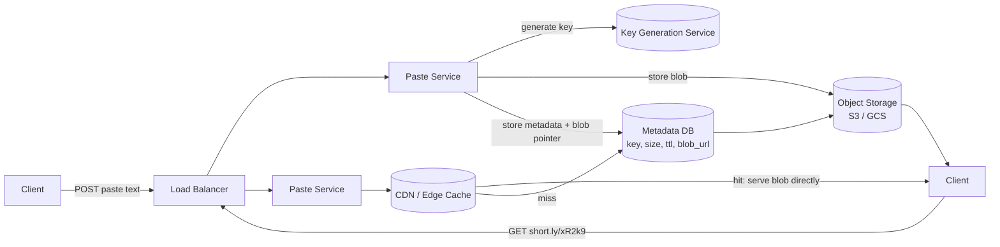

# 2. Design Pastebin

> Structurally a cousin of the URL shortener (random key → blob), but the blob is now large, immutable text, which shifts the design toward object storage and content-addressing instead of a pure KV row.

## 2.1 Requirements

**Functional**
- Paste text (up to some max size, e.g., 10 MB), get back a shareable URL.
- View a paste by its URL.
- Optional: expiry (burn-after-read, TTL), visibility (public/unlisted/private), syntax highlighting language tag.

**Non-functional**
- Read-heavy, similar ratio to URL shortener (~10:1 to 100:1).
- Pastes are **immutable** once created — no updates, only creation and deletion/expiry. This simplifies caching enormously (no invalidation problem).
- Durability matters more than for a short link: losing someone's paste is a real complaint.

## 2.2 Back-of-the-Envelope Estimation

- 1M new pastes/day, average size 10 KB → 10 GB/day raw → **~3.6 TB/year** before replication (×3 replication ≈ 11 TB/year).
- Some pastes are large (up to 10 MB) — long tail; storing large blobs in a relational row is wrong, they belong in **object storage**.
- Metadata (key, size, language, expiry, owner) is tiny (~200 bytes) and read on every view — this is what should sit in a fast KV/relational store, separate from the blob itself.

## 2.3 High-Level Architecture

- **Key generation** — identical approach to the URL shortener (pre-generated batches; Section 1.5).
- **Metadata store** — small row per paste: `key`, `size_bytes`, `language`, `created_at`, `expires_at`, `owner_id`, `blob_location`. A relational DB or KV store both work fine at this size.
- **Blob storage** — the actual text goes to S3/GCS/blob storage, not the database. This keeps the metadata DB small and fast, and blob storage is built for exactly this access pattern (write-once, read-many, large objects).
- **CDN in front of blob storage** — since pastes are immutable, they are **maximally cacheable**: set `Cache-Control: immutable` and let the CDN serve repeat reads without hitting origin at all.

## 2.4 Data Model & API

| Endpoint | Description |
|---|---|
| `POST /api/v1/pastes {content, language?, ttl?, visibility?}` | Returns paste key + URL |
| `GET /{key}` | Returns rendered/raw paste |
| `DELETE /api/v1/{key}` | Owner-only delete |

**Table `pastes`**

| Column | Type | Notes |
|---|---|---|
| `key` | varchar(8), PK | base62 key |
| `owner_id` | bigint, nullable | anonymous allowed |
| `blob_url` | text | pointer into object storage |
| `size_bytes` | int | for quota/abuse checks |
| `language` | varchar(20) | syntax highlighting hint |
| `created_at` / `expires_at` | timestamp | |
| `visibility` | enum | public / unlisted / private |

## 2.5 Deep Dive — Why Split Metadata from Blob?

A tempting shortcut is "just put the text in a `TEXT` column." This breaks down at scale:
- Large rows bloat the database's buffer pool/cache, pushing out hot metadata for unrelated pastes — one 10 MB paste can evict thousands of small metadata rows from cache.
- Databases are optimized for structured, indexed access, not for streaming large binary/text payloads to clients.
- Object storage (S3-style) gives you **content-addressable, horizontally scalable, cheap** storage with built-in replication, and integrates directly with a CDN for edge caching — the DB shouldn't be in the hot path for serving bytes at all.

A nice property: since content is immutable, the blob key can be a **hash of the content** (content-addressed storage). Two users pasting identical text can share the same blob, deduplicating storage — a detail worth mentioning if the interviewer probes on storage efficiency.

## 2.6 Deep Dive — Expiry & Abuse Handling

- **TTL cleanup**: a background sweeper (cron/batch job) scans `expires_at < now()` and deletes both the metadata row and the blob. For "burn after read," the read path itself deletes the row after the first successful fetch (needs a `SELECT ... FOR UPDATE`/atomic delete-and-return, or a KV store's atomic get-and-delete, to avoid a race where two readers both "successfully" read a supposedly single-use paste).
- **Abuse**: pastebins are a favorite for hosting malware/phishing payloads and dumped credentials. Run every new paste through async content scanning (regex for known secret patterns, malware signature checks) and rate-limit creation per IP/account.
- **Large paste DoS**: enforce a max size at the API layer *before* accepting the upload body, not after.

## 2.7 Scaling & Trade-offs

- Because pastes are immutable and content-addressed, this is one of the **easiest systems to cache aggressively** — no invalidation logic needed anywhere in the stack.
- Metadata DB can be sharded by `key` hash exactly like the URL shortener once row count grows past a single instance's comfort zone.
- If "private" pastes are supported, blob storage access must go through signed/pre-authorized URLs (short-lived) rather than being publicly world-readable, and the metadata check (visibility + ownership) must happen before the URL is issued.

## 2.8 Common Follow-ups

- "How would you support versioned pastes (edit history)?" → each edit creates a new immutable blob + key, with a `parent_key` pointer chaining revisions — no more in-place mutation than before.
- "How do you prevent someone brute-forcing keys to find 'unlisted' pastes?" → use a large enough random key space (base62 × 8+ chars) and rate-limit `GET` by IP to make enumeration impractical.
