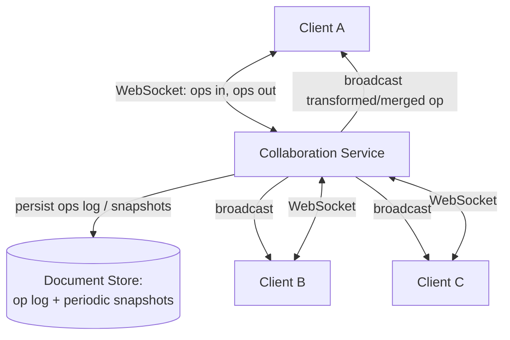
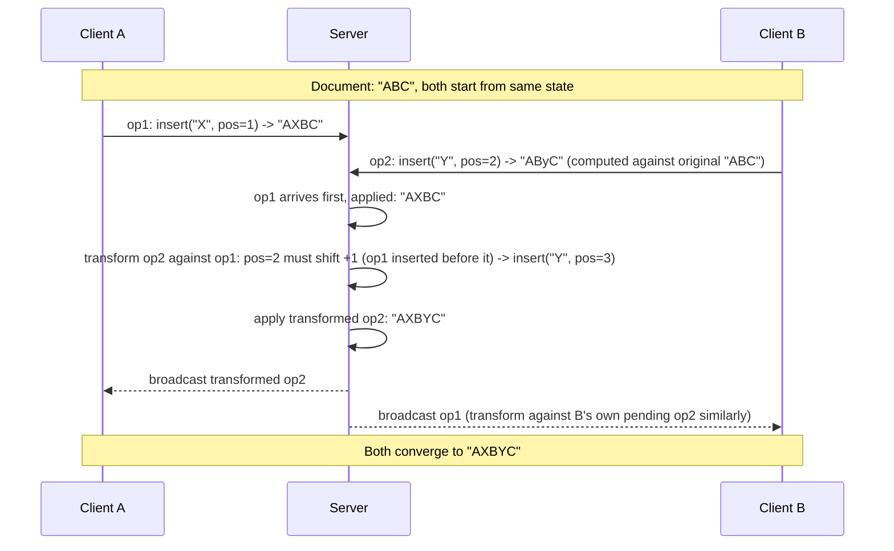

# 20. Design a Collaborative Document Editor (Google Docs)

> The most theoretically deep question in this list — real-time multi-writer editing without locking requires either Operational Transformation or CRDTs, and explaining *why* naive locking or last-write-wins fails is the heart of a strong answer.

## 20.1 Requirements

**Functional**
- Multiple users edit the same document simultaneously; each sees others' changes in near real time.
- Cursor/selection presence (see where collaborators are editing).
- Full edit history / version restore.
- Offline editing that syncs and merges correctly on reconnect.

**Non-functional**
- **Never lose a user's edit**, even under concurrent conflicting edits.
- All clients must **converge to the same final document state**, regardless of network delay or message ordering.
- Low-latency local echo — a user's own keystrokes must appear instantly, not wait for a server round trip.

## 20.2 Why the Obvious Approaches Fail

- **Pessimistic locking** ("only one person can edit a paragraph/document at a time") kills the actual product requirement — real-time *simultaneous* editing is the whole point, and locking makes it feel like a shared file, not a live document.
- **Last-Write-Wins on the whole document**: if two users type in different parts of the document within the same second, whoever's save lands last silently discards the other's entire edit — completely unacceptable for text editing where every keystroke matters.
- **Naive "just apply operations in the order the server receives them"**: still breaks, because an operation like "insert 'X' at position 5" computed on a client's *local* document state becomes wrong if another user's edit already shifted what's at position 5 by the time the server applies it — this is exactly the problem the two real solutions below solve.

## 20.3 High-Level Architecture

- Similar connection shape to the chat design (Section 7) — persistent WebSocket connections, a stateful service per active document — but the payload is **operations on shared structured state**, not independent messages, which is what demands OT/CRDT logic instead of simple ordered delivery.
- Typically, **one document = one logical "room"/partition**, so all edits to that document flow through a consistent ordering point (even if the underlying algorithm is designed to tolerate out-of-order arrival) — analogous to partitioning chat by `conversation_id` for ordering.

## 20.4 Deep Dive — Operational Transformation (OT)

**Core idea**: when two operations happen concurrently, don't just apply them as-is — **transform** one operation against the other so that applying both (in either order) produces the same, correct result.

- The transform function encodes rules like "if another insert happened before my target position, shift my position forward" — this must be defined for every pair of operation types (insert-insert, insert-delete, delete-delete) and proven to satisfy convergence properties, which is exactly why OT implementations are notoriously subtle and bug-prone (Google Wave/Docs's OT implementation took years to get fully correct).
- **A central server is typically required** as the single point that decides the canonical order of operations and performs the transforms — clients send their local operations against the version they last saw, and the server transforms and rebroadcasts, meaning OT is naturally a client-server (not peer-to-peer) algorithm.

## 20.5 Deep Dive — CRDTs (the modern alternative)

**Conflict-free Replicated Data Types** take a different approach: design the data structure itself so that operations **commute** — applying them in any order (or any number of times) always converges to the same result, with no transform step needed at all.

- For text editing, a common CRDT approach assigns each character a **stable, globally unique, order-preserving identifier** (not a plain numeric index) when inserted — e.g., a fractional position between its neighbors, or a (site_id, counter) pair. Inserting "at position 5" becomes "insert this character between the characters currently identified as X and Y" — a reference that **never becomes stale** even as other concurrent edits happen elsewhere in the document, unlike a numeric index which shifts.
- Because operations reference stable identifiers rather than positions that can be invalidated by others' concurrent edits, **any two replicas that have seen the same set of operations (in any order) converge to the identical document** — no central authority needs to arbitrate ordering or transform anything.
- **This is what makes CRDTs naturally support peer-to-peer and offline-first editing**: a client can apply its own edits locally instantly (no round trip needed for correctness, only for propagation) and merge with others' edits whenever connectivity allows, in any order, with mathematically guaranteed convergence — a much better fit for "edit offline for a day, then sync" than OT's server-mediated model.
- **Trade-off**: CRDT metadata (unique IDs per character/element, tombstones for deletions) adds storage and memory overhead per character compared to OT's plain text + op log — a real cost at large-document scale, and why production systems (e.g., Figma's multiplayer engine, Yjs-based editors) invest heavily in compacting this metadata.

| | OT | CRDT |
|---|---|---|
| Coordination | Needs a central server to order & transform | Can be fully peer-to-peer / offline-first |
| Convergence proof | Requires correct transform functions per op-pair (hard to get right) | Convergence is a property of the data structure itself (easier to reason about once designed) |
| Overhead | Compact (plain ops) | Higher (stable IDs, tombstones per element) |
| Real-world examples | Google Docs (early/classic implementation) | Figma, Notion-style editors, Automerge/Yjs libraries |

## 20.6 Deep Dive — Presence, History, and Offline Sync

- **Cursor/selection presence** is *not* run through OT/CRDT merge logic at all — it's ephemeral, last-write-wins, broadcast state (like the chat design's presence heartbeats, Section 7.5) that doesn't need convergence guarantees since it's not persisted document content.
- **Version history**: the server periodically persists **snapshots** of the document state plus the intervening operation log — restoring to "5 minutes ago" replays or jumps to the nearest snapshot, rather than needing to store every micro-keystroke as a separately restorable version forever.
- **Offline editing**: a client keeps applying operations locally (instant local echo, using its local CRDT/OT state) while disconnected; on reconnect, it sends its queued operations to the server (OT: transformed against everything that happened while offline; CRDT: simply merged, since convergence doesn't care about order) — this is where **CRDTs meaningfully simplify the offline case**, which is part of why newer collaborative editors lean CRDT over classic OT.

## 20.7 Scaling & Failure Handling

- **Document as the unit of scaling**: each actively-edited document is handled by one collaboration-service instance (in-memory current state + connected clients) at a time — horizontal scale comes from spreading many documents across many instances, not from splitting one document's real-time editing across multiple servers.
- **Server crash mid-session**: since state is periodically persisted (op log + snapshots), a client reconnecting to a new instance rehydrates from the last durable state and replays/resyncs any operations the crashed instance hadn't yet persisted — durability lives in the storage layer, not in a single server's memory being treated as authoritative forever.
- **Very large documents / very large collaborator counts**: presence and cursor broadcast is the first thing that needs throttling/batching at scale (100 simultaneous editors don't need 100×100 cursor updates per keystroke) — a debounce/batching layer, same principle as the notification system's digest batching.

## 20.8 Common Follow-ups

- "Why not just use a database transaction per edit?" → transactions solve isolation for discrete, independent operations on shared rows; they don't solve *merging two people's concurrent, overlapping intent* about the same piece of text, which requires operation-level semantic transformation (OT) or a structure designed for commutative merging (CRDT) — a fundamentally different problem than transactional isolation.
- "How would this extend to structured documents (not just plain text — tables, formatting, images)?" → the same OT/CRDT principles extend to tree-structured or rich-document models, but the transform/merge rules become significantly more complex (moving a table cell concurrently with someone formatting text inside it, for example) — this is genuinely one of the hardest areas of applied distributed systems, and production editors invest years into it.
- "OT/CRDT feels like a lot of machinery — when would a much simpler design suffice?" → if true simultaneous character-level editing isn't required (e.g., a document that's realistically edited by one person at a time, with rare overlap), a much simpler **optimistic locking + "someone else edited this, please review" conflict UI** (like Section 15's file-sync conflicted-copy approach) is far less complex and perfectly adequate — reach for OT/CRDT specifically when true real-time multi-cursor editing is a hard product requirement.
