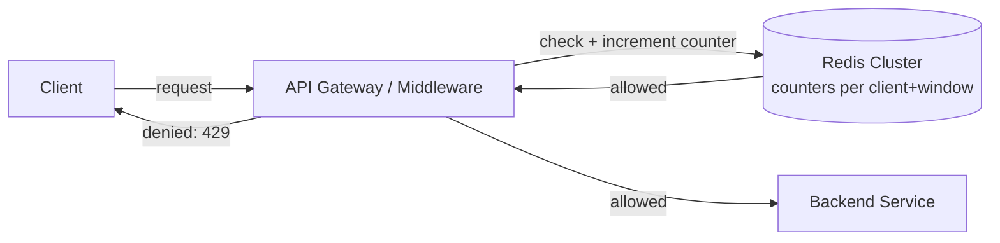
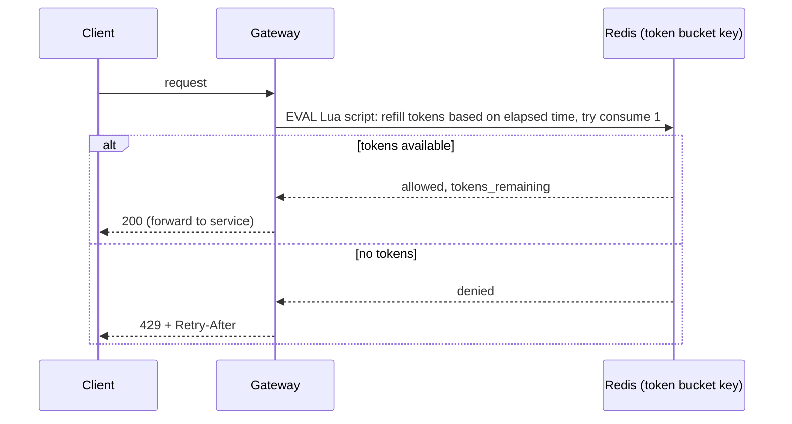

# 3. Design a Rate Limiter

> A small system with an outsized interview footprint — it tests your grip on concurrency, algorithm trade-offs, and where state lives in a distributed system.

## 3.1 Requirements

**Functional**
- Limit the number of requests a client (by API key, user ID, or IP) can make in a given time window.
- Return `429 Too Many Requests` with a `Retry-After` header when the limit is exceeded.
- Support different limits per API/tier (e.g., free tier 100 req/min, paid 10,000 req/min).

**Non-functional**
- The limiter must add **negligible latency** (single-digit ms) to every request — it sits on the hot path.
- Must work correctly across a **fleet of stateless API servers**, not just one process.
- Should be resilient — if the rate limiter's own store is briefly unavailable, decide explicitly whether to fail open (allow) or fail closed (deny).

## 3.2 High-Level Architecture

Rate limiting is almost always implemented as **middleware at the API gateway / edge layer**, not inside each backend service — this way every service behind the gateway is protected uniformly, and the limiting logic lives in one place. The counters themselves live in a **shared, fast, in-memory store (Redis)** so that all gateway instances see the same count for a given client — a rate limiter with per-server local counters is not a distributed rate limiter at all.

## 3.3 Deep Dive — Algorithms

This question is really "which algorithm, and why":

| Algorithm | How it works | Pros | Cons |
|---|---|---|---|
| **Fixed window counter** | Increment a counter keyed by `(client, floor(now/window))`; reset each window | Simple, memory-cheap (one counter) | **Boundary burst**: up to 2× the limit can slip through at a window edge (e.g., 100 req in the last second of one window + 100 in the first second of the next) |
| **Sliding window log** | Store a timestamp per request in a sorted set; count entries within the trailing window | Perfectly accurate | Memory grows with request volume; pruning old entries costs work per request |
| **Sliding window counter** | Weighted average of current + previous fixed window, proportional to overlap | Good approximation of sliding log, O(1) memory | Slight inaccuracy under non-uniform traffic, but usually good enough |
| **Token bucket** | Bucket holds tokens up to a capacity, refills at a fixed rate; each request consumes a token | Allows controlled bursts, smooths traffic, industry favorite (AWS, Stripe use variants) | Slightly more state per key (tokens + last-refill timestamp) |
| **Leaky bucket** | Requests queue into a bucket that drains (processes) at a constant rate | Smooths output rate strictly — good for protecting downstream at a fixed throughput | Bursty clients get queued/delayed rather than a clean deny |

**Token bucket is the most common answer** in interviews because it naturally allows short bursts (good UX) while enforcing a long-run average rate, and its state (`tokens_remaining`, `last_refill_ts`) fits in a single Redis key.

## 3.4 Deep Dive — Distributed Correctness

The subtle part of this problem isn't the algorithm, it's making "read counter, check limit, increment counter" **atomic** across concurrent requests from the same client hitting different gateway instances simultaneously.

- **Race condition without atomicity**: two requests both read `count=99` (limit 100), both decide "allowed," both increment → the client just made 101 requests through a limiter that thought it was enforcing 100.
- **Fix: atomic operations.** Use Redis `INCR` (atomic by itself) for fixed-window counters, or a **Lua script** (executed atomically by Redis) for anything multi-step like token bucket refill-and-consume. This turns "read-modify-write" into a single indivisible operation on the Redis server, eliminating the race without needing distributed locks.
- **Sharding the limiter store**: for very high QPS, shard Redis by `client_id` hash so no single node becomes the bottleneck; each client's counter lives on exactly one shard, so atomicity is still local to a single Redis instance (no cross-shard coordination needed).

## 3.5 Scaling & Failure Handling

- **Fail-open vs fail-closed**: if Redis is unreachable, do you let all requests through (protects availability, risks overload) or block all requests (protects backend, hurts availability)? Most production systems **fail open** for a short grace period with alerting, since a rate limiter outage shouldn't cascade into a full outage.
- **Local + global two-tier limiting**: for extreme scale, each gateway node keeps a small local approximate counter (cheap, no network round trip) synced periodically to the global Redis count, trading a little precision for much lower latency and Redis load.
- **Distinguish limit dimensions**: per-user, per-IP, per-API-key, and per-endpoint limits often need to be checked independently and combined (e.g., "even paid users can't exceed the per-endpoint global limit protecting a fragile downstream dependency").
- **Client-side cooperation**: return `X-RateLimit-Remaining` and `Retry-After` headers so well-behaved clients back off proactively instead of hammering and immediately retrying.

## 3.6 Common Follow-ups

- "How would you rate-limit by a composite key like (user, endpoint)?" → concatenate into the Redis key, e.g., `rl:{user_id}:{endpoint}`; each combination gets its own bucket.
- "How do you rate-limit without a shared store at all (edge/CDN layer, thousands of nodes)?" → approximate local counting with periodic gossip/aggregation, accepting some overshoot in exchange for zero cross-node latency.
- "What's the difference between rate limiting and throttling/backpressure?" → rate limiting rejects excess requests outright (protects the API contract); backpressure/queueing delays them (smooths load but adds latency) — leaky bucket is really backpressure in limiter's clothing.
