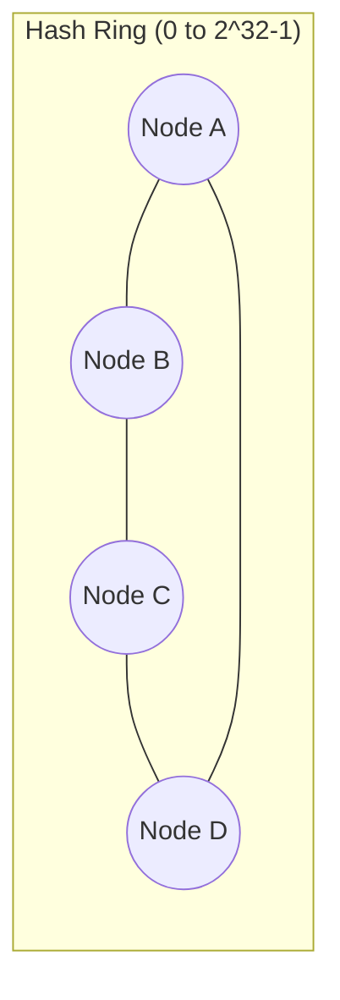

# 4. Design a Distributed Cache

> Not "how does Redis work" but "how do you build a Redis" — partitioning, replication, eviction, and consistency across a cluster of cache nodes.

## 4.1 Requirements

**Functional**
- `GET key`, `SET key value [ttl]`, `DELETE key` with sub-millisecond latency.
- Cluster of many nodes, total capacity larger than any single machine's RAM.
- Automatic eviction under memory pressure (LRU/LFU).

**Non-functional**
- **Availability and latency over strict consistency** — a cache is a derived, disposable view; losing a node should degrade gracefully (higher DB load), not fail requests.
- Near-linear scalability by adding nodes.
- Even key distribution — no single node should become a hot spot.

## 4.2 High-Level Architecture

```mermaid
flowchart TB
    Client[App Server] -->|hash(key)| Router[Client-side router /<br/>Proxy layer]
    Router --> N1[(Cache Node 1<br/>keys A-F)]
    Router --> N2[(Cache Node 2<br/>keys G-M)]
    Router --> N3[(Cache Node 3<br/>keys N-S)]
    Router --> N4[(Cache Node 4<br/>keys T-Z)]
    N1 -.replica.-> N1R[(Replica 1)]
    N2 -.replica.-> N2R[(Replica 2)]
    N3 -.replica.-> N3R[(Replica 3)]
    N4 -.replica.-> N4R[(Replica 4)]
```

- **Routing** can live in a smart client library (each app server knows the cluster topology and hashes locally, like Redis Cluster clients) or a proxy tier (Twemproxy-style) — the smart-client approach avoids an extra network hop.
- **Each node** is an in-memory hash table (O(1) get/set) with its own eviction policy applied locally.
- **Replicas** exist per shard for read scaling and failover, not for durability in the strict sense — a cache is allowed to lose data (it's recoverable from the source of truth).

## 4.3 Deep Dive — Partitioning (the core of this question)

**Naive modulo hashing** (`hash(key) % N`) fails the moment `N` changes: adding/removing one node reshuffles the mapping for almost every key, causing a mass cache miss stampede against the backing database.

**Consistent hashing** is the standard answer:



- Both nodes and keys are hashed onto the same circular space; a key belongs to the first node clockwise from its hash position.
- Adding/removing a node only remaps the keys between it and its predecessor on the ring — roughly `1/N` of all keys move, not all of them.
- **Virtual nodes**: each physical node is placed at many points on the ring (e.g., 150 virtual nodes each) so that load spreads evenly even with few physical nodes, and a departing node's load is spread across many survivors rather than dumped on one neighbor.

## 4.4 Deep Dive — Eviction & Memory Management

| Policy | Behavior | When to use |
|---|---|---|
| **LRU** | Evict least-recently-used | Default, good general-purpose recency bias |
| **LFU** | Evict least-frequently-used | Better when popularity is stable over time (some keys are always hot) |
| **TTL-based** | Expire regardless of access pattern | Time-sensitive data (sessions, quotes) |
| **Random sampling** | Approximate LRU/LFU by sampling a few keys and evicting the "worst" of the sample | What Redis actually does — true LRU's bookkeeping cost isn't worth it at scale |

Each node evicts independently based on its own local memory pressure — there's no global coordination needed, which is part of why caches scale so cleanly compared to databases.

## 4.5 Deep Dive — Consistency With the Source of Truth

A cache is only useful if it doesn't lie too often or for too long:

- **Cache-aside** (most common): app reads cache first, falls back to DB on miss and repopulates; writes go to the DB and then invalidate (not update) the cache key.
- **Write-through**: writes go to the cache, which synchronously writes through to the DB — keeps cache always warm, at the cost of write latency.
- **Stale reads race**: a classic bug — request A misses cache, reads old value from DB; concurrently request B writes new value to DB and invalidates cache; request A now writes the *old* value into the cache, which lingers until TTL. Mitigation: short TTL as a backstop, or a versioned/CAS write (only write to cache if the version you read is still current).
- **Failure modes to name explicitly**: thundering herd/stampede (hot key expires, thousands of concurrent DB hits — fix with a per-key mutex/single-flight so only one request refetches), cache penetration (queries for nonexistent keys always miss — fix with negative caching or a Bloom filter), cache avalanche (many keys expire together or a node dies — fix with TTL jitter and redundant replicas).

## 4.6 Scaling & Failure Handling

- **Node failure**: the router detects a dead node (health checks / gossip protocol) and promotes its replica, or simply routes around it, accepting a temporary spike in DB load for that key range while data rewarms.
- **Resharding when adding capacity**: consistent hashing bounds data movement, but you still need a controlled **rebalancing process** — spin up the new node, let it warm from the DB (or copy from the node losing keys) before shifting traffic, to avoid a cold-cache dip in hit ratio.
- **Multi-region caches**: usually independent per-region clusters (each region's app servers hit their local cache) rather than cross-region replication — cache staleness across regions is acceptable since the source of truth is the authority.

## 4.7 Common Follow-ups

- "How is this different from a CDN?" → same caching principles, but a CDN caches at the network edge close to users for static/semi-static content over HTTP, while this is an internal service-to-service cache for arbitrary key-value data close to application servers.
- "How would you cache a value too large for one node?" → don't; either compress, store a pointer to blob storage with metadata cached instead, or explicitly shard the value across keys if it's genuinely structured data.
- "In-process (local) cache vs distributed cache?" → local cache has zero network latency but is inconsistent across instances and limited by one machine's memory; distributed cache trades a network hop for a shared, larger, consistent-enough view. Many high-performance systems layer both (L1 local + L2 distributed).
