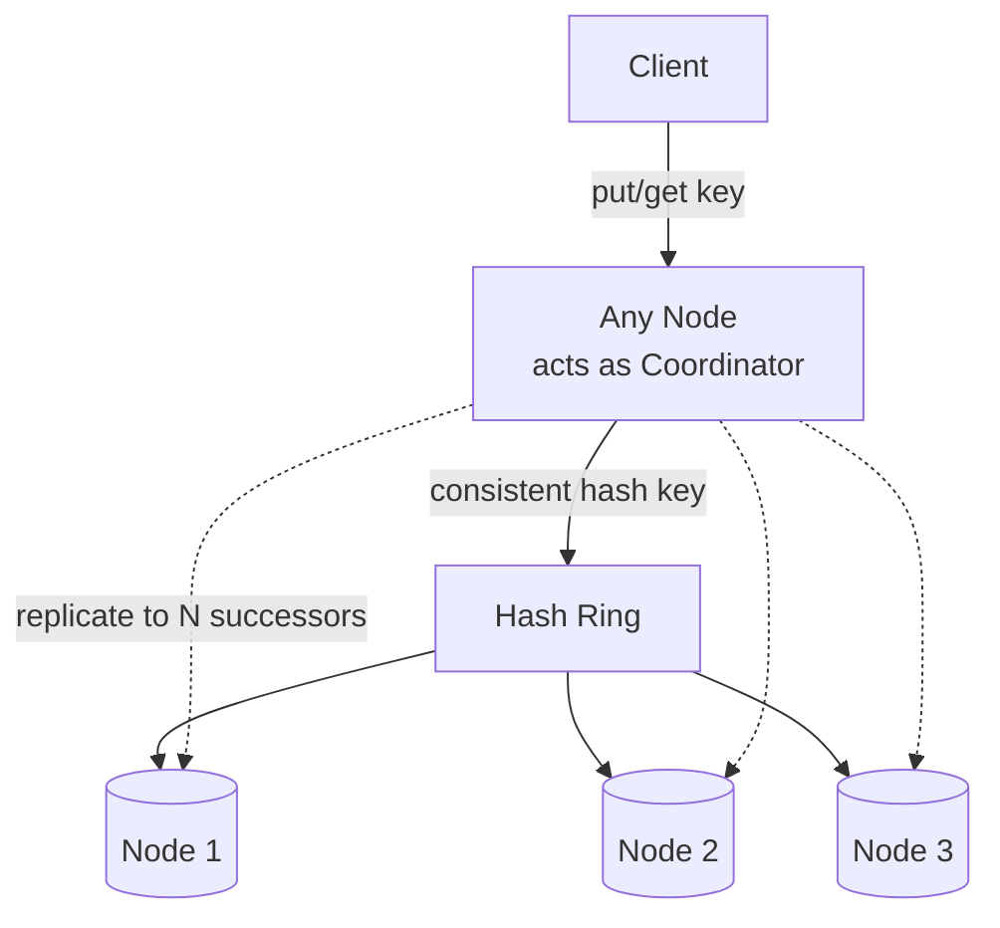

# 5. Design a Distributed Key-Value Store (Dynamo-style)

> The synthesis question — partitioning, replication, and consistency all show up at once. Almost every answer traces back to the 2007 Amazon Dynamo paper, which DynamoDB, Cassandra, and Riak all descend from.

## 5.1 Requirements

**Functional**
- `put(key, value)`, `get(key)` — simple API, no joins/transactions across keys.
- Values are opaque blobs (or structured but accessed by primary key).

**Non-functional**
- **Always writable** — the system should accept writes even during network partitions or node failures (favor **AP over CP** in CAP terms, unlike a traditional RDBMS).
- Horizontally scalable to many nodes, no single point of failure.
- Low-latency, predictable p99s.
- Tunable consistency per request (strong when needed, eventual by default).

## 5.2 High-Level Architecture

- **Every node is a peer** — no special leader/coordinator node; any node can receive a request and act as coordinator for that operation, forwarding to the replicas responsible for the key. This peer-to-peer design is what avoids a single point of failure.
- **Partitioning**: consistent hashing (Section 4.3) determines which node "owns" a key.
- **Replication**: each key is stored on the **N nodes** following it clockwise on the ring (its "preference list"), so a single node loss never loses data.

## 5.3 Deep Dive — Quorums (R, W, N)

For a replication factor **N**, define:
- **W** = number of replicas that must acknowledge a write before it's considered successful.
- **R** = number of replicas queried on a read before returning a result (reconciling conflicting versions if returned values differ).

**If R + W > N**, every read is guaranteed to overlap with the most recent write on at least one replica — this gives **quorum consistency** (strong-ish, tunable). Common configurations:

| N | W | R | Behavior |
|---|---|---|---|
| 3 | 3 | 1 | Fast reads, slow/fragile writes (all replicas must ack) |
| 3 | 1 | 3 | Fast writes, slow reads, most available for writes |
| 3 | 2 | 2 | Balanced — the most common default (this is Cassandra's `QUORUM`) |

Clients (or the API) choose R/W per operation — this is the "tunable consistency" that defines Dynamo-style stores: pay for strong consistency only on the operations that need it.

## 5.4 Deep Dive — Conflict Resolution

Because writes can succeed on a subset of replicas during a partition, two replicas can end up with **concurrent, conflicting versions** of the same key.

- **Vector clocks**: each value is tagged with a vector of `(node, counter)` pairs recording its causal history. On read, if one version's vector clock is a strict ancestor of another's, the newer one wins automatically. If neither dominates (truly concurrent writes), **both versions are returned to the client/application** to resolve (e.g., "merge the two shopping carts") — the store doesn't silently pick a winner and lose data.
- **Last-Write-Wins (LWW)**: simpler — attach a timestamp, highest timestamp wins. Easy to reason about, but silently discards one of two concurrent writes; fine when losing an update occasionally is acceptable (Cassandra defaults to this for simplicity).
- **CRDTs** (Conflict-free Replicated Data Types): for specific data shapes (counters, sets, sorted lists), design the merge function so concurrent updates *always* converge to the same correct result without needing an app-level resolver — the modern, more automatic evolution of vector-clock reconciliation.

## 5.5 Deep Dive — Anti-Entropy & Failure Detection

Even with quorums, replicas drift out of sync over time (a node was down during some writes). Two standard repair mechanisms:

- **Hinted handoff**: if a replica is down at write time, another node temporarily stores the write with a "hint" to forward it once the original replica recovers — keeps writes succeeding without permanently losing the update.
- **Read repair**: when a `get` fans out to R replicas and their versions disagree, the coordinator resolves and pushes the correct value back to the stale replicas as a side effect of the read.
- **Merkle trees**: periodically compare hash trees of key ranges between replicas to find and fix diverged data in the background without scanning every key — a background anti-entropy process, not needed for a request to complete.
- **Gossip protocol**: nodes periodically exchange state with a few random peers to detect failures and spread ring membership changes without a central coordinator — keeps the "who owns what" view eventually consistent across the whole cluster.

## 5.6 Data Model & Storage Engine

Each node stores its owned key ranges using an **LSM-tree** (memtable + SSTables + compaction) — the same engine covered in the storage chapter — because Dynamo-style stores are optimized for high write throughput and the write path is append-only (great fit for spinning disks originally, and still excellent for SSDs and write amplification control).

## 5.7 Scaling & Trade-offs

- **Adding a node**: it claims a position (or several virtual positions) on the ring, and streams its owned key ranges from the nodes that previously held them — consistent hashing bounds this to a fraction of total data, not a full reshuffle.
- **CAP trade-off, stated explicitly**: during a network partition, this design chooses **availability** — both sides of the partition keep accepting writes, accepting that they'll conflict and need reconciliation later. A system that instead blocked writes during a partition to preserve a single consistent view would be choosing **CP** (e.g., a consensus-based store like etcd/ZooKeeper, or HBase).
- **When NOT to use this pattern**: anything needing multi-key transactions, secondary indexes with strong consistency, or ACID guarantees (financial ledgers) — reach for a CP system or a relational database instead.

## 5.8 Common Follow-ups

- "How is this different from a sharded relational database?" → no cross-shard transactions/joins by design, peer-to-peer with no fixed leader per shard, and consistency is tunable per-request rather than fixed by the engine.
- "How do you do range queries (`get all keys between X and Y`) if hashing scatters keys randomly?" → you generally can't efficiently, by design; if range scans matter, partition by an ordered key (like Cassandra's wide-column model: partition key + clustering columns) instead of relying purely on hash order.
- "What does DynamoDB do differently from the original Dynamo paper?" → DynamoDB is managed, uses **synchronous replication with leaderless writes but a coordinator-mediated consensus** for stronger default consistency options, and exposes on-demand vs provisioned throughput instead of exposing raw R/W/N knobs to the client.
