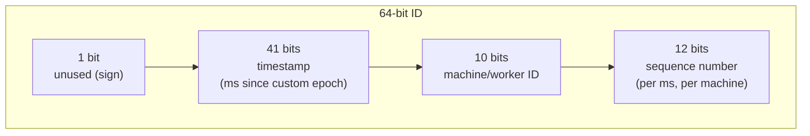
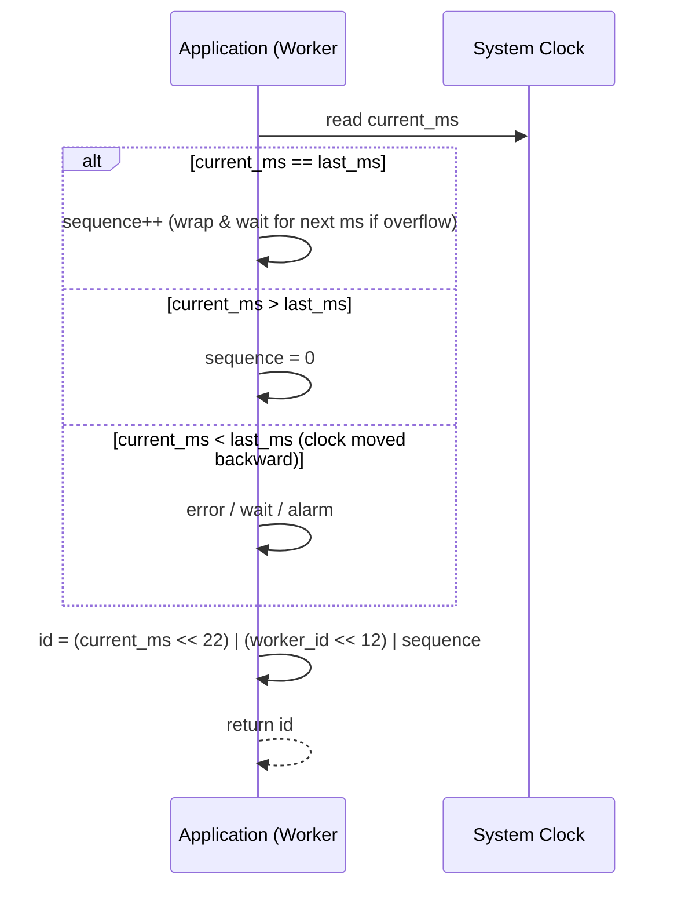

# 6. Design a Unique ID Generator (Snowflake-style)

> A focused question that shows up as a sub-problem inside many other designs (chat message ordering, order IDs, primary keys for sharded tables) — worth mastering on its own.

## 6.1 Requirements

**Functional**
- Generate a unique ID for every request, across many machines, with no central coordination on the hot path.

**Non-functional**
- **Uniqueness** — no two IDs collide, ever, even across data centers.
- **Roughly time-sortable** — IDs generated later should generally be numerically larger (useful for range scans, "recent items" queries, and as clustering keys).
- **High throughput, low latency** — must not require a network round trip per ID.
- Compact (fits in 64 bits, ideally, to be a cheap primary/partition key).

## 6.2 Why Not Simpler Options?

| Approach | Problem |
|---|---|
| Database auto-increment | Single point of contention; doesn't scale past one writer; breaks the moment you shard |
| UUID v4 (random) | Globally unique, zero coordination, but **not sortable** and poor as a B-tree/index key (random inserts cause page splits everywhere — see storage-engine chapter) |
| Centralized ID service (call a server for every ID) | Adds a network round trip and a single point of failure/bottleneck to every single write |

This is exactly why **Twitter's Snowflake** approach (and its many clones — Sonyflake, Instagram's scheme, Discord's snowflakes) became the standard answer: encode enough information into the ID itself that any machine can generate one independently, with no coordination.

## 6.3 Deep Dive — Snowflake ID Layout

- **41-bit timestamp**: milliseconds since a custom epoch (not Unix epoch, to maximize usable range) — gives ~69 years before overflow. This prefix is what makes IDs roughly sortable by creation time.
- **10-bit machine/worker ID**: uniquely identifies the generating node (e.g., `datacenter_id` + `worker_id`), assigned at startup via config or a coordination service (ZooKeeper/etcd) claiming an unused slot — supports up to 1024 concurrent workers.
- **12-bit sequence number**: a per-millisecond counter on that single machine, reset to 0 each new millisecond — allows up to 4096 IDs per machine per millisecond (4.09M IDs/sec/machine) before it has to wait for the next millisecond tick.

Because timestamp + machine ID + sequence together are unique, **any machine can generate IDs completely independently** — zero network calls, zero shared state, zero contention.

## 6.4 Deep Dive — Clock Issues (the classic follow-up)

The one real danger: **clock skew or NTP clock rollback**. If a machine's system clock jumps backward, it could regenerate a timestamp (and therefore an ID) it already used.

- **Detection**: on every ID generation, compare the current timestamp to the `last_timestamp` this worker used. If the new timestamp is *less than* the last one, the clock went backward.
- **Mitigation options**:
  1. **Refuse to generate** and raise an alarm/error until the clock catches back up (safest, but causes a brief outage on that worker).
  2. **Wait** until the system clock passes `last_timestamp` before resuming.
  3. Maintain a small **logical offset** to keep monotonicity even through minor rollbacks.
- In practice: run NTP with monotonic clock sync (or use a monotonic clock source where available) and treat clock rollback as a rare operational alarm, not a routine code path.

## 6.5 Sequence Diagram — Generating One ID

## 6.6 Alternative Approaches Worth Naming

- **Pre-allocated ID ranges (ticket server)**: a lightweight central service hands out *batches* of IDs (e.g., "you own 1000–1999") to each worker, which then increments locally until exhausted — trades a small amount of coordination (rare batch requests, not per-ID) for simplicity, at the cost of a mild single point of failure that's easy to make highly available (it's stateless between batch grants).
- **UUID v7**: a newer UUID variant that embeds a timestamp prefix like Snowflake while staying in the standard 128-bit UUID format — a good answer if the interviewer wants standards compliance over compactness.
- **Database segment/hi-lo allocation**: each app instance reserves a "hi" value from a DB row via a single atomic increment, then generates many IDs locally by varying the "lo" part — similar spirit to the ticket server, using the existing DB instead of a new service.

## 6.7 Common Follow-ups

- "Why not just use UUIDv4 everywhere?" → fine for pure uniqueness needs with no ordering requirement, but random UUIDs make terrible database index/partition keys (no locality, causes hot-spot-free but cache-unfriendly random writes) and can't be used to sort "most recent first" without a separate timestamp column.
- "How would you assign the 10-bit machine ID safely so two workers never collide?" → a coordination service (ZooKeeper/etcd) that atomically claims an ephemeral node per worker ID at startup, releasing it if the worker dies, so IDs are never double-assigned.
- "What happens at 4096 IDs/ms on one machine?" → the generator **spins/waits for the next millisecond tick** rather than overflowing the sequence bits into the machine-ID bits — a hard backpressure point worth mentioning if asked about extreme throughput on a single node.
