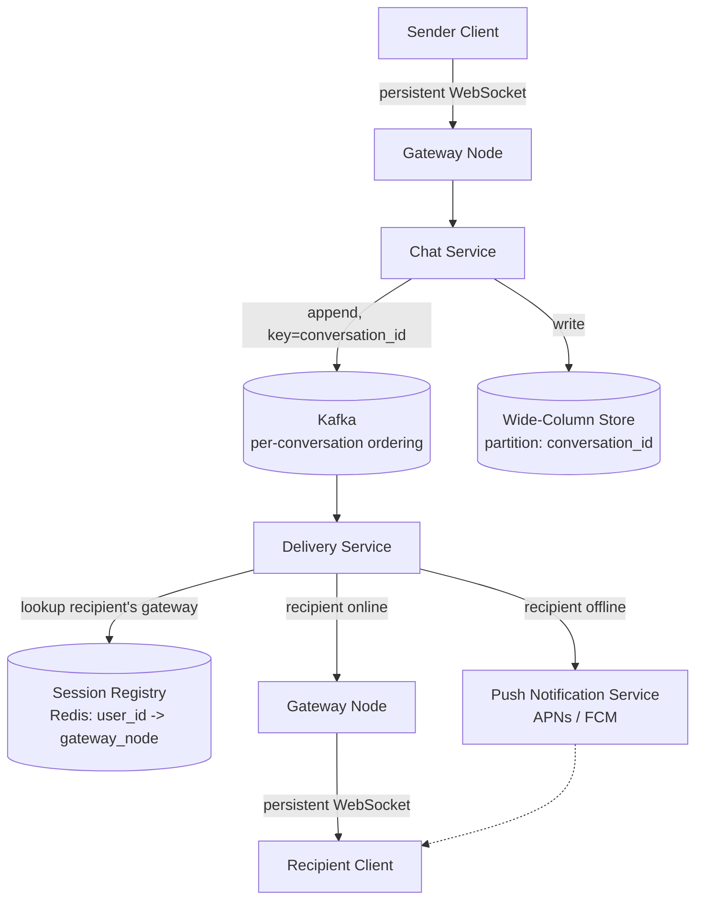
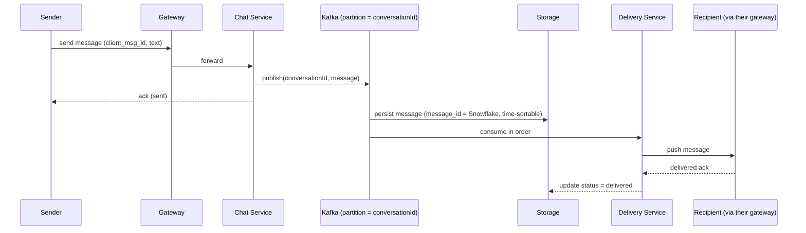

# 7. Design a Chat / Messaging App (WhatsApp / Messenger)

> The canonical "stateful, real-time, write-heavy" question — it forces a conversation about persistent connections, ordering, and delivery guarantees that stateless HTTP CRUD questions never touch.

## 7.1 Requirements

**Functional**
- 1:1 messaging and small group chats.
- Online/offline presence.
- Delivery receipts (sent / delivered / read).
- Message history, synced across a user's devices.
- Push notification when the recipient is offline.

**Non-functional**
- **No message loss**, even across reconnects/crashes.
- **Ordering within a conversation** must be preserved.
- Low latency for online delivery (sub-second).
- Scale: 50M DAU × ~40 messages/day ≈ 2B messages/day (~23K avg msg/s, ~100K peak).

## 7.2 High-Level Architecture

- **Gateways are stateful** — each holds many long-lived WebSocket connections and is "connection-affine" (a client stays pinned to the gateway it connected to). This is the key architectural difference from stateless REST services.
- **Session registry** (Redis) maps `user_id → gateway_node_id` so the delivery service knows where to route a message for an online recipient, regardless of which gateway the sender used.
- **Kafka partitioned by `conversation_id`** guarantees all messages in one conversation are processed **in order**, by the same partition/consumer, even under massive horizontal scale (see the stream-processing chapter for why partition-key choice = your ordering guarantee).

## 7.3 Deep Dive — Message Flow & Ordering

- **Sequence numbers per conversation** (or the Snowflake `message_id` itself) let clients detect gaps — if a client sees message #45 then #47, it knows #46 is missing and can request a gap-fill instead of silently losing it.
- **At-least-once delivery + client-side dedupe**: the pipeline may redeliver a message on retry; each message carries a client-generated `client_msg_id` so the receiving client can discard duplicates idempotently rather than the system trying to guarantee exactly-once end-to-end (which is far harder — see the streaming chapter's take on exactly-once).

## 7.4 Data Model

**Storage choice: LSM-based wide-column store** (Cassandra/ScyllaDB) — the workload is a heavy **append-only write stream** with a dominant query pattern of "give me the most recent N messages of conversation X," which maps perfectly onto:

| Partition key | Clustering key | Columns |
|---|---|---|
| `conversation_id` | `message_id` (Snowflake, time-sortable, descending) | `sender_id`, `text`/`media_ref`, `status`, `sent_at` |

"Recent messages of a conversation" becomes a single-partition range scan — no cross-partition fan-out, no secondary index needed for the hot path. This is the same reasoning as the storage-and-partitioning chapters: **pick the partition key from the dominant query.**

## 7.5 Deep Dive — Presence & Fan-out

- **Presence**: clients heartbeat every ~10s; the registry entry carries a short TTL. Subscribers (contacts viewing "online" status) get **debounced** updates — don't broadcast every flap of a spotty connection as online/offline/online.
- **Group chat fan-out**: rather than the sender writing N times (once per member), the message is written once to the conversation's log, and the **delivery service fans out reads** — each online member's gateway pulls/receives it once via its own subscription. For very large groups (broadcast channels), this shifts further toward a pull-based or CDN-like distribution model rather than pushing to millions of sockets synchronously.
- **Multi-device sync**: a user's message history is keyed by conversation, not by device — each of a user's devices independently maintains its own read cursor/offset into the conversation log, so opening the app on a new device replays from the log rather than needing device-to-device sync logic.

## 7.6 Scaling & Failure Handling

- **Gateway node dies**: all its connections drop; clients detect the disconnect and reconnect (with backoff) to a healthy gateway (via DNS/LB), then resume from their last-acknowledged message offset — no data loss because messages live durably in Kafka/storage, not in gateway memory.
- **Hot conversation** (celebrity broadcast / large public group): split into an announcement-channel pattern — one-way fan-out optimized for massive read scale (like a news feed, Section 8) rather than a symmetric peer-to-peer conversation.
- **Multi-region**: pin each conversation to a "home region" to keep the single-partition ordering guarantee simple, and replicate asynchronously to other regions for read locality and disaster recovery.
- **End-to-end encryption** (if in scope): the server becomes a pure ordered-relay of opaque ciphertext blobs — this doesn't change the architecture above, only what's inside the `text` field and where key exchange happens (out of scope for most interviews, but good to flag as "the storage/delivery design is unaffected, only payload handling changes").

## 7.7 Common Follow-ups

- "How do you guarantee exactly-once delivery?" → you generally don't try to; you guarantee **at-least-once delivery + idempotent client-side dedupe by message ID**, which is both simpler and more robust than chasing true exactly-once across a network.
- "How would read receipts scale for a 500-person group?" → don't fan out N×N receipt events; aggregate read state per message (e.g., a compact bitmap/counter of "read by") and let clients query summarized state rather than receiving 500 individual receipt events per message.
- "WebSocket vs long-polling vs SSE for the client connection?" → WebSocket for full-duplex low-latency chat (needed for typing indicators, presence); long-polling as a fallback for restrictive networks/older clients; SSE would work for one-directional delivery but chat needs bidirectional.
