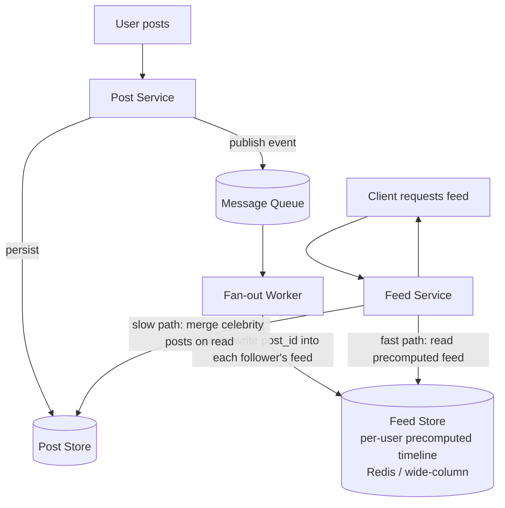
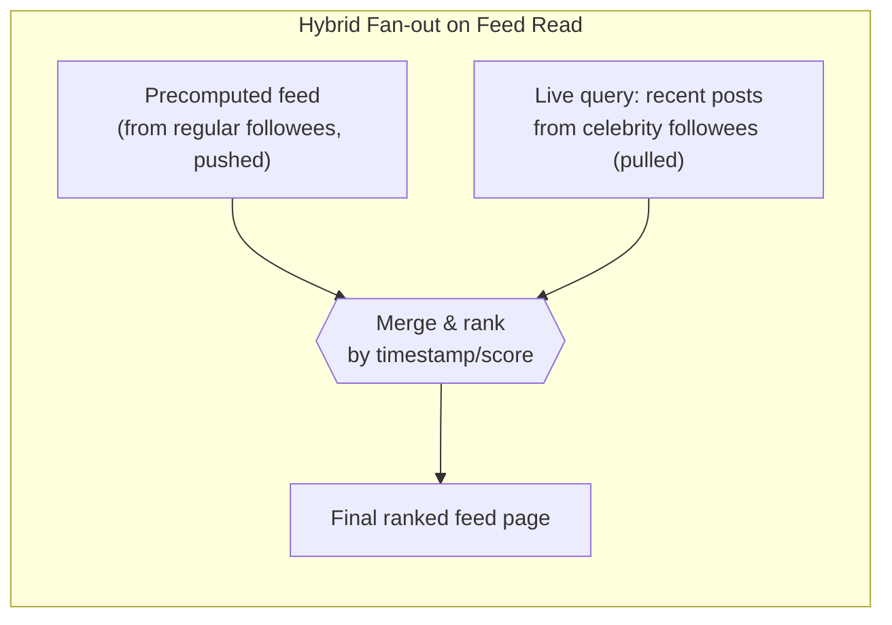

# 8. Design a News Feed System (Twitter / Facebook)

> The classic **fan-out** question: given a social graph, how do you make "show me what my friends posted, in roughly reverse-chronological/ranked order" fast at massive scale, when naive approaches fall over on celebrity accounts.

## 8.1 Requirements

**Functional**
- Users post content (text/media).
- Users follow other users; a feed shows posts from followees.
- Feed is ranked or reverse-chronological, paginated.

**Non-functional**
- **Read-heavy**: feed reads vastly outnumber posts (users check feeds far more often than they post).
- Feed load latency should feel instant (p99 < 200 ms).
- Eventual consistency is fine — a post appearing in followers' feeds a few seconds late is unnoticeable; a home feed is not a system of record.
- Must handle **highly skewed** follower graphs (celebrities with 100M followers vs. average users with a few hundred).

## 8.2 High-Level Architecture

## 8.3 Deep Dive — Push vs Pull Fan-out (the crux of this question)

| Strategy | How it works | Best for | Problem |
|---|---|---|---|
| **Push (fan-out-on-write)** | When a user posts, immediately write the post ID into every follower's precomputed feed list | Average users (hundreds of followers) — feed reads become a single fast lookup | **Celebrity problem**: a user with 100M followers triggers 100M writes for one post — massive write amplification and latency spike |
| **Pull (fan-out-on-read)** | Feed is assembled at read time by querying posts from all followees and merging | Celebrities/high-fan-out accounts — one post, zero extra writes | Read is expensive: fetching and merging posts from hundreds of followees on every feed load; slow for heavy feed-checkers |
| **Hybrid (used in practice)** | Push for regular users; celebrities are excluded from push fan-out and instead **merged in at read time** | Best of both | More complex feed-service logic (merge two sources), but avoids both failure modes |

The **threshold** (e.g., "accounts with >1M followers skip push fan-out") is a config knob tuned from real follower-count distribution data — worth stating explicitly as a design decision, not a hardcoded guess.

## 8.4 Data Model

**Post store**: `post_id` (Snowflake, time-sortable), `author_id`, `content`, `created_at`, `media_refs` — partitioned by `author_id` or `post_id` depending on whether "get a user's own posts" or "get post by id" dominates.

**Feed store** (per-user precomputed timeline): a **capped list** of recent `post_id`s per user (e.g., last 1000), stored in Redis (sorted set scored by timestamp) or a wide-column store keyed by `user_id`, clustered by `post_id`/timestamp descending — same "partition by the dominant access pattern" principle as the chat design (Section 7.4).

## 8.5 Deep Dive — Ranking

A pure reverse-chronological feed is the simplest version of this question; most real systems rank instead:

- **Candidate generation**: pull a window of recent posts from followees (push list + pulled celebrity posts).
- **Scoring**: a model (or simpler heuristic — recency × engagement × affinity with the author) scores each candidate.
- **Serving**: top-K by score, paginated. Scoring can happen at fan-out time (cheap, coarse) or at read time (fresh, more expensive) — many systems do a cheap score at write time and a light re-rank at read time.
- This is where the design connects to a **recommendation/ML serving pipeline** as a follow-up — worth mentioning that ranking is a pluggable stage, not part of the storage/fan-out architecture itself.

## 8.6 Scaling & Failure Handling

- **Fan-out worker backlog**: if a burst of celebrity-adjacent activity floods the queue, workers fall behind — feeds get **eventually** consistent (a few seconds/minutes stale), which is an acceptable degradation, not an outage, given the non-functional requirements.
- **New follow relationship**: when user A follows user B, don't try to retroactively fan out B's entire history into A's feed synchronously — either backfill asynchronously with a capped lookback window, or simply let A's next feed read pull B's recent posts via the celebrity-style merge path until the async backfill catches up.
- **Feed store as a cache, not source of truth**: the precomputed feed list is fully derivable from the post store + social graph, so it's safe to treat as disposable — a lost feed cache for a user is rebuilt on next fan-out/read, not a data-loss incident.
- **Storage growth**: cap precomputed feed length (e.g., 1000 most recent post IDs); older content is only reachable by paging into the pull path.

## 8.7 Common Follow-ups

- "How would you handle a deleted post?" → fan-out lists store post *IDs*, not content, so the feed service does a live existence/visibility check (or a tombstone flag) against the post store when rendering — deletion propagates naturally without rewriting every follower's feed list.
- "How do you avoid showing the same post twice (pagination stability) while new posts keep arriving?" → paginate with a **cursor** (e.g., last-seen timestamp/post_id), not offset-based paging, so insertions ahead of the cursor don't shift results.
- "What about feed diversity (not showing 10 posts from the same person in a row)?" → a re-ranking/interleaving pass over the candidate set at serve time, independent of the fan-out mechanism — another argument for keeping ranking a separate, swappable stage.
