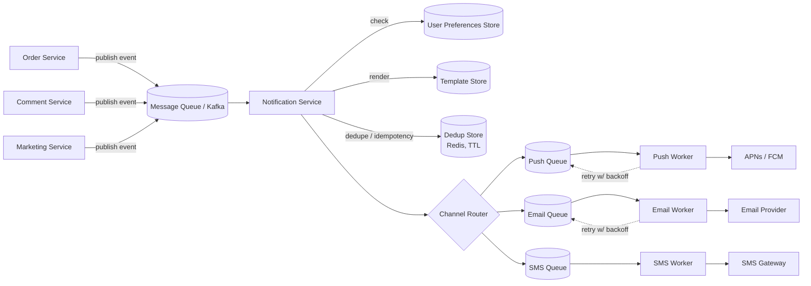
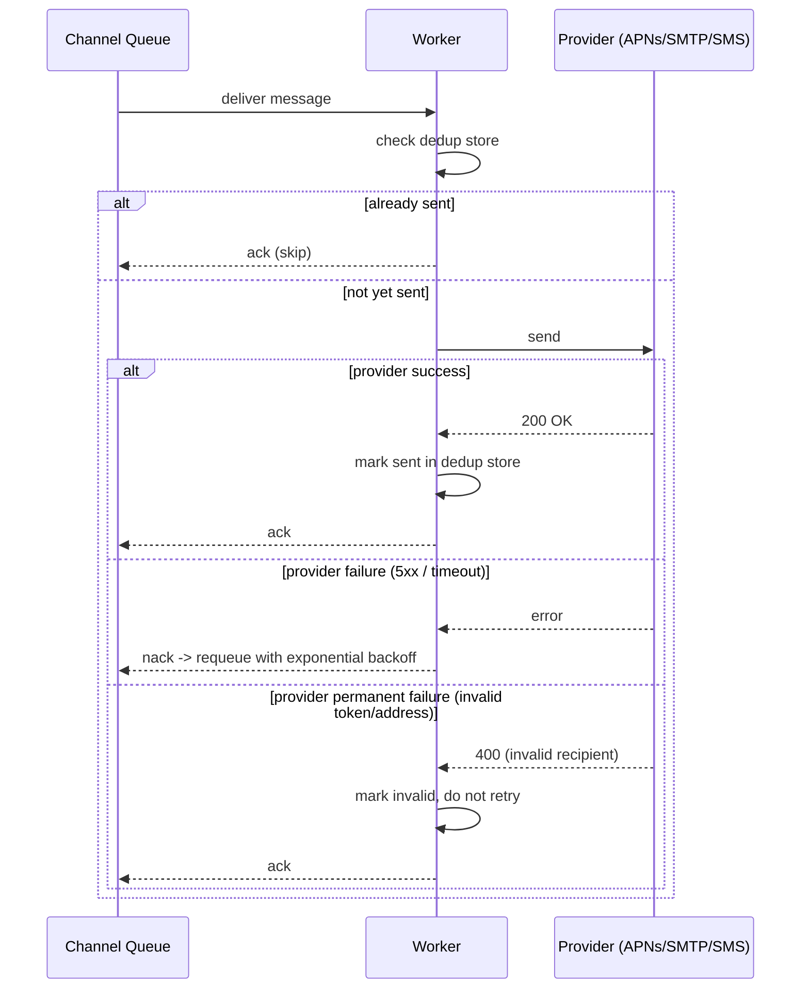

# 9. Design a Notification System

> A fan-out and multi-channel-delivery question with a strong emphasis on decoupling, retries, and not spamming users — less about a single hard algorithm, more about clean service boundaries.

## 9.1 Requirements

**Functional**
- Any internal service can trigger a notification ("order shipped," "new comment," "friend request").
- Delivery across multiple channels: push (mobile), email, SMS, in-app.
- User preferences (opt-out per channel/category), quiet hours, do-not-disturb.
- Templating (localized, personalized content).

**Non-functional**
- **Decoupled from calling services** — a checkout service shouldn't know or care how notifications are delivered, or block on delivery.
- At-least-once delivery with **deduplication** (don't double-notify on retries).
- High throughput bursts (a flash sale can trigger millions of notifications in seconds).
- Respect rate limits of third-party providers (APNs, FCM, SMTP relays, SMS gateways).

## 9.2 High-Level Architecture

- **Producers are decoupled via a queue** — any service simply publishes a `NotificationRequested` event and moves on; the notification service owns everything downstream. This is the single most important design decision: it turns a potentially slow, third-party-dependent operation into an async side effect instead of something on a critical request path.
- **Per-channel queues + workers** — each channel has wildly different throughput, latency, and failure characteristics (SMS providers rate-limit hard; email can batch), so isolating them means one channel's outage or slowness doesn't back up the others.

## 9.3 Deep Dive — Idempotency & Deduplication

Because the whole pipeline is at-least-once (queue redelivery, worker retries), the same logical notification can be attempted more than once. Two protections:

- **Idempotency key**: every notification event carries a unique key (e.g., `order_id + "shipped"`); before sending, the worker does an atomic check-and-set against a dedup store (Redis `SETNX` with TTL) — if the key already exists, skip sending, just ack the message.
- **Provider-level idempotency**: where the third-party API supports an idempotency key (many push/email providers do), pass it through so even a genuine double-send request from your own retry doesn't produce two emails.

## 9.4 Deep Dive — User Preferences & Throttling

- **Preferences store**: `(user_id, category, channel) → enabled/disabled`, checked before rendering — a marketing notification respects opt-outs; a security alert (password changed) typically bypasses preferences entirely (worth calling out as a deliberate exception, not an oversight).
- **Quiet hours**: instead of dropping a notification generated at 2 AM local time, queue it with a scheduled delivery time and let a delayed-delivery mechanism (a time-bucketed queue, or a scheduler service — see Section 17) release it after the quiet window ends.
- **Digest/batching**: high-frequency triggers (e.g., "10 people liked your photo") should be **aggregated** over a short window into a single notification rather than firing one push per like — this is usually implemented as a short buffering stage keyed by `(user_id, category)` that flushes on a timer or count threshold.
- **Rate limiting outbound calls to providers**: APNs/FCM/SMS gateways impose their own rate limits — each channel worker pool applies a token-bucket limiter (Section 3) tuned to the provider's documented ceiling, with backpressure into the channel queue rather than hammering the provider into further throttling you.

## 9.5 Deep Dive — Delivery Guarantees & Retries

- Transient failures (provider 5xx, timeout) → retry with exponential backoff + jitter, capped attempts, then to a **dead-letter queue** for investigation.
- Permanent failures (invalid push token, bounced email) → don't retry; mark the destination invalid (e.g., remove a stale device token) so future notifications don't keep failing against it.

## 9.6 Scaling & Failure Handling

- **Burst handling**: a flash sale firing millions of events is absorbed by the queue's buffering — workers scale out horizontally and drain at their own sustainable rate; the queue depth becomes the visible backlog metric, not a cascading failure.
- **Priority tiers**: security/critical notifications (password reset codes) should not sit behind a backlog of marketing blasts — separate high-priority queues/topics with dedicated worker capacity.
- **Multi-provider failover per channel**: if the primary push/SMS provider is degraded, route to a secondary provider — this only works cleanly because the channel router already abstracts "send push" from "which specific provider," a decoupling worth designing in from the start.

## 9.7 Common Follow-ups

- "How would you avoid sending a notification about an event that later got rolled back (e.g., order canceled 1 second after 'shipped' event fired)?" → introduce a small delay/debounce before dispatch for cancelable event types, or have the notification service re-check current state just before send rather than trusting the event payload as final truth.
- "How do you track delivery/read status for analytics?" → providers send delivery/open webhooks back; a separate ingestion pipeline correlates them to the original notification ID for dashboards — kept out of the critical send path.
- "In-app notification center vs push — same system?" → same triggering/dedup/preference logic, but in-app notifications are simply persisted rows read by the client on next app open, no external provider or retry-on-failure semantics needed.
